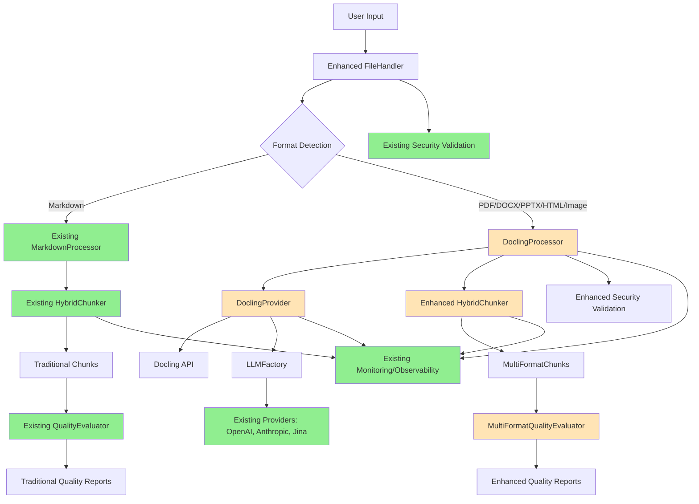

# Component Architecture

## **New Components**

### **DoclingProcessor**

**Responsibility**: Core multi-format document processing using Docling API, handling PDF, DOCX, PPTX, HTML, and image files while integrating with existing chunking pipeline  
**Integration Points**: Interfaces with enhanced FileHandler for format routing, integrates with existing quality evaluation system, follows established processor patterns from MarkdownProcessor

**Key Interfaces:**
- `process_document(file_path: str, metadata: Dict) -> DoclingProcessingResult` - Main processing interface following existing processor patterns
- `extract_structure(content: Any) -> Dict` - Document hierarchy extraction compatible with existing chunk metadata
- `process_vision_content(visual_elements: List) -> List[Dict]` - Image and visual content analysis with fallback handling
- `validate_format_support(file_path: str) -> bool` - Format compatibility check integrating with existing validation framework

**Dependencies:**
- **Existing Components**: FileHandler (enhanced), existing security validation framework, observability infrastructure
- **New Components**: DoclingProvider for API communication, MultiFormatChunk for enhanced metadata storage

**Technology Stack**: Python 3.11+, Docling SDK, integrates with existing LangChain text processing, follows current error handling patterns

### **DoclingProvider**

**Responsibility**: LLM provider implementation for Docling API following established BaseLLMProvider interface, enabling seamless integration with existing provider factory  
**Integration Points**: Registers with LLMFactory, uses existing configuration management, integrates with current monitoring and error handling

**Key Interfaces:**
- `count_tokens(text: str) -> int` - Token counting for multi-format content following provider interface
- `completion(prompt: str, **kwargs) -> str` - Document processing completion interface
- `embeddings(text: str) -> List[float]` - Multi-format content embeddings when supported
- `health_check() -> bool` - Provider health verification for monitoring integration

**Dependencies:**
- **Existing Components**: BaseLLMProvider interface, LLMFactory registration system, existing configuration framework
- **New Components**: DoclingProviderConfig for settings management, integration with DoclingProcessor

**Technology Stack**: Inherits from existing provider patterns, Docling SDK integration, follows current authentication and error handling approaches

### **EnhancedFileHandler**

**Responsibility**: Multi-format file detection, validation, and intelligent routing while preserving existing Markdown processing functionality  
**Integration Points**: Extends current FileHandler, integrates with existing security validation, maintains backward compatibility with all current file operations

**Key Interfaces:**
- `detect_format(file_path: str) -> str` - Automatic format detection using python-magic and existing validation
- `route_to_processor(file_path: str, format: str) -> Union[MarkdownProcessor, DoclingProcessor]` - Intelligent processor selection
- `validate_multi_format_file(file_path: str) -> bool` - Security validation extending current framework
- `find_supported_files(directory: str) -> List[str]` - Multi-format file discovery extending existing functionality

**Dependencies:**
- **Existing Components**: Current FileHandler functionality, existing security validation, path sanitization utilities
- **New Components**: DoclingProcessor for multi-format routing, enhanced validation for new file types

**Technology Stack**: Extends existing file handling patterns, python-magic for detection, Pillow for image validation, maintains current security approaches

### **MultiFormatQualityEvaluator**

**Responsibility**: Enhanced quality assessment for multi-format documents while preserving existing Markdown evaluation functionality  
**Integration Points**: Extends ChunkQualityEvaluator, integrates with existing metrics framework, maintains current quality reporting patterns

**Key Interfaces:**
- `evaluate_multi_format_chunks(chunks: List[MultiFormatChunk]) -> Dict` - Enhanced quality metrics for diverse content types
- `assess_visual_content_quality(visual_elements: List) -> Dict` - Image and table processing quality evaluation
- `compare_format_effectiveness(chunks: List, baseline_metrics: Dict) -> Dict` - Cross-format quality comparison
- `generate_enhanced_report(metrics: Dict) -> str` - Extended quality reporting with multi-format insights

**Dependencies:**
- **Existing Components**: ChunkQualityEvaluator base functionality, existing metrics infrastructure, current reporting system
- **New Components**: MultiFormatChunk for enhanced metadata, DoclingProcessingResult for quality context

**Technology Stack**: Extends existing scikit-learn evaluation patterns, maintains current metrics calculation approaches, integrates with existing reporting infrastructure

## **Component Interaction Diagram**

