# NextJS-FastAPI Technical Implementation Guide

**BMad Orchestrator Team** 🚀

**Document Version**: 1.0  
**Date**: 2024-12-19  
**Team**: Technical Implementation Team  
**Status**: Ready for Development

---

## Table of Contents

1. [Architecture Overview](#1-architecture-overview)
2. [Backend Implementation](#2-backend-implementation)
3. [Frontend Implementation](#3-frontend-implementation)
4. [Database Schema](#4-database-schema)
5. [API Specification](#5-api-specification)
6. [WebSocket Implementation](#6-websocket-implementation)
7. [Authentication & Security](#7-authentication--security)
8. [Testing Strategy](#8-testing-strategy)
9. [Deployment Configuration](#9-deployment-configuration)
10. [Performance Optimization](#10-performance-optimization)

---

## 1. Architecture Overview

### 1.1 System Architecture

```mermaid
graph TB
    subgraph "Frontend (NextJS 14+)"
        UI["🎨 User Interface"]
        API_CLIENT["📡 API Client"]
        WS_CLIENT["🔌 WebSocket Client"]
        STORE["🗄️ State Management"]
    end
    
    subgraph "Backend (FastAPI)"
        ROUTER["🛣️ API Router"]
        SERVICE["⚙️ Document Service"]
        WS_MANAGER["📡 WebSocket Manager"]
        QUEUE["📋 Task Queue"]
    end
    
    subgraph "Core System"
        CHUNKING["✂️ Chunking Engine"]
        LLM["🤖 LLM Providers"]
        STORAGE["💾 File Storage"]
    end
    
    subgraph "Infrastructure"
        DB[("🗃️ PostgreSQL")]
        REDIS[("🔴 Redis")]
        S3[("☁️ File Storage")]
    end
    
    UI --> API_CLIENT
    UI --> WS_CLIENT
    API_CLIENT --> ROUTER
    WS_CLIENT --> WS_MANAGER
    
    ROUTER --> SERVICE
    SERVICE --> CHUNKING
    SERVICE --> DB
    SERVICE --> QUEUE
    
    WS_MANAGER --> REDIS
    QUEUE --> REDIS
    CHUNKING --> LLM
    CHUNKING --> STORAGE
    STORAGE --> S3
```



### 1.2 Technology Stack

```yaml
Frontend:
  Framework: NextJS 14+ (App Router)
  Language: TypeScript 5+
  Styling: Tailwind CSS 3+
  UI Components: Shadcn/ui
  State Management: Zustand
  HTTP Client: Fetch API
  WebSocket: Native WebSocket API
  File Upload: react-dropzone
  Forms: react-hook-form + zod
  Testing: Jest + React Testing Library + Playwright

Backend:
  Framework: FastAPI 0.104+
  Language: Python 3.11+
  Database ORM: SQLAlchemy 2.0+
  Migration: Alembic
  Task Queue: Celery + Redis
  WebSocket: FastAPI WebSocket
  Authentication: fastapi-users
  Validation: Pydantic 2.0+
  Testing: pytest + httpx

Infrastructure:
  Database: PostgreSQL 15+
  Cache/Queue: Redis 7+
  File Storage: AWS S3 / MinIO
  Monitoring: Prometheus + Grafana
  Logging: Structured logging with loguru
```

---

## 2. Backend Implementation

### 2.1 Project Structure

```
src/
├── api/
│   ├── __init__.py
│   ├── dependencies.py          # Dependency injection
│   ├── health_endpoints.py      # Existing health checks
│   ├── document_endpoints.py    # New document APIs
│   ├── auth_endpoints.py        # Authentication
│   └── websocket_endpoints.py   # WebSocket handlers
├── core/
│   ├── __init__.py
│   ├── config.py               # Configuration
│   ├── database.py             # Database setup
│   ├── security.py             # Security utilities
│   └── chunking_system.py      # Existing chunking engine
├── models/
│   ├── __init__.py
│   ├── base.py                 # Base model classes
│   ├── document.py             # Document models
│   ├── chunk.py                # Chunk models
│   └── user.py                 # User models
├── services/
│   ├── __init__.py
│   ├── document_service.py     # Document processing
│   ├── file_service.py         # File handling
│   ├── websocket_service.py    # WebSocket management
│   └── notification_service.py # Real-time notifications
├── schemas/
│   ├── __init__.py
│   ├── document.py             # Pydantic schemas
│   ├── chunk.py                # Chunk schemas
│   └── user.py                 # User schemas
├── utils/
│   ├── __init__.py
│   ├── file_handler.py         # Existing file utilities
│   ├── validators.py           # Input validation
│   └── exceptions.py           # Custom exceptions
└── worker/
    ├── __init__.py
    ├── celery_app.py           # Celery configuration
    └── tasks.py                # Background tasks
```

### 2.2 Core Models

```python
# src/models/document.py
from sqlalchemy import Column, String, Integer, Float, DateTime, Text, Enum, JSON
from sqlalchemy.dialects.postgresql import UUID
from sqlalchemy.orm import relationship
from sqlalchemy.sql import func
import uuid
import enum
from .base import Base

class DocumentStatus(str, enum.Enum):
    UPLOADING = "uploading"
    PROCESSING = "processing"
    COMPLETED = "completed"
    ERROR = "error"
    CANCELLED = "cancelled"

class Document(Base):
    __tablename__ = "documents"
    
    id = Column(UUID(as_uuid=True), primary_key=True, default=uuid.uuid4)
    filename = Column(String(255), nullable=False)
    original_filename = Column(String(255), nullable=False)
    file_size = Column(Integer, nullable=False)
    mime_type = Column(String(100), nullable=False)
    file_path = Column(String(500), nullable=True)
    
    # Processing configuration
    chunking_strategy = Column(String(50), default="hybrid")
    llm_provider = Column(String(50), default="openai")
    chunk_size = Column(Integer, default=1000)
    overlap = Column(Integer, default=200)
    
    # Status and progress
    status = Column(Enum(DocumentStatus), default=DocumentStatus.UPLOADING)
    progress = Column(Float, default=0.0)
    error_message = Column(Text, nullable=True)
    
    # Metrics
    chunk_count = Column(Integer, default=0)
    processing_time = Column(Float, nullable=True)
    quality_score = Column(Float, nullable=True)
    
    # Metadata
    metadata = Column(JSON, default=dict)
    
    # Timestamps
    created_at = Column(DateTime(timezone=True), server_default=func.now())
    updated_at = Column(DateTime(timezone=True), onupdate=func.now())
    completed_at = Column(DateTime(timezone=True), nullable=True)
    
    # Relationships
    chunks = relationship("Chunk", back_populates="document", cascade="all, delete-orphan")
    
    def __repr__(self):
        return f"<Document(id={self.id}, filename={self.filename}, status={self.status})>"

# src/models/chunk.py
from sqlalchemy import Column, String, Integer, Float, Text, JSON, ForeignKey
from sqlalchemy.dialects.postgresql import UUID
from sqlalchemy.orm import relationship
import uuid
from .base import Base

class Chunk(Base):
    __tablename__ = "chunks"
    
    id = Column(UUID(as_uuid=True), primary_key=True, default=uuid.uuid4)
    document_id = Column(UUID(as_uuid=True), ForeignKey("documents.id"), nullable=False)
    
    # Content
    content = Column(Text, nullable=False)
    content_hash = Column(String(64), nullable=False)  # SHA-256 hash
    
    # Position and structure
    sequence_number = Column(Integer, nullable=False)
    start_position = Column(Integer, nullable=True)
    end_position = Column(Integer, nullable=True)
    
    # Metrics
    token_count = Column(Integer, nullable=False)
    character_count = Column(Integer, nullable=False)
    quality_score = Column(Float, default=0.0)
    
    # Metadata
    metadata = Column(JSON, default=dict)
    
    # Relationships
    document = relationship("Document", back_populates="chunks")
    
    def __repr__(self):
        return f"<Chunk(id={self.id}, document_id={self.document_id}, sequence={self.sequence_number})>"
```

### 2.3 Document Service

```python
# src/services/document_service.py
from typing import Optional, List, Dict, Any
from fastapi import UploadFile, HTTPException, BackgroundTasks
from sqlalchemy.orm import Session
from sqlalchemy import and_
import hashlib
import magic
import asyncio
from pathlib import Path

from ..models.document import Document, DocumentStatus
from ..models.chunk import Chunk
from ..schemas.document import DocumentCreate, DocumentResponse
from ..core.chunking_system import ChunkingSystem
from ..utils.file_handler import FileHandler
from ..utils.validators import validate_file_upload
from ..worker.tasks import process_document_task
from .websocket_service import websocket_manager

class DocumentService:
    def __init__(self, db: Session, chunking_system: ChunkingSystem):
        self.db = db
        self.chunking_system = chunking_system
        self.file_handler = FileHandler()
    
    async def upload_document(
        self,
        file: UploadFile,
        chunking_strategy: str = "hybrid",
        llm_provider: str = "openai",
        chunk_size: int = 1000,
        overlap: int = 200,
        background_tasks: BackgroundTasks = None
    ) -> DocumentResponse:
        """Upload and queue document for processing."""
        
        # Validate file
        await validate_file_upload(file)
        
        # Calculate file hash for deduplication
        content = await file.read()
        file_hash = hashlib.sha256(content).hexdigest()
        await file.seek(0)  # Reset file pointer
        
        # Check for existing document with same hash
        existing_doc = self.db.query(Document).filter(
            Document.metadata['file_hash'].astext == file_hash
        ).first()
        
        if existing_doc:
            return DocumentResponse.from_orm(existing_doc)
        
        # Detect MIME type
        mime_type = magic.from_buffer(content[:1024], mime=True)
        
        # Create document record
        document = Document(
            filename=self._generate_safe_filename(file.filename),
            original_filename=file.filename,
            file_size=len(content),
            mime_type=mime_type,
            chunking_strategy=chunking_strategy,
            llm_provider=llm_provider,
            chunk_size=chunk_size,
            overlap=overlap,
            status=DocumentStatus.UPLOADING,
            metadata={"file_hash": file_hash}
        )
        
        self.db.add(document)
        self.db.commit()
        self.db.refresh(document)
        
        try:
            # Save file to storage
            file_path = await self.file_handler.save_upload(
                file, str(document.id)
            )
            
            # Update document with file path
            document.file_path = file_path
            document.status = DocumentStatus.PROCESSING
            self.db.commit()
            
            # Queue processing task
            if background_tasks:
                background_tasks.add_task(
                    self._queue_processing_task, str(document.id)
                )
            else:
                await self._queue_processing_task(str(document.id))
            
            return DocumentResponse.from_orm(document)
            
        except Exception as e:
            # Update document status on error
            document.status = DocumentStatus.ERROR
            document.error_message = str(e)
            self.db.commit()
            raise HTTPException(status_code=500, detail=f"Upload failed: {str(e)}")
    
    async def _queue_processing_task(self, document_id: str):
        """Queue document processing task."""
        try:
            # Send to Celery worker
            task = process_document_task.delay(document_id)
            
            # Update document with task ID
            document = self.db.query(Document).filter(
                Document.id == document_id
            ).first()
            
            if document:
                document.metadata = {
                    **document.metadata,
                    "task_id": task.id
                }
                self.db.commit()
                
        except Exception as e:
            # Handle queue errors
            document = self.db.query(Document).filter(
                Document.id == document_id
            ).first()
            
            if document:
                document.status = DocumentStatus.ERROR
                document.error_message = f"Failed to queue processing: {str(e)}"
                self.db.commit()
    
    def get_document(self, document_id: str) -> Optional[DocumentResponse]:
        """Get document by ID."""
        document = self.db.query(Document).filter(
            Document.id == document_id
        ).first()
        
        if not document:
            raise HTTPException(status_code=404, detail="Document not found")
        
        return DocumentResponse.from_orm(document)
    
    def list_documents(
        self,
        skip: int = 0,
        limit: int = 100,
        status: Optional[DocumentStatus] = None
    ) -> List[DocumentResponse]:
        """List documents with pagination and filtering."""
        query = self.db.query(Document)
        
        if status:
            query = query.filter(Document.status == status)
        
        documents = query.offset(skip).limit(limit).all()
        return [DocumentResponse.from_orm(doc) for doc in documents]
    
    def get_document_chunks(
        self,
        document_id: str,
        skip: int = 0,
        limit: int = 100
    ) -> List[Dict[str, Any]]:
        """Get chunks for a document."""
        chunks = self.db.query(Chunk).filter(
            and_(
                Chunk.document_id == document_id,
            )
        ).order_by(Chunk.sequence_number).offset(skip).limit(limit).all()
        
        return [
            {
                "id": str(chunk.id),
                "content": chunk.content,
                "sequence_number": chunk.sequence_number,
                "token_count": chunk.token_count,
                "character_count": chunk.character_count,
                "quality_score": chunk.quality_score,
                "metadata": chunk.metadata
            }
            for chunk in chunks
        ]
    
    def delete_document(self, document_id: str) -> bool:
        """Delete document and associated chunks."""
        document = self.db.query(Document).filter(
            Document.id == document_id
        ).first()
        
        if not document:
            raise HTTPException(status_code=404, detail="Document not found")
        
        try:
            # Delete file from storage
            if document.file_path:
                self.file_handler.delete_file(document.file_path)
            
            # Delete database records (chunks deleted via cascade)
            self.db.delete(document)
            self.db.commit()
            
            return True
            
        except Exception as e:
            self.db.rollback()
            raise HTTPException(
                status_code=500, 
                detail=f"Failed to delete document: {str(e)}"
            )
    
    def _generate_safe_filename(self, filename: str) -> str:
        """Generate safe filename for storage."""
        # Remove unsafe characters and limit length
        safe_chars = "-_.() abcdefghijklmnopqrstuvwxyzABCDEFGHIJKLMNOPQRSTUVWXYZ0123456789"
        safe_filename = "".join(c for c in filename if c in safe_chars)
        return safe_filename[:100]  # Limit to 100 characters
```

### 2.4 API Endpoints

```python
# src/api/document_endpoints.py
from typing import List, Optional
from fastapi import APIRouter, Depends, UploadFile, File, BackgroundTasks, Query
from fastapi.responses import JSONResponse
from sqlalchemy.orm import Session

from ..core.database import get_db
from ..core.chunking_system import get_chunking_system
from ..services.document_service import DocumentService
from ..schemas.document import DocumentResponse, DocumentListResponse
from ..models.document import DocumentStatus

router = APIRouter(prefix="/api/v1/documents", tags=["documents"])

def get_document_service(
    db: Session = Depends(get_db),
    chunking_system = Depends(get_chunking_system)
) -> DocumentService:
    return DocumentService(db, chunking_system)

@router.post("/upload", response_model=DocumentResponse)
async def upload_document(
    background_tasks: BackgroundTasks,
    file: UploadFile = File(...),
    chunking_strategy: str = Query("hybrid", description="Chunking strategy to use"),
    llm_provider: str = Query("openai", description="LLM provider for processing"),
    chunk_size: int = Query(1000, ge=100, le=4000, description="Target chunk size"),
    overlap: int = Query(200, ge=0, le=1000, description="Chunk overlap size"),
    service: DocumentService = Depends(get_document_service)
):
    """Upload a document for processing.
    
    - **file**: Document file to upload (PDF, DOCX, MD, TXT)
    - **chunking_strategy**: Strategy for chunking (hybrid, semantic, fixed)
    - **llm_provider**: LLM provider (openai, anthropic, local)
    - **chunk_size**: Target size for each chunk in tokens
    - **overlap**: Overlap between consecutive chunks
    """
    return await service.upload_document(
        file=file,
        chunking_strategy=chunking_strategy,
        llm_provider=llm_provider,
        chunk_size=chunk_size,
        overlap=overlap,
        background_tasks=background_tasks
    )

@router.get("/", response_model=DocumentListResponse)
def list_documents(
    skip: int = Query(0, ge=0, description="Number of documents to skip"),
    limit: int = Query(100, ge=1, le=1000, description="Number of documents to return"),
    status: Optional[DocumentStatus] = Query(None, description="Filter by status"),
    service: DocumentService = Depends(get_document_service)
):
    """List documents with pagination and filtering."""
    documents = service.list_documents(skip=skip, limit=limit, status=status)
    return DocumentListResponse(
        documents=documents,
        total=len(documents),
        skip=skip,
        limit=limit
    )

@router.get("/{document_id}", response_model=DocumentResponse)
def get_document(
    document_id: str,
    service: DocumentService = Depends(get_document_service)
):
    """Get document details by ID."""
    return service.get_document(document_id)

@router.get("/{document_id}/chunks")
def get_document_chunks(
    document_id: str,
    skip: int = Query(0, ge=0),
    limit: int = Query(100, ge=1, le=1000),
    service: DocumentService = Depends(get_document_service)
):
    """Get chunks for a specific document."""
    chunks = service.get_document_chunks(
        document_id=document_id,
        skip=skip,
        limit=limit
    )
    return {
        "chunks": chunks,
        "total": len(chunks),
        "skip": skip,
        "limit": limit
    }

@router.delete("/{document_id}")
def delete_document(
    document_id: str,
    service: DocumentService = Depends(get_document_service)
):
    """Delete a document and all associated chunks."""
    success = service.delete_document(document_id)
    return {"success": success, "message": "Document deleted successfully"}

@router.get("/{document_id}/download")
def download_document(
    document_id: str,
    service: DocumentService = Depends(get_document_service)
):
    """Download original document file."""
    # Implementation for file download
    pass

@router.post("/{document_id}/reprocess")
def reprocess_document(
    document_id: str,
    chunking_strategy: Optional[str] = None,
    service: DocumentService = Depends(get_document_service)
):
    """Reprocess document with new parameters."""
    # Implementation for reprocessing
    pass
```

---

## 3. Frontend Implementation

### 3.1 Project Structure

```
frontend/
├── app/
│   ├── (dashboard)/
│   │   ├── documents/
│   │   │   ├── page.tsx
│   │   │   ├── upload/
│   │   │   │   └── page.tsx
│   │   │   └── [id]/
│   │   │       ├── page.tsx
│   │   │       └── chunks/
│   │   │           └── page.tsx
│   │   ├── api-docs/
│   │   │   └── page.tsx
│   │   └── layout.tsx
│   ├── api/
│   │   └── proxy/
│   │       └── [...path]/
│   │           └── route.ts
│   ├── globals.css
│   ├── layout.tsx
│   └── page.tsx
├── components/
│   ├── ui/                    # Shadcn UI components
│   ├── upload/
│   │   ├── DocumentUploader.tsx
│   │   ├── ProgressIndicator.tsx
│   │   └── FileDropZone.tsx
│   ├── documents/
│   │   ├── DocumentList.tsx
│   │   ├── DocumentCard.tsx
│   │   └── DocumentFilters.tsx
│   ├── chunks/
│   │   ├── ChunkViewer.tsx
│   │   ├── ChunkList.tsx
│   │   └── QualityIndicator.tsx
│   └── layout/
│       ├── Sidebar.tsx
│       ├── Header.tsx
│       └── Navigation.tsx
├── lib/
│   ├── api.ts
│   ├── types.ts
│   ├── utils.ts
│   ├── websocket.ts
│   └── store.ts
├── hooks/
│   ├── useDocuments.ts
│   ├── useWebSocket.ts
│   └── useUpload.ts
└── styles/
    └── globals.css
```

### 3.2 Type Definitions

```typescript
// lib/types.ts
export interface Document {
  id: string
  filename: string
  originalFilename: string
  fileSize: number
  mimeType: string
  chunkingStrategy: string
  llmProvider: string
  chunkSize: number
  overlap: number
  status: 'uploading' | 'processing' | 'completed' | 'error' | 'cancelled'
  progress: number
  errorMessage?: string
  chunkCount: number
  processingTime?: number
  qualityScore?: number
  metadata: Record<string, any>
  createdAt: string
  updatedAt?: string
  completedAt?: string
}

export interface Chunk {
  id: string
  content: string
  sequenceNumber: number
  tokenCount: number
  characterCount: number
  qualityScore: number
  metadata: Record<string, any>
}

export interface DocumentUploadRequest {
  file: File
  chunkingStrategy?: string
  llmProvider?: string
  chunkSize?: number
  overlap?: number
}

export interface DocumentListResponse {
  documents: Document[]
  total: number
  skip: number
  limit: number
}

export interface ChunkListResponse {
  chunks: Chunk[]
  total: number
  skip: number
  limit: number
}

export interface WebSocketMessage {
  type: 'progress' | 'status' | 'error' | 'completed'
  documentId: string
  data: {
    progress?: number
    status?: Document['status']
    error?: string
    chunks?: Chunk[]
  }
}

export interface UploadState {
  isUploading: boolean
  progress: number
  error?: string
  documentId?: string
}
```

### 3.3 API Client

```typescript
// lib/api.ts
const API_BASE = process.env.NEXT_PUBLIC_API_URL || 'http://localhost:8000'

class ApiError extends Error {
  constructor(public status: number, message: string) {
    super(message)
    this.name = 'ApiError'
  }
}

export class ApiClient {
  private baseUrl: string
  
  constructor(baseUrl: string = API_BASE) {
    this.baseUrl = baseUrl
  }
  
  private async request<T>(
    endpoint: string,
    options: RequestInit = {}
  ): Promise<T> {
    const url = `${this.baseUrl}${endpoint}`
    
    const response = await fetch(url, {
      ...options,
      headers: {
        'Content-Type': 'application/json',
        ...options.headers,
      },
    })
    
    if (!response.ok) {
      const errorData = await response.json().catch(() => ({}))
      throw new ApiError(
        response.status,
        errorData.detail || response.statusText
      )
    }
    
    return response.json()
  }
  
  async uploadDocument(upload: DocumentUploadRequest): Promise<Document> {
    const formData = new FormData()
    formData.append('file', upload.file)
    
    if (upload.chunkingStrategy) {
      formData.append('chunking_strategy', upload.chunkingStrategy)
    }
    if (upload.llmProvider) {
      formData.append('llm_provider', upload.llmProvider)
    }
    if (upload.chunkSize) {
      formData.append('chunk_size', upload.chunkSize.toString())
    }
    if (upload.overlap) {
      formData.append('overlap', upload.overlap.toString())
    }
    
    const response = await fetch(`${this.baseUrl}/api/v1/documents/upload`, {
      method: 'POST',
      body: formData,
    })
    
    if (!response.ok) {
      const errorData = await response.json().catch(() => ({}))
      throw new ApiError(
        response.status,
        errorData.detail || 'Upload failed'
      )
    }
    
    return response.json()
  }
  
  async getDocuments(
    skip = 0,
    limit = 100,
    status?: Document['status']
  ): Promise<DocumentListResponse> {
    const params = new URLSearchParams({
      skip: skip.toString(),
      limit: limit.toString(),
    })
    
    if (status) {
      params.append('status', status)
    }
    
    return this.request<DocumentListResponse>(
      `/api/v1/documents?${params.toString()}`
    )
  }
  
  async getDocument(id: string): Promise<Document> {
    return this.request<Document>(`/api/v1/documents/${id}`)
  }
  
  async getDocumentChunks(
    documentId: string,
    skip = 0,
    limit = 100
  ): Promise<ChunkListResponse> {
    const params = new URLSearchParams({
      skip: skip.toString(),
      limit: limit.toString(),
    })
    
    return this.request<ChunkListResponse>(
      `/api/v1/documents/${documentId}/chunks?${params.toString()}`
    )
  }
  
  async deleteDocument(id: string): Promise<{ success: boolean; message: string }> {
    return this.request(`/api/v1/documents/${id}`, {
      method: 'DELETE',
    })
  }
  
  createWebSocket(documentId: string): WebSocket {
    const wsUrl = `${this.baseUrl.replace('http', 'ws')}/api/v1/documents/ws/${documentId}`
    return new WebSocket(wsUrl)
  }
}

export const apiClient = new ApiClient()
```

### 3.4 Document Upload Component

```typescript
// components/upload/DocumentUploader.tsx
'use client'

import { useState, useCallback } from 'react'
import { useDropzone } from 'react-dropzone'
import { useRouter } from 'next/navigation'
import { apiClient } from '@/lib/api'
import { Document, DocumentUploadRequest, WebSocketMessage } from '@/lib/types'
import { Button } from '@/components/ui/button'
import { Card, CardContent, CardHeader, CardTitle } from '@/components/ui/card'
import { Progress } from '@/components/ui/progress'
import { Alert, AlertDescription } from '@/components/ui/alert'
import { Select, SelectContent, SelectItem, SelectTrigger, SelectValue } from '@/components/ui/select'
import { Label } from '@/components/ui/label'
import { Input } from '@/components/ui/input'
import { Upload, FileText, CheckCircle, XCircle, Loader2 } from 'lucide-react'

interface UploadState {
  status: 'idle' | 'uploading' | 'processing' | 'completed' | 'error'
  progress: number
  document?: Document
  error?: string
}

interface UploadConfig {
  chunkingStrategy: string
  llmProvider: string
  chunkSize: number
  overlap: number
}

export function DocumentUploader() {
  const router = useRouter()
  const [uploadState, setUploadState] = useState<UploadState>({
    status: 'idle',
    progress: 0
  })
  
  const [config, setConfig] = useState<UploadConfig>({
    chunkingStrategy: 'hybrid',
    llmProvider: 'openai',
    chunkSize: 1000,
    overlap: 200
  })
  
  const onDrop = useCallback(async (acceptedFiles: File[]) => {
    const file = acceptedFiles[0]
    if (!file) return
    
    try {
      setUploadState({ status: 'uploading', progress: 0 })
      
      // Upload file
      const document = await apiClient.uploadDocument({
        file,
        ...config
      })
      
      setUploadState({
        status: 'processing',
        progress: 0,
        document
      })
      
      // Connect WebSocket for real-time updates
      const ws = apiClient.createWebSocket(document.id)
      
      ws.onmessage = (event) => {
        const message: WebSocketMessage = JSON.parse(event.data)
        
        setUploadState(prev => ({
          ...prev,
          status: message.data.status || prev.status,
          progress: message.data.progress || prev.progress
        }))
        
        if (message.type === 'completed') {
          setUploadState(prev => ({
            ...prev,
            status: 'completed'
          }))
          ws.close()
        } else if (message.type === 'error') {
          setUploadState(prev => ({
            ...prev,
            status: 'error',
            error: message.data.error
          }))
          ws.close()
        }
      }
      
      ws.onerror = () => {
        setUploadState(prev => ({
          ...prev,
          status: 'error',
          error: 'Connection lost'
        }))
      }
      
    } catch (error) {
      setUploadState({
        status: 'error',
        progress: 0,
        error: error instanceof Error ? error.message : 'Upload failed'
      })
    }
  }, [config])
  
  const { getRootProps, getInputProps, isDragActive } = useDropzone({
    onDrop,
    accept: {
      'text/markdown': ['.md', '.markdown'],
      'application/pdf': ['.pdf'],
      'application/vnd.openxmlformats-officedocument.wordprocessingml.document': ['.docx'],
      'text/plain': ['.txt']
    },
    maxSize: 100 * 1024 * 1024, // 100MB
    multiple: false,
    disabled: uploadState.status !== 'idle'
  })
  
  const getStatusIcon = () => {
    switch (uploadState.status) {
      case 'uploading':
      case 'processing':
        return <Loader2 className="h-5 w-5 text-blue-500 animate-spin" />
      case 'completed':
        return <CheckCircle className="h-5 w-5 text-green-500" />
      case 'error':
        return <XCircle className="h-5 w-5 text-red-500" />
      default:
        return <FileText className="h-5 w-5 text-gray-500" />
    }
  }
  
  const getStatusText = () => {
    switch (uploadState.status) {
      case 'idle': return 'Ready to upload'
      case 'uploading': return 'Uploading file...'
      case 'processing': return 'Processing document...'
      case 'completed': return 'Processing completed!'
      case 'error': return uploadState.error || 'An error occurred'
    }
  }
  
  const resetUpload = () => {
    setUploadState({ status: 'idle', progress: 0 })
  }
  
  return (
    <div className="w-full max-w-4xl mx-auto space-y-6">
      {/* Configuration Panel */}
      <Card>
        <CardHeader>
          <CardTitle>Processing Configuration</CardTitle>
        </CardHeader>
        <CardContent className="grid grid-cols-1 md:grid-cols-2 lg:grid-cols-4 gap-4">
          <div className="space-y-2">
            <Label htmlFor="chunking-strategy">Chunking Strategy</Label>
            <Select
              value={config.chunkingStrategy}
              onValueChange={(value) => setConfig(prev => ({ ...prev, chunkingStrategy: value }))}
              disabled={uploadState.status !== 'idle'}
            >
              <SelectTrigger>
                <SelectValue />
              </SelectTrigger>
              <SelectContent>
                <SelectItem value="hybrid">Hybrid</SelectItem>
                <SelectItem value="semantic">Semantic</SelectItem>
                <SelectItem value="fixed">Fixed Size</SelectItem>
              </SelectContent>
            </Select>
          </div>
          
          <div className="space-y-2">
            <Label htmlFor="llm-provider">LLM Provider</Label>
            <Select
              value={config.llmProvider}
              onValueChange={(value) => setConfig(prev => ({ ...prev, llmProvider: value }))}
              disabled={uploadState.status !== 'idle'}
            >
              <SelectTrigger>
                <SelectValue />
              </SelectTrigger>
              <SelectContent>
                <SelectItem value="openai">OpenAI</SelectItem>
                <SelectItem value="anthropic">Anthropic</SelectItem>
                <SelectItem value="local">Local</SelectItem>
              </SelectContent>
            </Select>
          </div>
          
          <div className="space-y-2">
            <Label htmlFor="chunk-size">Chunk Size</Label>
            <Input
              id="chunk-size"
              type="number"
              min={100}
              max={4000}
              value={config.chunkSize}
              onChange={(e) => setConfig(prev => ({ ...prev, chunkSize: parseInt(e.target.value) }))}
              disabled={uploadState.status !== 'idle'}
            />
          </div>
          
          <div className="space-y-2">
            <Label htmlFor="overlap">Overlap</Label>
            <Input
              id="overlap"
              type="number"
              min={0}
              max={1000}
              value={config.overlap}
              onChange={(e) => setConfig(prev => ({ ...prev, overlap: parseInt(e.target.value) }))}
              disabled={uploadState.status !== 'idle'}
            />
          </div>
        </CardContent>
      </Card>
      
      {/* Upload Area */}
      <Card>
        <CardHeader>
          <CardTitle className="flex items-center gap-2">
            <Upload className="h-5 w-5" />
            Document Upload
          </CardTitle>
        </CardHeader>
        <CardContent className="space-y-4">
          <div
            {...getRootProps()}
            className={`
              border-2 border-dashed rounded-lg p-8 text-center cursor-pointer transition-colors
              ${isDragActive ? 'border-blue-500 bg-blue-50' : 'border-gray-300 hover:border-gray-400'}
              ${uploadState.status !== 'idle' ? 'pointer-events-none opacity-50' : ''}
            `}
          >
            <input {...getInputProps()} />
            <Upload className="h-12 w-12 mx-auto mb-4 text-gray-400" />
            {isDragActive ? (
              <p className="text-blue-600">Drop the file here...</p>
            ) : (
              <div>
                <p className="text-lg font-medium mb-2">Drag & drop a document here</p>
                <p className="text-gray-500 mb-4">
                  Supports: PDF, DOCX, Markdown, TXT (max 100MB)
                </p>
                <Button variant="outline" disabled={uploadState.status !== 'idle'}>
                  Choose File
                </Button>
              </div>
            )}
          </div>
          
          {/* Status Display */}
          {uploadState.status !== 'idle' && (
            <div className="space-y-3">
              <div className="flex items-center gap-2">
                {getStatusIcon()}
                <span className="font-medium">{getStatusText()}</span>
              </div>
              
              {(uploadState.status === 'uploading' || uploadState.status === 'processing') && (
                <Progress value={uploadState.progress} className="w-full" />
              )}
              
              {uploadState.status === 'error' && (
                <Alert variant="destructive">
                  <AlertDescription>
                    {uploadState.error}
                  </AlertDescription>
                </Alert>
              )}
              
              {uploadState.status === 'completed' && uploadState.document && (
                <div className="flex gap-2">
                  <Button 
                    onClick={() => router.push(`/documents/${uploadState.document!.id}`)}
                    className="flex-1"
                  >
                    View Results
                  </Button>
                  <Button variant="outline" onClick={resetUpload}>
                    Upload Another
                  </Button>
                </div>
              )}
              
              {uploadState.status === 'error' && (
                <Button variant="outline" onClick={resetUpload} className="w-full">
                  Try Again
                </Button>
              )}
            </div>
          )}
        </CardContent>
      </Card>
    </div>
  )
}
```

---

## 4. Database Schema

### 4.1 Alembic Migration

```python
# alembic/versions/001_initial_schema.py
"""Initial schema for NextJS-FastAPI integration

Revision ID: 001
Revises: 
Create Date: 2024-12-19 10:00:00.000000

"""
from alembic import op
import sqlalchemy as sa
from sqlalchemy.dialects import postgresql

# revision identifiers
revision = '001'
down_revision = None
branch_labels = None
depends_on = None

def upgrade():
    # Create documents table
    op.create_table(
        'documents',
        sa.Column('id', postgresql.UUID(as_uuid=True), primary_key=True),
        sa.Column('filename', sa.String(255), nullable=False),
        sa.Column('original_filename', sa.String(255), nullable=False),
        sa.Column('file_size', sa.Integer, nullable=False),
        sa.Column('mime_type', sa.String(100), nullable=False),
        sa.Column('file_path', sa.String(500), nullable=True),
        
        # Processing configuration
        sa.Column('chunking_strategy', sa.String(50), default='hybrid'),
        sa.Column('llm_provider', sa.String(50), default='openai'),
        sa.Column('chunk_size', sa.Integer, default=1000),
        sa.Column('overlap', sa.Integer, default=200),
        
        # Status and progress
        sa.Column('status', sa.Enum(
            'uploading', 'processing', 'completed', 'error', 'cancelled',
            name='documentstatus'
        ), default='uploading'),
        sa.Column('progress', sa.Float, default=0.0),
        sa.Column('error_message', sa.Text, nullable=True),
        
        # Metrics
        sa.Column('chunk_count', sa.Integer, default=0),
        sa.Column('processing_time', sa.Float, nullable=True),
        sa.Column('quality_score', sa.Float, nullable=True),
        
        # Metadata
        sa.Column('metadata', postgresql.JSON, default={}),
        
        # Timestamps
        sa.Column('created_at', sa.DateTime(timezone=True), server_default=sa.func.now()),
        sa.Column('updated_at', sa.DateTime(timezone=True), onupdate=sa.func.now()),
        sa.Column('completed_at', sa.DateTime(timezone=True), nullable=True),
    )
    
    # Create chunks table
    op.create_table(
        'chunks',
        sa.Column('id', postgresql.UUID(as_uuid=True), primary_key=True),
        sa.Column('document_id', postgresql.UUID(as_uuid=True), 
                 sa.ForeignKey('documents.id', ondelete='CASCADE'), nullable=False),
        
        # Content
        sa.Column('content', sa.Text, nullable=False),
        sa.Column('content_hash', sa.String(64), nullable=False),
        
        # Position and structure
        sa.Column('sequence_number', sa.Integer, nullable=False),
        sa.Column('start_position', sa.Integer, nullable=True),
        sa.Column('end_position', sa.Integer, nullable=True),
        
        # Metrics
        sa.Column('token_count', sa.Integer, nullable=False),
        sa.Column('character_count', sa.Integer, nullable=False),
        sa.Column('quality_score', sa.Float, default=0.0),
        
        # Metadata
        sa.Column('metadata', postgresql.JSON, default={}),
    )
    
    # Create indexes
    op.create_index('idx_documents_status', 'documents', ['status'])
    op.create_index('idx_documents_created_at', 'documents', ['created_at'])
    op.create_index('idx_documents_filename', 'documents', ['filename'])
    op.create_index('idx_chunks_document_id', 'chunks', ['document_id'])
    op.create_index('idx_chunks_sequence', 'chunks', ['document_id', 'sequence_number'])
    op.create_index('idx_chunks_content_hash', 'chunks', ['content_hash'])

def downgrade():
    op.drop_table('chunks')
    op.drop_table('documents')
    op.execute('DROP TYPE documentstatus')
```

---

## 5. API Specification

### 5.1 OpenAPI Schema

```python
# src/api/openapi.py
from fastapi import FastAPI
from fastapi.openapi.utils import get_openapi

def custom_openapi(app: FastAPI):
    if app.openapi_schema:
        return app.openapi_schema
    
    openapi_schema = get_openapi(
        title="Chunking System API",
        version="2.0.0",
        description="""
        # Chunking System API
        
        A comprehensive document processing API that provides:
        
        ## Features
        
        * **Multi-format Support**: Process PDF, DOCX, Markdown, and TXT files
        * **Intelligent Chunking**: Multiple strategies (hybrid, semantic, fixed)
        * **Real-time Updates**: WebSocket support for processing progress
        * **Quality Metrics**: Automatic quality scoring for generated chunks
        * **Scalable Processing**: Async processing with queue management
        
        ## Authentication
        
        This API uses JWT-based authentication. Include the token in the Authorization header:
        
        ```
        Authorization: Bearer <your-jwt-token>
        ```
        
        ## Rate Limits
        
        * **File Upload**: 10 files per minute
        * **API Calls**: 1000 requests per hour
        * **File Size**: Maximum 100MB per file
        
        ## WebSocket Events
        
        Connect to `/api/v1/documents/ws/{document_id}` for real-time updates:
        
        ```json
        {
          "type": "progress",
          "documentId": "uuid",
          "data": {
            "progress": 75,
            "status": "processing"
          }
        }
        ```
        """,
        routes=app.routes,
    )
    
    # Add custom schemas
    openapi_schema["components"]["schemas"]["DocumentStatus"] = {
        "type": "string",
        "enum": ["uploading", "processing", "completed", "error", "cancelled"],
        "description": "Current status of document processing"
    }
    
    openapi_schema["components"]["schemas"]["ChunkingStrategy"] = {
        "type": "string",
        "enum": ["hybrid", "semantic", "fixed"],
        "description": "Strategy used for document chunking"
    }
    
    openapi_schema["components"]["schemas"]["LLMProvider"] = {
        "type": "string",
        "enum": ["openai", "anthropic", "local"],
        "description": "LLM provider for processing"
    }
    
    # Add examples
    openapi_schema["components"]["examples"] = {
        "DocumentUpload": {
            "summary": "Upload a document",
            "value": {
                "file": "(binary)",
                "chunking_strategy": "hybrid",
                "llm_provider": "openai",
                "chunk_size": 1000,
                "overlap": 200
            }
        },
        "DocumentResponse": {
            "summary": "Document processing response",
            "value": {
                "id": "123e4567-e89b-12d3-a456-426614174000",
                "filename": "document.pdf",
                "status": "processing",
                "progress": 45.5,
                "chunkCount": 0,
                "createdAt": "2024-12-19T10:00:00Z"
            }
        }
    }
    
    app.openapi_schema = openapi_schema
    return app.openapi_schema
```

---

## 6. WebSocket Implementation

### 6.1 WebSocket Manager

```python
# src/services/websocket_service.py
from typing import Dict, List, Optional
from fastapi import WebSocket, WebSocketDisconnect
import json
import asyncio
import logging
from datetime import datetime

logger = logging.getLogger(__name__)

class ConnectionManager:
    def __init__(self):
        self.active_connections: Dict[str, List[WebSocket]] = {}
        self.connection_metadata: Dict[WebSocket, Dict] = {}
    
    async def connect(self, websocket: WebSocket, document_id: str, user_id: Optional[str] = None):
        """Accept WebSocket connection and register it."""
        await websocket.accept()
        
        if document_id not in self.active_connections:
            self.active_connections[document_id] = []
        
        self.active_connections[document_id].append(websocket)
        self.connection_metadata[websocket] = {
            "document_id": document_id,
            "user_id": user_id,
            "connected_at": datetime.utcnow(),
            "last_ping": datetime.utcnow()
        }
        
        logger.info(f"WebSocket connected for document {document_id}")
        
        # Send initial connection confirmation
        await self.send_personal_message(websocket, {
            "type": "connected",
            "documentId": document_id,
            "data": {"message": "Connected successfully"}
        })
    
    def disconnect(self, websocket: WebSocket):
        """Remove WebSocket connection."""
        metadata = self.connection_metadata.get(websocket)
        if metadata:
            document_id = metadata["document_id"]
            
            if document_id in self.active_connections:
                try:
                    self.active_connections[document_id].remove(websocket)
                    if not self.active_connections[document_id]:
                        del self.active_connections[document_id]
                except ValueError:
                    pass
            
            del self.connection_metadata[websocket]
            logger.info(f"WebSocket disconnected for document {document_id}")
    
    async def send_personal_message(self, websocket: WebSocket, message: dict):
        """Send message to specific WebSocket connection."""
        try:
            await websocket.send_text(json.dumps(message))
        except Exception as e:
            logger.error(f"Failed to send personal message: {e}")
            self.disconnect(websocket)
    
    async def broadcast_to_document(self, document_id: str, message: dict):
        """Broadcast message to all connections for a document."""
        if document_id not in self.active_connections:
            return
        
        disconnected = []
        for connection in self.active_connections[document_id]:
            try:
                await connection.send_text(json.dumps(message))
            except Exception as e:
                logger.error(f"Failed to broadcast to connection: {e}")
                disconnected.append(connection)
        
        # Clean up disconnected connections
        for connection in disconnected:
            self.disconnect(connection)
    
    async def send_progress_update(self, document_id: str, progress: float, status: str):
        """Send progress update to all connections for a document."""
        message = {
            "type": "progress",
            "documentId": document_id,
            "data": {
                "progress": progress,
                "status": status,
                "timestamp": datetime.utcnow().isoformat()
            }
        }
        await self.broadcast_to_document(document_id, message)
    
    async def send_completion_notification(self, document_id: str, chunks_count: int):
        """Send completion notification."""
        message = {
            "type": "completed",
            "documentId": document_id,
            "data": {
                "status": "completed",
                "chunksCount": chunks_count,
                "timestamp": datetime.utcnow().isoformat()
            }
        }
        await self.broadcast_to_document(document_id, message)
    
    async def send_error_notification(self, document_id: str, error: str):
        """Send error notification."""
        message = {
            "type": "error",
            "documentId": document_id,
            "data": {
                "status": "error",
                "error": error,
                "timestamp": datetime.utcnow().isoformat()
            }
        }
        await self.broadcast_to_document(document_id, message)
    
    async def ping_connections(self):
        """Send ping to all connections to keep them alive."""
        for connections in self.active_connections.values():
            for connection in connections:
                try:
                    await connection.ping()
                    if connection in self.connection_metadata:
                        self.connection_metadata[connection]["last_ping"] = datetime.utcnow()
                except Exception:
                    self.disconnect(connection)
    
    def get_connection_count(self, document_id: str) -> int:
        """Get number of active connections for a document."""
        return len(self.active_connections.get(document_id, []))
    
    def get_total_connections(self) -> int:
        """Get total number of active connections."""
        return sum(len(connections) for connections in self.active_connections.values())

# Global connection manager instance
websocket_manager = ConnectionManager()

# Background task to ping connections
async def websocket_ping_task():
    """Background task to ping WebSocket connections."""
    while True:
        await asyncio.sleep(30)  # Ping every 30 seconds
        await websocket_manager.ping_connections()
```

### 6.2 WebSocket Endpoints

```python
# src/api/websocket_endpoints.py
from fastapi import APIRouter, WebSocket, WebSocketDisconnect, Depends
from sqlalchemy.orm import Session
import logging

from ..core.database import get_db
from ..services.websocket_service import websocket_manager
from ..models.document import Document

router = APIRouter()
logger = logging.getLogger(__name__)

@router.websocket("/api/v1/documents/ws/{document_id}")
async def websocket_endpoint(
    websocket: WebSocket,
    document_id: str,
    db: Session = Depends(get_db)
):
    """WebSocket endpoint for real-time document processing updates."""
    
    # Verify document exists
    document = db.query(Document).filter(Document.id == document_id).first()
    if not document:
        await websocket.close(code=4004, reason="Document not found")
        return
    
    try:
        # Connect to WebSocket manager
        await websocket_manager.connect(websocket, document_id)
        
        # Send current document status
        await websocket_manager.send_personal_message(websocket, {
            "type": "status",
            "documentId": document_id,
            "data": {
                "status": document.status.value,
                "progress": document.progress,
                "chunkCount": document.chunk_count
            }
        })
        
        # Keep connection alive and handle incoming messages
        while True:
            try:
                # Wait for messages from client
                data = await websocket.receive_text()
                message = json.loads(data)
                
                # Handle different message types
                if message.get("type") == "ping":
                    await websocket_manager.send_personal_message(websocket, {
                        "type": "pong",
                        "data": {"timestamp": datetime.utcnow().isoformat()}
                    })
                
                elif message.get("type") == "get_status":
                    # Refresh document status from database
                    db.refresh(document)
                    await websocket_manager.send_personal_message(websocket, {
                        "type": "status",
                        "documentId": document_id,
                        "data": {
                            "status": document.status.value,
                            "progress": document.progress,
                            "chunkCount": document.chunk_count
                        }
                    })
                
            except WebSocketDisconnect:
                break
            except Exception as e:
                logger.error(f"WebSocket error for document {document_id}: {e}")
                await websocket_manager.send_error_notification(
                    document_id, f"Connection error: {str(e)}"
                )
                break
    
    except WebSocketDisconnect:
        logger.info(f"WebSocket disconnected for document {document_id}")
    except Exception as e:
        logger.error(f"WebSocket connection error: {e}")
    finally:
        websocket_manager.disconnect(websocket)

@router.websocket("/api/v1/ws/health")
async def health_websocket(websocket: WebSocket):
    """Health check WebSocket endpoint."""
    await websocket.accept()
    
    try:
        while True:
            await asyncio.sleep(10)
            await websocket.send_text(json.dumps({
                "type": "health",
                "data": {
                    "status": "healthy",
                    "timestamp": datetime.utcnow().isoformat(),
                    "connections": websocket_manager.get_total_connections()
                }
            }))
    except WebSocketDisconnect:
        pass
```

---

## 7. Authentication & Security

### 7.1 JWT Authentication

```python
# src/core/security.py
from datetime import datetime, timedelta
from typing import Optional
from jose import JWTError, jwt
from passlib.context import CryptContext
from fastapi import HTTPException, status
from pydantic import BaseModel

# Configuration
SECRET_KEY = "your-secret-key-here"  # Use environment variable
ALGORITHM = "HS256"
ACCESS_TOKEN_EXPIRE_MINUTES = 30

pwd_context = CryptContext(schemes=["bcrypt"], deprecated="auto")

class Token(BaseModel):
    access_token: str
    token_type: str

class TokenData(BaseModel):
    username: Optional[str] = None

def verify_password(plain_password: str, hashed_password: str) -> bool:
    """Verify a password against its hash."""
    return pwd_context.verify(plain_password, hashed_password)

def get_password_hash(password: str) -> str:
    """Hash a password."""
    return pwd_context.hash(password)

def create_access_token(data: dict, expires_delta: Optional[timedelta] = None):
    """Create JWT access token."""
    to_encode = data.copy()
    if expires_delta:
        expire = datetime.utcnow() + expires_delta
    else:
        expire = datetime.utcnow() + timedelta(minutes=15)
    
    to_encode.update({"exp": expire})
    encoded_jwt = jwt.encode(to_encode, SECRET_KEY, algorithm=ALGORITHM)
    return encoded_jwt

def verify_token(token: str, credentials_exception):
    """Verify JWT token."""
    try:
        payload = jwt.decode(token, SECRET_KEY, algorithms=[ALGORITHM])
        username: str = payload.get("sub")
        if username is None:
            raise credentials_exception
        token_data = TokenData(username=username)
    except JWTError:
        raise credentials_exception
    
    return token_data
```

### 7.2 File Upload Security

```python
# src/utils/validators.py
import magic
import hashlib
from fastapi import UploadFile, HTTPException
from typing import Set

# Allowed MIME types
ALLOWED_MIME_TYPES: Set[str] = {
    'text/markdown',
    'text/plain',
    'application/pdf',
    'application/vnd.openxmlformats-officedocument.wordprocessingml.document'
}

# Maximum file size (100MB)
MAX_FILE_SIZE = 100 * 1024 * 1024

# Malicious file patterns
MALICIOUS_PATTERNS = [
    b'<script',
    b'javascript:',
    b'vbscript:',
    b'onload=',
    b'onerror='
]

async def validate_file_upload(file: UploadFile) -> bool:
    """Comprehensive file upload validation."""
    
    # Check file size
    if file.size and file.size > MAX_FILE_SIZE:
        raise HTTPException(
            status_code=413,
            detail=f"File too large. Maximum size: {MAX_FILE_SIZE // (1024*1024)}MB"
        )
    
    # Read file content for validation
    content = await file.read()
    await file.seek(0)  # Reset file pointer
    
    # Validate actual file size
    if len(content) > MAX_FILE_SIZE:
        raise HTTPException(
            status_code=413,
            detail=f"File too large. Maximum size: {MAX_FILE_SIZE // (1024*1024)}MB"
        )
    
    # Detect MIME type from content
    mime_type = magic.from_buffer(content[:1024], mime=True)
    
    if mime_type not in ALLOWED_MIME_TYPES:
        raise HTTPException(
            status_code=415,
            detail=f"File type not supported: {mime_type}"
        )
    
    # Check for malicious patterns
    content_lower = content.lower()
    for pattern in MALICIOUS_PATTERNS:
        if pattern in content_lower:
            raise HTTPException(
                status_code=400,
                detail="File contains potentially malicious content"
            )
    
    # Validate file extension matches MIME type
    if not _validate_extension_mime_match(file.filename, mime_type):
        raise HTTPException(
            status_code=400,
            detail="File extension does not match content type"
        )
    
    return True

def _validate_extension_mime_match(filename: str, mime_type: str) -> bool:
    """Validate that file extension matches MIME type."""
    if not filename:
        return False
    
    extension = filename.lower().split('.')[-1]
    
    mime_extension_map = {
        'text/markdown': ['md', 'markdown'],
        'text/plain': ['txt'],
        'application/pdf': ['pdf'],
        'application/vnd.openxmlformats-officedocument.wordprocessingml.document': ['docx']
    }
    
    allowed_extensions = mime_extension_map.get(mime_type, [])
    return extension in allowed_extensions

def calculate_file_hash(content: bytes) -> str:
    """Calculate SHA-256 hash of file content."""
    return hashlib.sha256(content).hexdigest()
```

---

## 8. Testing Strategy

### 8.1 Backend Testing

```python
# tests/test_document_api.py
import pytest
import asyncio
from fastapi.testclient import TestClient
from sqlalchemy import create_engine
from sqlalchemy.orm import sessionmaker
from unittest.mock import Mock, patch
import io

from src.main import app
from src.core.database import get_db, Base
from src.models.document import Document

# Test database
SQLALCHEMY_DATABASE_URL = "sqlite:///./test.db"
engine = create_engine(SQLALCHEMY_DATABASE_URL, connect_args={"check_same_thread": False})
TestingSessionLocal = sessionmaker(autocommit=False, autoflush=False, bind=engine)

def override_get_db():
    try:
        db = TestingSessionLocal()
        yield db
    finally:
        db.close()

app.dependency_overrides[get_db] = override_get_db

@pytest.fixture(scope="module")
def setup_database():
    Base.metadata.create_all(bind=engine)
    yield
    Base.metadata.drop_all(bind=engine)

@pytest.fixture
def client():
    return TestClient(app)

@pytest.fixture
def sample_markdown_file():
    content = b"# Test Document\n\nThis is a test markdown file."
    return io.BytesIO(content)

class TestDocumentUpload:
    def test_upload_valid_markdown(self, client, setup_database, sample_markdown_file):
        """Test uploading a valid markdown file."""
        response = client.post(
            "/api/v1/documents/upload",
            files={"file": ("test.md", sample_markdown_file, "text/markdown")},
            data={
                "chunking_strategy": "hybrid",
                "chunk_size": "1000"
            }
        )
        
        assert response.status_code == 200
        data = response.json()
        assert "id" in data
        assert data["filename"] == "test.md"
        assert data["status"] == "processing"
    
    def test_upload_invalid_file_type(self, client, setup_database):
        """Test uploading an invalid file type."""
        content = b"invalid content"
        file = io.BytesIO(content)
        
        response = client.post(
            "/api/v1/documents/upload",
            files={"file": ("test.exe", file, "application/octet-stream")}
        )
        
        assert response.status_code == 415
    
    def test_upload_file_too_large(self, client, setup_database):
        """Test uploading a file that's too large."""
        # Create a large file (simulate)
        large_content = b"x" * (101 * 1024 * 1024)  # 101MB
        file = io.BytesIO(large_content)
        
        response = client.post(
            "/api/v1/documents/upload",
            files={"file": ("large.md", file, "text/markdown")}
        )
        
        assert response.status_code == 413
    
    @patch('src.worker.tasks.process_document_task.delay')
    def test_upload_with_custom_parameters(self, mock_task, client, setup_database, sample_markdown_file):
        """Test uploading with custom processing parameters."""
        mock_task.return_value = Mock(id="task-123")
        
        response = client.post(
            "/api/v1/documents/upload",
            files={"file": ("test.md", sample_markdown_file, "text/markdown")},
            data={
                "chunking_strategy": "semantic",
                "llm_provider": "anthropic",
                "chunk_size": "1500",
                "overlap": "300"
            }
        )
        
        assert response.status_code == 200
        data = response.json()
        assert data["chunkingStrategy"] == "semantic"
        assert data["llmProvider"] == "anthropic"
        assert data["chunkSize"] == 1500
        assert data["overlap"] == 300

class TestDocumentRetrieval:
    def test_get_document_list(self, client, setup_database):
        """Test retrieving document list."""
        response = client.get("/api/v1/documents/")
        
        assert response.status_code == 200
        data = response.json()
        assert "documents" in data
        assert "total" in data
    
    def test_get_document_by_id(self, client, setup_database):
        """Test retrieving a specific document."""
        # First create a document
        upload_response = client.post(
            "/api/v1/documents/upload",
            files={"file": ("test.md", io.BytesIO(b"# Test"), "text/markdown")}
        )
        document_id = upload_response.json()["id"]
        
        # Then retrieve it
        response = client.get(f"/api/v1/documents/{document_id}")
        
        assert response.status_code == 200
        data = response.json()
        assert data["id"] == document_id
    
    def test_get_nonexistent_document(self, client, setup_database):
        """Test retrieving a non-existent document."""
        response = client.get("/api/v1/documents/nonexistent-id")
        
        assert response.status_code == 404
```

### 8.2 Frontend Testing

```typescript
// __tests__/components/DocumentUploader.test.tsx
import { render, screen, fireEvent, waitFor } from '@testing-library/react'
import { DocumentUploader } from '@/components/upload/DocumentUploader'
import { apiClient } from '@/lib/api'
import '@testing-library/jest-dom'

// Mock the API client
jest.mock('@/lib/api', () => ({
  apiClient: {
    uploadDocument: jest.fn(),
    createWebSocket: jest.fn()
  }
}))

// Mock WebSocket
class MockWebSocket {
  onmessage: ((event: MessageEvent) => void) | null = null
  onerror: ((event: Event) => void) | null = null
  
  close() {}
  
  simulateMessage(data: any) {
    if (this.onmessage) {
      this.onmessage({ data: JSON.stringify(data) } as MessageEvent)
    }
  }
  
  simulateError() {
    if (this.onerror) {
      this.onerror({} as Event)
    }
  }
}

describe('DocumentUploader', () => {
  beforeEach(() => {
    jest.clearAllMocks()
  })
  
  it('renders upload interface', () => {
    render(<DocumentUploader />)
    
    expect(screen.getByText('Document Upload')).toBeInTheDocument()
    expect(screen.getByText('Drag & drop a document here')).toBeInTheDocument()
    expect(screen.getByText('Choose File')).toBeInTheDocument()
  })
  
  it('handles successful file upload', async () => {
    const mockDocument = {
      id: 'test-id',
      filename: 'test.md',
      status: 'processing' as const,
      progress: 0
    }
    
    const mockWebSocket = new MockWebSocket()
    
    ;(apiClient.uploadDocument as jest.Mock).mockResolvedValue(mockDocument)
    ;(apiClient.createWebSocket as jest.Mock).mockReturnValue(mockWebSocket)
    
    render(<DocumentUploader />)
    
    // Create a test file
    const file = new File(['# Test content'], 'test.md', { type: 'text/markdown' })
    
    // Get the file input (hidden)
    const fileInput = screen.getByRole('button', { name: /choose file/i })
      .closest('div')?.querySelector('input[type="file"]') as HTMLInputElement
    
    // Simulate file selection
    Object.defineProperty(fileInput, 'files', {
      value: [file],
      writable: false,
    })
    
    fireEvent.change(fileInput)
    
    // Wait for upload to start
    await waitFor(() => {
      expect(screen.getByText('Processing document...')).toBeInTheDocument()
    })
    
    // Simulate WebSocket progress updates
    mockWebSocket.simulateMessage({
      type: 'progress',
      documentId: 'test-id',
      data: { progress: 50, status: 'processing' }
    })
    
    // Simulate completion
    mockWebSocket.simulateMessage({
      type: 'completed',
      documentId: 'test-id',
      data: { status: 'completed' }
    })
    
    await waitFor(() => {
      expect(screen.getByText('Processing completed!')).toBeInTheDocument()
      expect(screen.getByText('View Results')).toBeInTheDocument()
    })
  })
  
  it('handles upload errors', async () => {
    ;(apiClient.uploadDocument as jest.Mock).mockRejectedValue(
      new Error('Upload failed')
    )
    
    render(<DocumentUploader />)
    
    const file = new File(['# Test content'], 'test.md', { type: 'text/markdown' })
    const fileInput = screen.getByRole('button', { name: /choose file/i })
      .closest('div')?.querySelector('input[type="file"]') as HTMLInputElement
    
    Object.defineProperty(fileInput, 'files', {
      value: [file],
      writable: false,
    })
    
    fireEvent.change(fileInput)
    
    await waitFor(() => {
      expect(screen.getByText('Upload failed')).toBeInTheDocument()
      expect(screen.getByText('Try Again')).toBeInTheDocument()
    })
  })
  
  it('validates file types', () => {
    render(<DocumentUploader />)
    
    // Try to upload an invalid file type
    const file = new File(['invalid'], 'test.exe', { type: 'application/octet-stream' })
    const dropzone = screen.getByText('Drag & drop a document here').closest('div')
    
    fireEvent.drop(dropzone!, {
      dataTransfer: {
        files: [file]
      }
    })
    
    // Should not trigger upload for invalid file type
    expect(apiClient.uploadDocument).not.toHaveBeenCalled()
  })
})
```

### 8.3 End-to-End Testing

```typescript
// e2e/document-upload.spec.ts
import { test, expect } from '@playwright/test'
import path from 'path'

test.describe('Document Upload Flow', () => {
  test.beforeEach(async ({ page }) => {
    await page.goto('/documents/upload')
  })
  
  test('complete document upload and processing flow', async ({ page }) => {
    // Upload a test file
    const fileInput = page.locator('input[type="file"]')
    await fileInput.setInputFiles(path.join(__dirname, 'fixtures', 'test-document.md'))
    
    // Wait for upload to start
    await expect(page.locator('text=Processing document...')).toBeVisible()
    
    // Wait for processing to complete (with timeout)
    await expect(page.locator('text=Processing completed!')).toBeVisible({ timeout: 30000 })
    
    // Click to view results
    await page.click('text=View Results')
    
    // Verify we're on the document details page
    await expect(page).toHaveURL(/\/documents\/[a-f0-9-]+$/)
    
    // Verify document details are displayed
    await expect(page.locator('text=test-document.md')).toBeVisible()
    await expect(page.locator('text=completed')).toBeVisible()
  })
  
  test('handles large file upload with progress tracking', async ({ page }) => {
    // Create a larger test file
    const fileInput = page.locator('input[type="file"]')
    await fileInput.setInputFiles(path.join(__dirname, 'fixtures', 'large-document.pdf'))
    
    // Verify progress bar appears
    await expect(page.locator('[role="progressbar"]')).toBeVisible()
    
    // Wait for completion
    await expect(page.locator('text=Processing completed!')).toBeVisible({ timeout: 60000 })
  })
  
  test('configuration options work correctly', async ({ page }) => {
    // Change chunking strategy
    await page.selectOption('select[name="chunking-strategy"]', 'semantic')
    
    // Change LLM provider
    await page.selectOption('select[name="llm-provider"]', 'anthropic')
    
    // Modify chunk size
    await page.fill('input[name="chunk-size"]', '1500')
    
    // Upload file
    const fileInput = page.locator('input[type="file"]')
    await fileInput.setInputFiles(path.join(__dirname, 'fixtures', 'test-document.md'))
    
    // Wait for completion and verify settings were applied
    await expect(page.locator('text=Processing completed!')).toBeVisible({ timeout: 30000 })
    
    await page.click('text=View Results')
    
    // Verify the configuration was used
    await expect(page.locator('text=semantic')).toBeVisible()
    await expect(page.locator('text=anthropic')).toBeVisible()
  })
  
  test('error handling for invalid files', async ({ page }) => {
    // Try to upload an invalid file type
    const fileInput = page.locator('input[type="file"]')
    await fileInput.setInputFiles(path.join(__dirname, 'fixtures', 'invalid-file.exe'))
    
    //# Should show error message
     await expect(page.locator('text=File type not supported')).toBeVisible()
   })
 })
 ```

---

## 9. Deployment Configuration

### 9.1 Docker Configuration

```dockerfile
# Dockerfile.nextjs
FROM node:18-alpine AS base

# Install dependencies only when needed
FROM base AS deps
RUN apk add --no-cache libc6-compat
WORKDIR /app

# Install dependencies based on the preferred package manager
COPY package.json yarn.lock* package-lock.json* pnpm-lock.yaml* ./
RUN \
  if [ -f yarn.lock ]; then yarn --frozen-lockfile; \
  elif [ -f package-lock.json ]; then npm ci; \
  elif [ -f pnpm-lock.yaml ]; then yarn global add pnpm && pnpm i --frozen-lockfile; \
  else echo "Lockfile not found." && exit 1; \
  fi

# Rebuild the source code only when needed
FROM base AS builder
WORKDIR /app
COPY --from=deps /app/node_modules ./node_modules
COPY . .

# Environment variables for build
ENV NEXT_TELEMETRY_DISABLED 1
ENV NODE_ENV production

# Build the application
RUN yarn build

# Production image, copy all the files and run next
FROM base AS runner
WORKDIR /app

ENV NODE_ENV production
ENV NEXT_TELEMETRY_DISABLED 1

# Create nextjs user
RUN addgroup --system --gid 1001 nodejs
RUN adduser --system --uid 1001 nextjs

# Copy built application
COPY --from=builder /app/public ./public
COPY --from=builder --chown=nextjs:nodejs /app/.next/standalone ./
COPY --from=builder --chown=nextjs:nodejs /app/.next/static ./.next/static

USER nextjs

EXPOSE 3000

ENV PORT 3000
ENV HOSTNAME "0.0.0.0"

CMD ["node", "server.js"]
```

```dockerfile
# Dockerfile.fastapi
FROM python:3.11-slim as base

# Set environment variables
ENV PYTHONUNBUFFERED=1 \
    PYTHONDONTWRITEBYTECODE=1 \
    PIP_NO_CACHE_DIR=1 \
    PIP_DISABLE_PIP_VERSION_CHECK=1

# Install system dependencies
RUN apt-get update && apt-get install -y \
    build-essential \
    curl \
    && rm -rf /var/lib/apt/lists/*

# Install Poetry
RUN pip install poetry

# Configure Poetry
ENV POETRY_NO_INTERACTION=1 \
    POETRY_VENV_IN_PROJECT=1 \
    POETRY_CACHE_DIR=/tmp/poetry_cache

WORKDIR /app

# Copy dependency files
COPY pyproject.toml poetry.lock ./

# Install dependencies
RUN poetry install --only=main && rm -rf $POETRY_CACHE_DIR

# Copy application code
COPY . .

# Create non-root user
RUN useradd --create-home --shell /bin/bash app
USER app

# Expose port
EXPOSE 8000

# Health check
HEALTHCHECK --interval=30s --timeout=30s --start-period=5s --retries=3 \
    CMD curl -f http://localhost:8000/health || exit 1

# Run the application
CMD ["poetry", "run", "uvicorn", "src.main:app", "--host", "0.0.0.0", "--port", "8000"]
```

### 9.2 Docker Compose

```yaml
# docker-compose.yml
version: '3.8'

services:
  # PostgreSQL Database
  postgres:
    image: postgres:15-alpine
    environment:
      POSTGRES_DB: chunking_system
      POSTGRES_USER: postgres
      POSTGRES_PASSWORD: ${POSTGRES_PASSWORD:-postgres}
    volumes:
      - postgres_data:/var/lib/postgresql/data
      - ./init.sql:/docker-entrypoint-initdb.d/init.sql
    ports:
      - "5432:5432"
    healthcheck:
      test: ["CMD-SHELL", "pg_isready -U postgres"]
      interval: 10s
      timeout: 5s
      retries: 5

  # Redis for caching and sessions
  redis:
    image: redis:7-alpine
    ports:
      - "6379:6379"
    volumes:
      - redis_data:/data
    healthcheck:
      test: ["CMD", "redis-cli", "ping"]
      interval: 10s
      timeout: 5s
      retries: 5

  # FastAPI Backend
  backend:
    build:
      context: .
      dockerfile: Dockerfile.fastapi
    environment:
      - DATABASE_URL=postgresql://postgres:${POSTGRES_PASSWORD:-postgres}@postgres:5432/chunking_system
      - REDIS_URL=redis://redis:6379
      - OPENAI_API_KEY=${OPENAI_API_KEY}
      - ANTHROPIC_API_KEY=${ANTHROPIC_API_KEY}
      - JWT_SECRET_KEY=${JWT_SECRET_KEY}
    ports:
      - "8000:8000"
    depends_on:
      postgres:
        condition: service_healthy
      redis:
        condition: service_healthy
    volumes:
      - ./uploads:/app/uploads
    healthcheck:
      test: ["CMD", "curl", "-f", "http://localhost:8000/health"]
      interval: 30s
      timeout: 10s
      retries: 3

  # Celery Worker
  worker:
    build:
      context: .
      dockerfile: Dockerfile.fastapi
    command: poetry run celery -A src.worker.celery_app worker --loglevel=info
    environment:
      - DATABASE_URL=postgresql://postgres:${POSTGRES_PASSWORD:-postgres}@postgres:5432/chunking_system
      - REDIS_URL=redis://redis:6379
      - OPENAI_API_KEY=${OPENAI_API_KEY}
      - ANTHROPIC_API_KEY=${ANTHROPIC_API_KEY}
    depends_on:
      postgres:
        condition: service_healthy
      redis:
        condition: service_healthy
    volumes:
      - ./uploads:/app/uploads

  # Next.js Frontend
  frontend:
    build:
      context: ./frontend
      dockerfile: Dockerfile.nextjs
    environment:
      - NEXT_PUBLIC_API_URL=http://localhost:8000
      - NEXT_PUBLIC_WS_URL=ws://localhost:8000
    ports:
      - "3000:3000"
    depends_on:
      - backend

  # Nginx Reverse Proxy
  nginx:
    image: nginx:alpine
    ports:
      - "80:80"
      - "443:443"
    volumes:
      - ./nginx.conf:/etc/nginx/nginx.conf
      - ./ssl:/etc/nginx/ssl
    depends_on:
      - frontend
      - backend

volumes:
  postgres_data:
  redis_data:
```

### 9.3 Nginx Configuration

```nginx
# nginx.conf
events {
    worker_connections 1024;
}

http {
    upstream backend {
        server backend:8000;
    }
    
    upstream frontend {
        server frontend:3000;
    }
    
    # Rate limiting
    limit_req_zone $binary_remote_addr zone=api:10m rate=10r/s;
    limit_req_zone $binary_remote_addr zone=upload:10m rate=2r/s;
    
    server {
        listen 80;
        server_name localhost;
        
        # Security headers
        add_header X-Frame-Options DENY;
        add_header X-Content-Type-Options nosniff;
        add_header X-XSS-Protection "1; mode=block";
        add_header Strict-Transport-Security "max-age=31536000; includeSubDomains";
        
        # Frontend routes
        location / {
            proxy_pass http://frontend;
            proxy_set_header Host $host;
            proxy_set_header X-Real-IP $remote_addr;
            proxy_set_header X-Forwarded-For $proxy_add_x_forwarded_for;
            proxy_set_header X-Forwarded-Proto $scheme;
        }
        
        # API routes
        location /api/ {
            limit_req zone=api burst=20 nodelay;
            
            proxy_pass http://backend;
            proxy_set_header Host $host;
            proxy_set_header X-Real-IP $remote_addr;
            proxy_set_header X-Forwarded-For $proxy_add_x_forwarded_for;
            proxy_set_header X-Forwarded-Proto $scheme;
            
            # Increase timeouts for long-running requests
            proxy_read_timeout 300s;
            proxy_connect_timeout 75s;
        }
        
        # File upload routes (stricter rate limiting)
        location /api/v1/documents/upload {
            limit_req zone=upload burst=5 nodelay;
            
            proxy_pass http://backend;
            proxy_set_header Host $host;
            proxy_set_header X-Real-IP $remote_addr;
            proxy_set_header X-Forwarded-For $proxy_add_x_forwarded_for;
            proxy_set_header X-Forwarded-Proto $scheme;
            
            # Increase body size for file uploads
            client_max_body_size 100M;
            proxy_read_timeout 600s;
            proxy_connect_timeout 75s;
        }
        
        # WebSocket routes
        location /api/v1/ws/ {
            proxy_pass http://backend;
            proxy_http_version 1.1;
            proxy_set_header Upgrade $http_upgrade;
            proxy_set_header Connection "upgrade";
            proxy_set_header Host $host;
            proxy_set_header X-Real-IP $remote_addr;
            proxy_set_header X-Forwarded-For $proxy_add_x_forwarded_for;
            proxy_set_header X-Forwarded-Proto $scheme;
        }
    }
}
```

---

## 10. Monitoring & Observability

### 10.1 Application Metrics

```python
# src/core/metrics.py
from prometheus_client import Counter, Histogram, Gauge, generate_latest
from fastapi import Request, Response
from fastapi.responses import PlainTextResponse
import time
from typing import Callable

# Metrics definitions
REQUEST_COUNT = Counter(
    'http_requests_total',
    'Total HTTP requests',
    ['method', 'endpoint', 'status_code']
)

REQUEST_DURATION = Histogram(
    'http_request_duration_seconds',
    'HTTP request duration in seconds',
    ['method', 'endpoint']
)

ACTIVE_CONNECTIONS = Gauge(
    'websocket_connections_active',
    'Number of active WebSocket connections'
)

DOCUMENT_PROCESSING_TIME = Histogram(
    'document_processing_duration_seconds',
    'Document processing duration in seconds',
    ['chunking_strategy', 'llm_provider']
)

DOCUMENT_COUNT = Counter(
    'documents_processed_total',
    'Total number of documents processed',
    ['status', 'chunking_strategy']
)

CHUNK_COUNT = Counter(
    'chunks_created_total',
    'Total number of chunks created',
    ['chunking_strategy']
)

ERROR_COUNT = Counter(
    'errors_total',
    'Total number of errors',
    ['error_type', 'endpoint']
)

def metrics_middleware(request: Request, call_next: Callable) -> Callable:
    """Middleware to collect HTTP metrics."""
    async def middleware(request: Request) -> Response:
        start_time = time.time()
        
        response = await call_next(request)
        
        # Record metrics
        duration = time.time() - start_time
        
        REQUEST_COUNT.labels(
            method=request.method,
            endpoint=request.url.path,
            status_code=response.status_code
        ).inc()
        
        REQUEST_DURATION.labels(
            method=request.method,
            endpoint=request.url.path
        ).observe(duration)
        
        return response
    
    return middleware

def get_metrics() -> PlainTextResponse:
    """Endpoint to expose Prometheus metrics."""
    return PlainTextResponse(
        generate_latest(),
        media_type="text/plain"
    )

def record_document_processing(duration: float, strategy: str, provider: str, status: str):
    """Record document processing metrics."""
    DOCUMENT_PROCESSING_TIME.labels(
        chunking_strategy=strategy,
        llm_provider=provider
    ).observe(duration)
    
    DOCUMENT_COUNT.labels(
        status=status,
        chunking_strategy=strategy
    ).inc()

def record_chunks_created(count: int, strategy: str):
    """Record chunk creation metrics."""
    CHUNK_COUNT.labels(chunking_strategy=strategy).inc(count)

def record_error(error_type: str, endpoint: str):
    """Record error metrics."""
    ERROR_COUNT.labels(
        error_type=error_type,
        endpoint=endpoint
    ).inc()
```

### 10.2 Health Checks

```python
# src/api/health.py
from fastapi import APIRouter, Depends, HTTPException
from sqlalchemy.orm import Session
from sqlalchemy import text
import redis
import asyncio
from datetime import datetime
from typing import Dict, Any

from src.core.database import get_db
from src.core.config import settings

router = APIRouter()

@router.get("/health")
async def health_check() -> Dict[str, Any]:
    """Basic health check endpoint."""
    return {
        "status": "healthy",
        "timestamp": datetime.utcnow().isoformat(),
        "version": "1.0.0"
    }

@router.get("/health/detailed")
async def detailed_health_check(db: Session = Depends(get_db)) -> Dict[str, Any]:
    """Detailed health check with dependency status."""
    health_status = {
        "status": "healthy",
        "timestamp": datetime.utcnow().isoformat(),
        "checks": {}
    }
    
    # Database check
    try:
        db.execute(text("SELECT 1"))
        health_status["checks"]["database"] = {
            "status": "healthy",
            "response_time_ms": 0  # You can measure actual response time
        }
    except Exception as e:
        health_status["checks"]["database"] = {
            "status": "unhealthy",
            "error": str(e)
        }
        health_status["status"] = "unhealthy"
    
    # Redis check
    try:
        redis_client = redis.from_url(settings.REDIS_URL)
        redis_client.ping()
        health_status["checks"]["redis"] = {
            "status": "healthy"
        }
    except Exception as e:
        health_status["checks"]["redis"] = {
            "status": "unhealthy",
            "error": str(e)
        }
        health_status["status"] = "unhealthy"
    
    # External API checks (OpenAI, Anthropic)
    health_status["checks"]["external_apis"] = await check_external_apis()
    
    return health_status

async def check_external_apis() -> Dict[str, Any]:
    """Check external API availability."""
    apis_status = {}
    
    # OpenAI API check
    try:
        # Simple API call to check availability
        # This is a placeholder - implement actual API check
        apis_status["openai"] = {"status": "healthy"}
    except Exception as e:
        apis_status["openai"] = {
            "status": "unhealthy",
            "error": str(e)
        }
    
    # Anthropic API check
    try:
        # Simple API call to check availability
        # This is a placeholder - implement actual API check
        apis_status["anthropic"] = {"status": "healthy"}
    except Exception as e:
        apis_status["anthropic"] = {
            "status": "unhealthy",
            "error": str(e)
        }
    
    return apis_status

@router.get("/health/readiness")
async def readiness_check(db: Session = Depends(get_db)) -> Dict[str, Any]:
    """Readiness check for Kubernetes."""
    try:
        # Check if the application is ready to serve requests
        db.execute(text("SELECT 1"))
        return {"status": "ready"}
    except Exception:
        raise HTTPException(status_code=503, detail="Service not ready")

@router.get("/health/liveness")
async def liveness_check() -> Dict[str, Any]:
    """Liveness check for Kubernetes."""
    return {"status": "alive"}
```

### 10.3 Logging Configuration

```python
# src/core/logging.py
import logging
import sys
from typing import Any, Dict
from pythonjsonlogger import jsonlogger
from src.core.config import settings

class CustomJsonFormatter(jsonlogger.JsonFormatter):
    """Custom JSON formatter for structured logging."""
    
    def add_fields(self, log_record: Dict[str, Any], record: logging.LogRecord, message_dict: Dict[str, Any]):
        super().add_fields(log_record, record, message_dict)
        
        # Add custom fields
        log_record['service'] = 'chunking-system'
        log_record['environment'] = settings.ENVIRONMENT
        log_record['level'] = record.levelname
        log_record['logger'] = record.name
        
        # Add request context if available
        if hasattr(record, 'request_id'):
            log_record['request_id'] = record.request_id
        if hasattr(record, 'user_id'):
            log_record['user_id'] = record.user_id

def setup_logging():
    """Configure application logging."""
    
    # Create formatter
    formatter = CustomJsonFormatter(
        '%(asctime)s %(name)s %(levelname)s %(message)s'
    )
    
    # Configure root logger
    root_logger = logging.getLogger()
    root_logger.setLevel(getattr(logging, settings.LOG_LEVEL.upper()))
    
    # Remove existing handlers
    for handler in root_logger.handlers[:]:
        root_logger.removeHandler(handler)
    
    # Add console handler
    console_handler = logging.StreamHandler(sys.stdout)
    console_handler.setFormatter(formatter)
    root_logger.addHandler(console_handler)
    
    # Configure specific loggers
    logging.getLogger("uvicorn.access").setLevel(logging.INFO)
    logging.getLogger("sqlalchemy.engine").setLevel(logging.WARNING)
    
    return root_logger

class RequestContextFilter(logging.Filter):
    """Filter to add request context to log records."""
    
    def filter(self, record: logging.LogRecord) -> bool:
        # Add request context from contextvars if available
        # This would be set in middleware
        return True
```

---

## 11. Performance Optimization

### 11.1 Caching Strategy

```python
# src/core/cache.py
import redis
import json
import pickle
from typing import Any, Optional, Union
from functools import wraps
from src.core.config import settings

class CacheManager:
    """Redis-based cache manager."""
    
    def __init__(self):
        self.redis_client = redis.from_url(settings.REDIS_URL)
        self.default_ttl = 3600  # 1 hour
    
    def get(self, key: str) -> Optional[Any]:
        """Get value from cache."""
        try:
            value = self.redis_client.get(key)
            if value:
                return pickle.loads(value)
        except Exception as e:
            logging.error(f"Cache get error: {e}")
        return None
    
    def set(self, key: str, value: Any, ttl: Optional[int] = None) -> bool:
        """Set value in cache."""
        try:
            ttl = ttl or self.default_ttl
            serialized_value = pickle.dumps(value)
            return self.redis_client.setex(key, ttl, serialized_value)
        except Exception as e:
            logging.error(f"Cache set error: {e}")
            return False
    
    def delete(self, key: str) -> bool:
        """Delete value from cache."""
        try:
            return bool(self.redis_client.delete(key))
        except Exception as e:
            logging.error(f"Cache delete error: {e}")
            return False
    
    def invalidate_pattern(self, pattern: str) -> int:
        """Invalidate all keys matching pattern."""
        try:
            keys = self.redis_client.keys(pattern)
            if keys:
                return self.redis_client.delete(*keys)
        except Exception as e:
            logging.error(f"Cache invalidate error: {e}")
        return 0

cache_manager = CacheManager()

def cache_result(key_prefix: str, ttl: Optional[int] = None):
    """Decorator to cache function results."""
    def decorator(func):
        @wraps(func)
        async def wrapper(*args, **kwargs):
            # Generate cache key
            cache_key = f"{key_prefix}:{hash(str(args) + str(kwargs))}"
            
            # Try to get from cache
            cached_result = cache_manager.get(cache_key)
            if cached_result is not None:
                return cached_result
            
            # Execute function and cache result
            result = await func(*args, **kwargs)
            cache_manager.set(cache_key, result, ttl)
            
            return result
        return wrapper
    return decorator
```

### 11.2 Database Optimization

```python
# src/core/database_optimized.py
from sqlalchemy import create_engine, event
from sqlalchemy.engine import Engine
from sqlalchemy.orm import sessionmaker
from sqlalchemy.pool import QueuePool
import time
import logging

# Optimized database configuration
engine = create_engine(
    settings.DATABASE_URL,
    poolclass=QueuePool,
    pool_size=20,
    max_overflow=30,
    pool_pre_ping=True,
    pool_recycle=3600,
    echo=settings.DEBUG
)

# Query performance monitoring
@event.listens_for(Engine, "before_cursor_execute")
def receive_before_cursor_execute(conn, cursor, statement, parameters, context, executemany):
    context._query_start_time = time.time()

@event.listens_for(Engine, "after_cursor_execute")
def receive_after_cursor_execute(conn, cursor, statement, parameters, context, executemany):
    total = time.time() - context._query_start_time
    if total > 0.1:  # Log slow queries (>100ms)
        logging.warning(f"Slow query: {total:.3f}s - {statement[:100]}...")

# Optimized session configuration
SessionLocal = sessionmaker(
    autocommit=False,
    autoflush=False,
    bind=engine,
    expire_on_commit=False
)
```

### 11.3 Async Processing Optimization

```python
# src/worker/optimized_tasks.py
from celery import Celery
from celery.signals import task_prerun, task_postrun
import asyncio
import time
from typing import List, Dict, Any

# Optimized Celery configuration
celery_app = Celery(
    "chunking_system",
    broker=settings.REDIS_URL,
    backend=settings.REDIS_URL,
    include=["src.worker.tasks"]
)

# Celery configuration for performance
celery_app.conf.update(
    task_serializer='pickle',
    accept_content=['pickle'],
    result_serializer='pickle',
    timezone='UTC',
    enable_utc=True,
    worker_prefetch_multiplier=1,
    task_acks_late=True,
    worker_max_tasks_per_child=1000,
    task_compression='gzip',
    result_compression='gzip'
)

@celery_app.task(bind=True, max_retries=3)
def process_document_optimized(self, document_id: str, config: Dict[str, Any]):
    """Optimized document processing task."""
    try:
        start_time = time.time()
        
        # Process document with optimizations
        result = _process_document_with_batching(document_id, config)
        
        # Record metrics
        processing_time = time.time() - start_time
        record_document_processing(
            processing_time,
            config.get('chunking_strategy', 'unknown'),
            config.get('llm_provider', 'unknown'),
            'completed'
        )
        
        return result
        
    except Exception as exc:
        # Record error metrics
        record_error('processing_error', 'document_processing')
        
        # Retry with exponential backoff
        raise self.retry(exc=exc, countdown=60 * (2 ** self.request.retries))

def _process_document_with_batching(document_id: str, config: Dict[str, Any]) -> Dict[str, Any]:
    """Process document with optimized batching."""
    # Implementation with:
    # - Batch processing of chunks
    # - Parallel LLM calls where possible
    # - Memory-efficient streaming
    # - Progress tracking
    pass
```

---

## 12. Security Considerations

### 12.1 Input Validation & Sanitization

```python
# src/core/security_validators.py
import re
from typing import Any, Dict, List
from fastapi import HTTPException
from pydantic import BaseModel, validator
import bleach

class SecureDocumentUpload(BaseModel):
    """Secure document upload validation."""
    
    chunking_strategy: str
    llm_provider: str
    chunk_size: int
    overlap: int
    
    @validator('chunking_strategy')
    def validate_chunking_strategy(cls, v):
        allowed_strategies = ['fixed', 'semantic', 'hybrid']
        if v not in allowed_strategies:
            raise ValueError(f'Invalid chunking strategy. Allowed: {allowed_strategies}')
        return v
    
    @validator('llm_provider')
    def validate_llm_provider(cls, v):
        allowed_providers = ['openai', 'anthropic']
        if v not in allowed_providers:
            raise ValueError(f'Invalid LLM provider. Allowed: {allowed_providers}')
        return v
    
    @validator('chunk_size')
    def validate_chunk_size(cls, v):
        if not 100 <= v <= 5000:
            raise ValueError('Chunk size must be between 100 and 5000')
        return v
    
    @validator('overlap')
    def validate_overlap(cls, v):
        if not 0 <= v <= 1000:
            raise ValueError('Overlap must be between 0 and 1000')
        return v

def sanitize_filename(filename: str) -> str:
    """Sanitize uploaded filename."""
    # Remove path traversal attempts
    filename = filename.replace('../', '').replace('..\\', '')
    
    # Allow only alphanumeric, dots, hyphens, and underscores
    filename = re.sub(r'[^a-zA-Z0-9._-]', '_', filename)
    
    # Limit length
    if len(filename) > 255:
        name, ext = filename.rsplit('.', 1) if '.' in filename else (filename, '')
        filename = name[:250] + ('.' + ext if ext else '')
    
    return filename

def validate_content_type(content: bytes, expected_type: str) -> bool:
    """Validate file content matches expected type."""
    # Use python-magic for content type detection
    import magic
    
    detected_type = magic.from_buffer(content[:1024], mime=True)
    
    type_mappings = {
        'text/markdown': ['text/markdown', 'text/plain'],
        'application/pdf': ['application/pdf'],
        'application/vnd.openxmlformats-officedocument.wordprocessingml.document': [
            'application/vnd.openxmlformats-officedocument.wordprocessingml.document'
        ]
    }
    
    allowed_types = type_mappings.get(expected_type, [expected_type])
    return detected_type in allowed_types
```

### 12.2 Rate Limiting

```python
# src/core/rate_limiting.py
from fastapi import Request, HTTPException
from fastapi.responses import JSONResponse
import redis
import time
from typing import Optional

class RateLimiter:
    """Redis-based rate limiter."""
    
    def __init__(self, redis_url: str):
        self.redis_client = redis.from_url(redis_url)
    
    async def is_allowed(
        self,
        key: str,
        limit: int,
        window: int,
        identifier: str = None
    ) -> tuple[bool, dict]:
        """Check if request is allowed under rate limit."""
        
        current_time = int(time.time())
        window_start = current_time - window
        
        # Use sliding window log
        pipe = self.redis_client.pipeline()
        
        # Remove old entries
        pipe.zremrangebyscore(key, 0, window_start)
        
        # Count current requests
        pipe.zcard(key)
        
        # Add current request
        pipe.zadd(key, {f"{current_time}:{identifier or 'anon'}": current_time})
        
        # Set expiration
        pipe.expire(key, window)
        
        results = pipe.execute()
        current_requests = results[1]
        
        if current_requests >= limit:
            return False, {
                "allowed": False,
                "limit": limit,
                "remaining": 0,
                "reset_time": current_time + window
            }
        
        return True, {
            "allowed": True,
            "limit": limit,
            "remaining": limit - current_requests - 1,
            "reset_time": current_time + window
        }

rate_limiter = RateLimiter(settings.REDIS_URL)

async def rate_limit_middleware(request: Request, call_next):
    """Rate limiting middleware."""
    
    # Get client identifier
    client_ip = request.client.host
    user_id = getattr(request.state, 'user_id', None)
    identifier = user_id or client_ip
    
    # Define rate limits for different endpoints
    rate_limits = {
        '/api/v1/documents/upload': (5, 300),  # 5 uploads per 5 minutes
        '/api/v1/documents/': (100, 60),       # 100 requests per minute
        'default': (1000, 60)                  # 1000 requests per minute
    }
    
    # Get rate limit for current path
    path = request.url.path
    limit, window = rate_limits.get(path, rate_limits['default'])
    
    # Check rate limit
    allowed, info = await rate_limiter.is_allowed(
        f"rate_limit:{identifier}:{path}",
        limit,
        window,
        identifier
    )
    
    if not allowed:
        return JSONResponse(
            status_code=429,
            content={
                "error": "Rate limit exceeded",
                "limit": info["limit"],
                "reset_time": info["reset_time"]
            },
            headers={
                "X-RateLimit-Limit": str(info["limit"]),
                "X-RateLimit-Remaining": str(info["remaining"]),
                "X-RateLimit-Reset": str(info["reset_time"])
            }
        )
    
    response = await call_next(request)
    
    # Add rate limit headers to response
    response.headers["X-RateLimit-Limit"] = str(info["limit"])
    response.headers["X-RateLimit-Remaining"] = str(info["remaining"])
    response.headers["X-RateLimit-Reset"] = str(info["reset_time"])
    
    return response
```

---

## Conclusion

This technical implementation guide provides a comprehensive foundation for integrating NextJS with FastAPI in the chunking system. The implementation includes:

- **Robust Architecture**: Clean separation of concerns with proper error handling
- **Real-time Communication**: WebSocket integration for live progress updates
- **Security**: Comprehensive input validation, rate limiting, and authentication
- **Performance**: Caching strategies, database optimization, and async processing
- **Monitoring**: Metrics collection, health checks, and structured logging
- **Testing**: Unit, integration, and end-to-end testing strategies
- **Deployment**: Docker containerization and production-ready configuration

The solution addresses the current system's limitations while providing a scalable foundation for future enhancements.
```