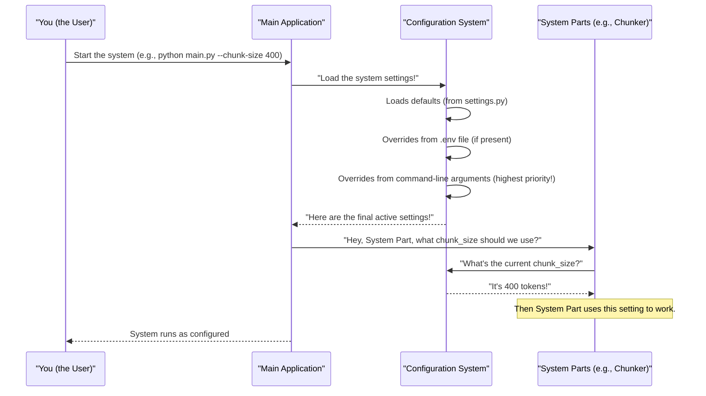

# Chapter 1: Configuration Management

Welcome to the `chuncking-system` tutorial! Imagine you have a new gadget, like a smart TV. When you first turn it on, it has default settings – maybe a certain brightness, a default language, and some pre-installed apps. But what if you want to change the brightness, switch the language, or uninstall an app? You wouldn't open the TV and rewire it, right? You'd use its remote control or on-screen menu!

In the world of software, we have something similar: **Configuration Management**. Think of it as the **remote control** or **central control panel** for our `chuncking-system`. It lets you tell the system *how* to behave without changing its core programming code.

#### What Problem Does Configuration Management Solve?

Our `chuncking-system` is designed to be super flexible. It can cut documents into pieces (chunks) in many different ways. For example:

*   You might want **small chunks** for a quick AI question-and-answer system.
*   You might need **larger chunks** for deep analysis of an entire section.
*   You might want to save the chunks in a specific **folder**, or as a different **file type**.
*   Perhaps you need to turn on or off special features like **caching** (remembering past results to speed things up) or **security checks**.

If these settings were "hard-coded" (meaning they are fixed inside the main program's logic), you'd have to edit the program's code every single time you wanted to change something. This is like rewiring your TV just to change the volume! It's difficult, risky, and makes it almost impossible for different users or different parts of your company to use the system in their own specific ways.

**Configuration Management** solves this by providing a simple, safe way to **customize the system's behavior without modifying its core logic.** It allows you (or anyone using the system) to easily adapt it for different needs and environments.

#### Your System's Control Panel: The `ChunkingConfig`

In our `chuncking-system`, the main blueprint for all these settings is a special Python class called `ChunkingConfig`. It defines what kinds of settings exist and what their default values are. You can find this blueprint in `src/config/settings.py`.

Let's look at a simplified version of it:

```python
# src/config/settings.py (simplified)
from pydantic_settings import BaseSettings

class ChunkingConfig(BaseSettings):
    # Default chunk sizes
    DEFAULT_CHUNK_SIZE: int = 800
    DEFAULT_CHUNK_OVERLAP: int = 150

    # Input and output locations
    INPUT_DIR: str = "data/input/markdown_files"
    OUTPUT_DIR: str = "data/output"

    # Feature switches (on/off)
    enable_caching: bool = True
    enable_security: bool = True

    class Config:
        # This tells our settings system to also look for values in a .env file
        env_file = ".env"

# This line creates a single, easy-to-access object for all our settings
config = ChunkingConfig()
```

This `settings.py` file acts as the "factory default settings" for your `chuncking-system`. It tells the system what to do unless you explicitly say otherwise. The `class Config: env_file = ".env"` line is very important: it means the system can also load settings from a `.env` file, which is often used for settings that change per environment or are sensitive (like secret keys).

#### How to Customize Settings (Using Your Remote Control)

Now, how do you actually use this "control panel" to change how the system works? There are a few ways, each with a different level of priority and convenience. Think of it like this: if you set a volume on your remote, but then mute the TV using a button on the TV itself, the TV button wins.

**Method 1: Using Environment Variables (via a `.env` file)**

For quick, system-wide overrides that don't involve changing code, you can use a `.env` file. This is a plain text file that usually sits in the main folder of your project (where `main.py` is).

Let's say you always want chunks to be `500` "tokens" (AI words) long, and you want to turn caching `off`. Create a file named `.env` in your project's main directory:

```bash
# .env file content
DEFAULT_CHUNK_SIZE=500
ENABLE_CACHING=False
```

Now, when you run any part of the system, it will automatically pick up these values from the `.env` file. This overrides the defaults from `src/config/settings.py`.

*What happens?* When the `config = ChunkingConfig()` line runs, it first reads the defaults, then checks the `.env` file and uses *those* values if they are present. So, `DEFAULT_CHUNK_SIZE` becomes `500`.

**Method 2: Command Line Arguments**

You can provide settings directly when you run the program from your terminal. This is great for making temporary changes just for *one specific run*.

```bash
python main.py \
  --input-file data/input/my_report.md \
  --chunk-size 400 \
  --output-dir my_report_chunks
```

*What happens here?*
*   `--input-file data/input/my_report.md`: Tells the system which file to process.
*   `--chunk-size 400`: This tells the system to use a chunk size of `400` *just for this specific execution*. This value will override anything set in `settings.py` or your `.env` file.
*   `--output-dir my_report_chunks`: This directs the system to save the results in a folder named `my_report_chunks` for this run.

Command line arguments usually have the highest priority, meaning they override `.env` files and the default `settings.py` values.

**Method 3: Direct Python API Usage (Most Control)**

If you're writing your own Python script to use the `chuncking-system` and want to set very specific parameters directly in your code, you can create a custom `ChunkingConfig` object and pass it to the main system "orchestrator" (we'll learn more about the [Document Chunking System (Orchestrator)](02_document_chunking_system__orchestrator__.md) in the next chapter!).

```python
from src.chunking_system import DocumentChunker # Our system's "project manager"
from src.config.settings import ChunkingConfig # Import our settings blueprint

# 1. Create your OWN custom settings object
my_special_config = ChunkingConfig(
    DEFAULT_CHUNK_SIZE=300,  # Make chunks very small for quick Q&A
    DEFAULT_CHUNK_OVERLAP=0, # No overlap for this special case
    enable_caching=False,    # Turn off caching for this specific process
    OUTPUT_DIR="my_tiny_chunks_output" # Save results here
)

# 2. Pass your custom settings to the Orchestrator
# The Orchestrator will now use these settings!
orchestrator = DocumentChunker(config=my_special_config)

# 3. Now, when you use the orchestrator, it respects your custom settings!
print(f"Using chunk size: {orchestrator.config.DEFAULT_CHUNK_SIZE}")
print(f"Caching enabled? {orchestrator.config.enable_caching}")
# (Imagine you then process a file using 'orchestrator.chunk_file(...)')
```

*What happens here?* You're explicitly telling *this specific instance* of the `DocumentChunker` exactly what settings to use. This gives you the most precise control over the system's behavior within your Python programs. If you don't pass a `config` object, the `DocumentChunker` will just use the global `config` instance that loads from `src/config/settings.py` and any `.env` overrides.

#### Under the Hood: How Configuration Connects

Let's imagine how the settings flow through our `chuncking-system`:



As you can see, the **Configuration System** acts like a central rulebook that all other parts of the system can ask for information.

When you start the system (either by running `main.py` or by creating a `DocumentChunker` in Python):
1.  The `ChunkingConfig` object in `src/config/settings.py` first loads all its *default* values.
2.  It then checks for a `.env` file and **overrides** any defaults with values found there.
3.  Finally, if you provided command-line arguments or directly passed a `ChunkingConfig` object in your Python code, those values **override everything else**. This creates a clear "priority" for settings.

All other parts of the `chuncking-system`, like the [Hybrid Chunking Engine](03_hybrid_chunking_engine_.md) or the [Security Framework](06_security_framework_.md), don't need to know *how* you set the values. They just ask the Configuration System for the current settings, and they get the most up-to-date, active value.

Here's a peek at how the [Hybrid Chunking Engine](03_hybrid_chunking_engine_.md) uses these settings:

```python
# src/chunkers/hybrid_chunker.py (simplified)

from src.config.settings import config # Import the global config instance

class HybridMarkdownChunker:
    def __init__(self, chunk_size: int = None, chunk_overlap: int = None):
        # If chunk_size is provided when creating the chunker (e.g., chunker = HybridMarkdownChunker(chunk_size=500)),
        # it uses that value.
        # OTHERWISE, it falls back to the system's global DEFAULT_CHUNK_SIZE from the config!
        self.chunk_size = chunk_size or config.DEFAULT_CHUNK_SIZE
        self.chunk_overlap = chunk_overlap or config.DEFAULT_CHUNK_OVERLAP
        
        # Other parts also use settings, like which headers to split on:
        # self.header_splitter = MarkdownHeaderTextSplitter(
        #     headers_to_split_on=config.HEADER_LEVELS, # Uses settings from config
        # )
```
In this snippet, `config.DEFAULT_CHUNK_SIZE` and `config.HEADER_LEVELS` are being read from our central `ChunkingConfig` object. This pattern is used throughout the system, ensuring that changes in your settings are immediately reflected in how the system operates.

#### Why is Configuration Management So Useful?

Configuration Management is a fundamental part of building flexible and easy-to-use software.

| Benefit             | Description                                                   | Analogy                                   |
| :------------------ | :------------------------------------------------------------ | :---------------------------------------- |
| **Flexibility**     | Easily change system behavior without touching core code.    | Changing your phone's screen brightness without reprogramming the phone. |
| **Adaptability**    | Use the same system for different tasks or environments.      | Driving the same car in "Eco Mode" for fuel saving or "Sport Mode" for speed. |
| **Maintainability** | All changeable settings are in one clear place, making updates and fixing issues easier. | All the controls for your car are on the dashboard, not hidden in the engine. |
| **Safety**          | Prevents accidental changes to core programming logic, reducing errors.   | Adjusting the volume on a stereo is safer than rewiring its speakers. |
| **Scalability**     | Easy to deploy and manage across many servers with different needs. | Setting up many identical coffee machines, but each can have custom brew settings. |

#### Conclusion

In this first chapter, we've explored **Configuration Management**, the central control panel for our `chuncking-system`. We learned how it allows us to customize everything from chunk sizes to feature toggles without touching the core code. We saw how to use `.env` files, command line arguments, and direct Python code to adjust settings, and we peeked under the hood to understand how these settings are loaded and used by different components.

This flexibility is incredibly powerful, making our system adaptable to a wide range of document processing needs.

Now that we understand how to tell the system *what to do*, let's dive into *what* the system actually does! In the next chapter, we'll meet the "project manager" of our system, the [Document Chunking System (Orchestrator)](02_document_chunking_system__orchestrator__.md), and see how it brings all these pieces together.

---

<sub><sup>Generated by [AI Codebase Knowledge Builder](https://github.com/The-Pocket/Tutorial-Codebase-Knowledge).</sup></sub> <sub><sup>**References**: [[1]](https://github.com/ai-rio/chuncking-system/blob/e1a233785e744443e919c2de3f68d87ab02216d1/docs/tutorial/Chapter 3: Configuration Management.md), [[2]](https://github.com/ai-rio/chuncking-system/blob/e1a233785e744443e919c2de3f68d87ab02216d1/main.py), [[3]](https://github.com/ai-rio/chuncking-system/blob/e1a233785e744443e919c2de3f68d87ab02216d1/src/config/settings.py)</sup></sub>
