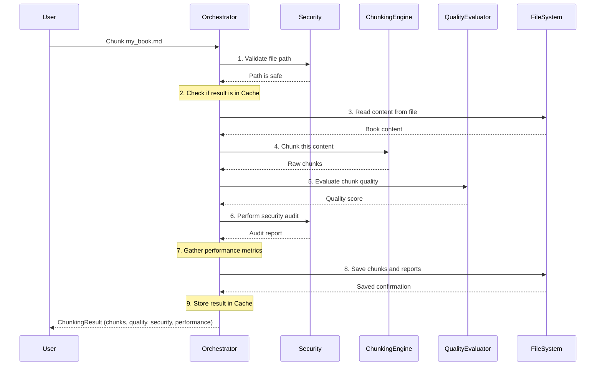

# Chapter 1: Document Chunking System (Orchestrator)

Welcome to the `chuncking-system` project! In this first chapter, we'll begin our journey by understanding the "brain" of the entire system: the **Document Chunking System (Orchestrator)**.

Imagine you have a giant, complex LEGO set that you need to build. This set comes with many different types of bricks, instructions, and even a quality checker. If you just dump all the pieces on the floor, it's a mess! You need a **project manager** to organize everything.

That's exactly what our Document Chunking System (Orchestrator) does for documents!

#### What Problem Does the Orchestrator Solve?

Let's say you have a massive digital book – maybe hundreds or thousands of pages – in a Markdown file. You want to use this book to answer questions with an Artificial Intelligence (AI) model, like one used in a Retrieval-Augmented Generation (RAG) system. AI models can't read entire books at once; they need smaller, manageable pieces of text. These smaller pieces are called "chunks."

But simply cutting a book into fixed-size pieces isn't enough. You need to:
*   Make sure the pieces are meaningful (e.g., don't cut a sentence in half).
*   Check if the pieces are of good quality (not too short, not too long, relevant).
*   Handle the document securely.
*   Keep track of how well the system is performing.

This is where the **Document Chunking System (Orchestrator)** comes in. It's the central brain that manages this entire process, ensuring your big book is broken down into high-quality, secure, and useful chunks.

#### The Orchestrator: Your Project Manager

Think of the Orchestrator as the **project manager** for processing your document. It doesn't do all the work itself, but it knows *who* needs to do *what* and *when*. It directs specialized teams to get the job done.

Here are its key responsibilities:

1.  **Receiving the Document**: It takes your input document (like a big Markdown file).
2.  **Directing Chunking**: It tells the [Hybrid Chunking Engine](02_hybrid_chunking_engine_.md) to carefully cut the document into smaller chunks.
3.  **Evaluating Quality**: It asks the [Chunk Quality Evaluator](04_chunk_quality_evaluator_.md) to check if the generated chunks are good enough.
4.  **Ensuring Security**: It coordinates with the [Security Framework](05_security_framework_.md) to make sure the document is handled safely and securely.
5.  **Monitoring Performance**: It keeps an eye on how fast and efficiently everything is running (with help from [Enterprise Observability & Monitoring](06_enterprise_observability___monitoring_.md)).
6.  **Saving Results**: Finally, it makes sure the high-quality, secure chunks are saved properly using [File & Path Utilities](07_file___path_utilities_.md).

In short, the Orchestrator pulls all the different parts of our `chuncking-system` project together to deliver a complete, high-quality result.

#### How to Use the Orchestrator

Let's see how you can use the Orchestrator to process your own Markdown book. The primary way to interact with the Orchestrator directly in Python is through the `DocumentChunker` class, located in `src/chunking_system.py`.

You can also use the system from your command line, which `main.py` handles, acting as a simplified interface to the Orchestrator.

**Command Line Usage (Simple)**

For quick use, you can run the `main.py` script from your terminal. This script uses the Orchestrator internally.

```bash
python main.py \
  --input-file data/input/markdown_files/your_book.md \
  --output-dir my_chunks \
  --chunk-size 800 \
  --format json
```

What happens here?
*   `python main.py`: Runs our main program.
*   `--input-file ...`: Tells the Orchestrator *which* book file to process.
*   `--output-dir ...`: Specifies *where* to save the resulting chunks and reports.
*   `--chunk-size 800`: Sets the approximate maximum size of each chunk (in AI "tokens").
*   `--format json`: Tells it to save the chunks as a JSON file.

After running this, you'll find a new folder `my_chunks` with your processed chunks and a report on their quality!

**Python API Usage (More Control)**

If you're writing your own Python code and want more direct control, you can import and use the `DocumentChunker` class.

First, you need to set up your Python environment. Make sure `src` is accessible (the `main.py` script already handles this by adding `src` to the path).

```python
from src.chunking_system import DocumentChunker # Import the Orchestrator!
from pathlib import Path

# 1. Prepare your input file path
book_file_path = Path('data/input/markdown_files/your_book.md')

# 2. Create an instance of the Orchestrator
# You can customize its behavior using the config settings.
orchestrator = DocumentChunker()

# 3. Tell the Orchestrator to chunk your file!
# It will handle everything: reading, chunking, evaluating, etc.
chunking_result = orchestrator.chunk_file(book_file_path)

# 4. Check the results
if chunking_result.success:
    print(f"Successfully chunked {len(chunking_result.chunks)} pieces!")
    print(f"Overall Quality Score: {chunking_result.quality_metrics['overall_score']:.1f}/100")
    # You can now access chunking_result.chunks for the actual chunks
else:
    print(f"Failed to chunk: {chunking_result.error_message}")
```

This short example shows how simple it is to kick off the entire process using the `DocumentChunker` (our Orchestrator). You give it a file, and it gives you back the chunks along with detailed information about them.

#### Under the Hood: How the Orchestrator Works

Let's peel back a layer and see what happens when you call `orchestrator.chunk_file(book_file_path)`.

Imagine our "project manager" (the Orchestrator) receiving a new task: "Chunk this document!".

Here's a simplified step-by-step sequence:

1.  **Receive Task**: The Orchestrator gets the `book_file_path`.
2.  **Security Check (Gatekeeper)**: It first sends the file path to the [Security Framework](05_security_framework_.md) team. "Is this file safe to process? Is the path valid?"
3.  **Cache Check (Memory)**: Has this file been processed recently with the exact same settings? The Orchestrator checks its internal "memory" (cache). If yes, it quickly returns the old result!
4.  **Read Content (Librarian)**: If not in cache, it asks the [File & Path Utilities](07_file___path_utilities_.md) to safely read the document's content.
5.  **Chunking (The Builder Team)**: Now with the content, it passes it to the [Hybrid Chunking Engine](02_hybrid_chunking_engine_.md). "Here's the book, break it into smart pieces!"
6.  **Quality Evaluation (The Inspector)**: Once the chunks are ready, the Orchestrator sends them to the [Chunk Quality Evaluator](04_chunk_quality_evaluator_.md). "Are these chunks good quality? Are they coherent?"
7.  **Final Security Audit (The Auditor)**: It performs a final check on the processed data.
8.  **Performance Tracking (The Stopwatch)**: Throughout all these steps, the Orchestrator is using [Enterprise Observability & Monitoring](06_enterprise_observability___monitoring_.md) to measure how long each step takes and how much memory is used.
9.  **Bundle Results**: It collects all the chunks, quality scores, security reports, and performance data into a neat package (`ChunkingResult`).
10. **Save & Cache**: It saves the results to your specified output location (using [File & Path Utilities](07_file___path_utilities_.md)) and also stores them in its cache for next time.
11. **Report Back**: Finally, it returns the `ChunkingResult` to you.

Here's a simple diagram illustrating this flow:



#### Diving into the Code

The main logic for the Orchestrator is within the `DocumentChunker` class in `src/chunking_system.py`.

Let's look at a simplified version of the `chunk_file` method:

```python
# src/chunking_system.py (simplified)

class DocumentChunker:
    def __init__(self, config: Optional[ChunkingConfig] = None):
        self.config = config or ChunkingConfig()
        # Initialize other components (chunker, evaluator, security, monitoring)
        # These are like the "teams" the Orchestrator manages.
        self.hybrid_chunker = HybridMarkdownChunker(...)
        self.quality_evaluator = ChunkQualityEvaluator()
        # ... and so on

    def chunk_file(self, file_path: Union[str, Path],
                   metadata: Optional[Dict[str, Any]] = None) -> ChunkingResult:
        start_time = time.time()
        try:
            # 1. Security validation (if enabled in config)
            if self.config.enable_security:
                file_path = self._validate_file_security(file_path)

            # 2. Cache check (if enabled)
            if self.config.enable_caching and self._is_cached(file_path, metadata):
                return self._get_from_cache(file_path, metadata)

            # 3. Read file content
            content = self._read_file_safely(file_path)

            # 4. Perform chunking using the Hybrid Chunking Engine
            chunks = self.hybrid_chunker.chunk_document(content, metadata)

            # 5. Evaluate quality using the Chunk Quality Evaluator
            quality_metrics = self.quality_evaluator.evaluate_chunks(chunks)

            # 6. Perform security audit (if enabled)
            security_audit = self._perform_security_audit(file_path)

            # 7. Collect performance metrics
            performance_metrics = self._collect_performance_metrics()

            # Create and return the result object
            return ChunkingResult(
                chunks=chunks,
                metadata=metadata,
                performance_metrics=performance_metrics,
                quality_metrics=quality_metrics,
                security_audit=security_audit,
                processing_time_ms=(time.time() - start_time) * 1000,
                success=True,
                file_path=file_path
            )
        except Exception as e:
            # Handle any errors gracefully and return a failed result
            return ChunkingResult(chunks=[], success=False, error_message=str(e))

```

*   **`__init__`**: When you create a `DocumentChunker`, it sets up all its "teams" (like the `hybrid_chunker`, `quality_evaluator`, `security_auditor`, etc.) based on the settings you provide in the [Configuration Management](03_configuration_management_.md).
*   **`chunk_file`**: This is the core method. It follows the project manager's flow we discussed: validation, caching, reading, chunking, evaluating, auditing, and finally bundling all the information into a `ChunkingResult`. Notice how it calls methods on `self.hybrid_chunker` and `self.quality_evaluator` – it's delegating tasks to its specialized "teams."

This modular approach means each "team" (like the [Hybrid Chunking Engine](02_hybrid_chunking_engine_.md) or [Chunk Quality Evaluator](04_chunk_quality_evaluator_.md)) can focus on its specific job, making the overall system easier to understand, maintain, and improve. The Orchestrator just needs to know *how* to coordinate them.

| Orchestrator Responsibility | Coordinated Component / Feature                                         | Covered in Chapter                                        |
| :-------------------------- | :---------------------------------------------------------------------- | :-------------------------------------------------------- |
| Directing Chunking          | `HybridMarkdownChunker`                                                 | [Hybrid Chunking Engine](02_hybrid_chunking_engine_.md)   |
| Evaluating Quality          | `ChunkQualityEvaluator`                                                 | [Chunk Quality Evaluator](04_chunk_quality_evaluator_.md) |
| Ensuring Security           | `SecurityConfig`, `PathSanitizer`, `FileValidator`, `SecurityAuditor` | [Security Framework](05_security_framework_.md)           |
| Monitoring Performance      | `SystemMonitor`, `PerformanceMonitor`, `MemoryOptimizer`                | [Enterprise Observability & Monitoring](06_enterprise_observability___monitoring_.md) |
| Saving/Loading Data         | `FileHandler`, `PathSanitizer`                                          | [File & Path Utilities](07_file___path_utilities_.md)     |
| System Settings             | `ChunkingConfig`                                                        | [Configuration Management](03_configuration_management_.md) |

This table shows how the Orchestrator relies on and coordinates with the other major components of our system, each of which will be explored in detail in upcoming chapters.

#### Conclusion

In this chapter, we've learned that the **Document Chunking System (Orchestrator)** is the central brain and project manager of our `chuncking-system`. It takes a document, coordinates all the necessary steps like chunking, quality evaluation, and security checks, and then delivers a comprehensive result. We saw how to use it both from the command line and directly in Python.

Now that we understand *what* the Orchestrator does and *how* it delegates tasks, let's dive into the first "team" it directs: the crucial task of splitting documents.

Ready to see how the actual cutting and structuring of documents happens? Let's move on to explore the [Hybrid Chunking Engine](02_hybrid_chunking_engine_.md)!

---

<sub><sup>Generated by [AI Codebase Knowledge Builder](https://github.com/The-Pocket/Tutorial-Codebase-Knowledge).</sup></sub> <sub><sup>**References**: [[1]](https://github.com/ai-rio/chuncking-system/blob/34705b324f6b2c41c349afa9662fbea086940ff9/README.md), [[2]](https://github.com/ai-rio/chuncking-system/blob/34705b324f6b2c41c349afa9662fbea086940ff9/main.py), [[3]](https://github.com/ai-rio/chuncking-system/blob/34705b324f6b2c41c349afa9662fbea086940ff9/src/chunking_system.py)</sup></sub>
