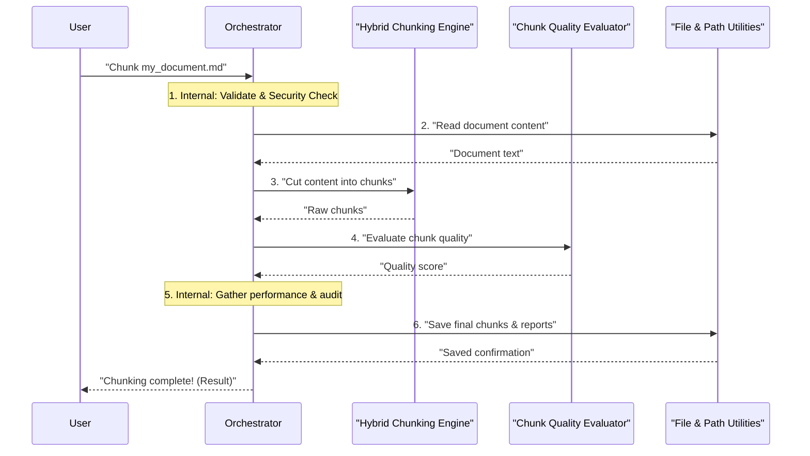

# Chapter 2: Document Chunking System (Orchestrator)

Welcome back! In [Chapter 1: Configuration Management](01_configuration_management_.md), we learned how to customize our `chuncking-system` using settings, much like using a remote control for your TV. We saw how `ChunkingConfig` helps us tell the system *what* to do – for example, how big chunks should be or where to save them.

Now, it's time to meet the "brain" that takes these settings and makes things happen: the **Document Chunking System (Orchestrator)**.

#### What Problem Does the Orchestrator Solve?

Imagine you have a huge, complex project to complete, like building a custom robot. You have different teams responsible for different parts:
*   One team designs the robot's body.
*   Another team works on its computer brain.
*   A third team checks if all parts meet quality standards.
*   And a security team ensures no one tampers with the designs.

If these teams worked completely separately, it would be chaotic! You need a **project manager** to coordinate them, tell them what to do, ensure they work together, and make sure the final robot is built correctly and safely.

That's exactly what our **Document Chunking System (Orchestrator)** does for documents!

Our `chuncking-system` needs to do more than just cut a document into pieces. It needs to:
*   Read the original document safely.
*   Cut it into smart, meaningful chunks.
*   Check if those chunks are of high quality.
*   Make sure the entire process is secure.
*   Keep track of how well the system is performing.
*   Save the final chunks in the right place.

The Orchestrator is the central "brain" or **project manager** that handles all of this. You tell the Orchestrator which document to process, and it intelligently directs the entire workflow, ensuring everything runs smoothly and securely. It doesn't do the detailed cutting or checking itself; it tells the specialized parts to do their jobs and brings all their work together.

#### The Orchestrator: Your Project Manager in Action

Think of the Orchestrator as the **central control hub** for document processing. It's the `DocumentChunker` class within our system.

Here are its key responsibilities:

1.  **Receiving the Document**: It takes your input document (like a large Markdown file).
2.  **Delegating Chunking**: It tells the [Hybrid Chunking Engine](03_hybrid_chunking_engine_.md) to carefully cut the document into smaller, meaningful pieces.
3.  **Requesting Quality Evaluation**: It asks the [Chunk Quality Evaluator](05_chunk_quality_evaluator_.md) to check if the generated chunks are good enough.
4.  **Coordinating Security**: It interacts with the [Security Framework](06_security_framework_.md) to ensure the document is handled safely from start to finish.
5.  **Gathering Performance Data**: It uses features from [Enterprise Observability & Monitoring](09_enterprise_observability___monitoring_.md) to track how fast and efficiently everything is running.
6.  **Managing File Operations**: It uses [File & Path Utilities](07_file___path_utilities_.md) to read the input document and save the final, high-quality chunks.

In essence, the Orchestrator ensures that your big document is correctly processed, evaluated, secured, and saved.

#### How to Use the Orchestrator

You can interact with the Orchestrator in two main ways: through a simple command in your terminal or directly in your Python code for more control.

**Command Line Usage (Simple)**

For quick tasks, you can use the `main.py` script. This script acts as a user-friendly wrapper that internally uses the Orchestrator.

```bash
python main.py \
  --input-file data/input/markdown_files/my_favorite_book.md \
  --output-dir my_book_chunks \
  --chunk-size 700 \
  --format json
```

**What happens here?**
*   `python main.py`: This runs our main program.
*   `--input-file ...`: You're telling the Orchestrator *which* book file to process.
*   `--output-dir ...`: You're telling it *where* to save the resulting chunks and reports.
*   `--chunk-size 700`: This sets the approximate maximum size for each chunk (in AI "tokens"). This is an example of using the configuration we learned about in [Chapter 1](01_configuration_management_.md).
*   `--format json`: This tells the system to save the chunks as a JSON file.

After running this, the Orchestrator will spring into action, coordinating all the teams. You'll find a new folder `my_book_chunks` with your processed chunks and a report on their quality!

**Python API Usage (More Control)**

If you're writing your own Python scripts and need more direct control, you can import and use the `DocumentChunker` class (our Orchestrator) directly.

```python
from src.chunking_system import DocumentChunker
from pathlib import Path

# 1. Prepare your input file path
my_book_path = Path('data/input/markdown_files/my_great_novel.md')

# 2. Create an instance of the Orchestrator
# It will automatically use the default settings or load from your .env file
orchestrator = DocumentChunker()

# 3. Tell the Orchestrator to chunk your file!
# It handles everything behind the scenes.
chunking_result = orchestrator.chunk_file(my_book_path)

# What happens next?
# The orchestrator runs the entire process. The 'chunking_result'
# object will contain the chunks, quality scores, and other details.
if chunking_result.success:
    print(f"✅ Successfully chunked {len(chunking_result.chunks)} pieces!")
    print(f"Overall Quality Score: {chunking_result.quality_metrics['overall_score']:.1f}/100")
    # You can now access chunking_result.chunks for the actual chunks
    # or chunking_result.performance_metrics for timings.
else:
    print(f"❌ Failed to chunk: {chunking_result.error_message}")
```

This short example shows how simple it is to kick off the entire process using the `DocumentChunker`. You give it a file path, and it gives you back the chunks along with detailed information about the processing.

#### Under the Hood: How the Orchestrator Works

Let's peek behind the curtain and see what happens when you call `orchestrator.chunk_file(my_book_path)`.

Imagine our "project manager" (the Orchestrator) receiving a new task: "Chunk this document!". Here's a simplified sequence of steps it takes:

1.  **Receive Task**: The Orchestrator gets the file path of your document.
2.  **Internal Checks**: It first performs internal checks, like validating the file path and doing initial security scans (e.g., checking for dangerous file types). It also checks if it has processed this *exact* file with the *exact* same settings before (caching) to save time!
3.  **Read Content**: If not cached, it then asks the [File & Path Utilities](07_file___path_utilities_.md) to safely read the document's content.
4.  **Delegate Chunking**: With the document content in hand, it passes it to the [Hybrid Chunking Engine](03_hybrid_chunking_engine_.md). "Here's the book, break it into smart pieces based on our settings!"
5.  **Delegate Quality Evaluation**: Once the chunks are ready, the Orchestrator sends them to the [Chunk Quality Evaluator](05_chunk_quality_evaluator_.md). "Are these chunks good quality? Are they coherent?"
6.  **Gather Final Data**: It collects results from the chunking and evaluation teams. It also performs a final security audit on the processed data and gathers all performance metrics using [Enterprise Observability & Monitoring](09_enterprise_observability___monitoring_.md).
7.  **Save & Cache**: Finally, it makes sure the high-quality, secure chunks are saved properly to your specified output location using [File & Path Utilities](07_file___path_utilities_.md), and also stores them in its internal cache for future use.
8.  **Report Back**: It bundles all the chunks, quality scores, security reports, and performance data into a neat `ChunkingResult` package and returns it to you.

Here's a simple diagram illustrating this flow:



The Orchestrator is responsible for coordinating the various specialized components that make our `chuncking-system` powerful and reliable. Each of these components will be explored in detail in upcoming chapters.

| Orchestrator Responsibility   | Coordinated Component / Feature                                         | Covered in Chapter                                        |
| :---------------------------- | :---------------------------------------------------------------------- | :-------------------------------------------------------- |
| Delegating Chunking           | `HybridMarkdownChunker`                                                 | [Hybrid Chunking Engine](03_hybrid_chunking_engine_.md)   |
| Requesting Quality Evaluation | `ChunkQualityEvaluator`                                                 | [Chunk Quality Evaluator](05_chunk_quality_evaluator_.md) |
| Coordinating Security         | `SecurityConfig`, `PathSanitizer`, `FileValidator`, `SecurityAuditor` | [Security Framework](06_security_framework_.md)           |
| Gathering Performance Data    | `SystemMonitor`, `PerformanceMonitor`, `MemoryOptimizer`                | [Enterprise Observability & Monitoring](09_enterprise_observability___monitoring_.md) |
| Managing File Operations      | `FileHandler`, `PathSanitizer`                                          | [File & Path Utilities](07_file___path_utilities_.md)     |
| Applying System Settings      | `ChunkingConfig`                                                        | [Configuration Management](01_configuration_management_.md) |

#### Diving into the Code

The core logic for our Orchestrator lives in the `DocumentChunker` class, which you can find in `src/chunking_system.py`.

Let's look at how the Orchestrator is set up and how its main `chunk_file` method works in a very simplified way:

**1. Setting up the Orchestrator (`__init__` method)**

When you create a `DocumentChunker` object, it initializes all the "teams" (other components) it needs to manage.

```python
# src/chunking_system.py (simplified __init__)
from src.config.settings import ChunkingConfig
from src.chunkers.hybrid_chunker import HybridMarkdownChunker
from src.chunkers.evaluators import ChunkQualityEvaluator # Evaluator is in 'evaluators' module

class DocumentChunker:
    def __init__(self, config: Optional[ChunkingConfig] = None):
        # The Orchestrator uses the settings we learned about in Chapter 1.
        self.config = config or ChunkingConfig()

        # It creates instances of its "teams" or specialized components.
        # It passes relevant settings to them.
        self.hybrid_chunker = HybridMarkdownChunker(
            chunk_size=self.config.DEFAULT_CHUNK_SIZE,
            chunk_overlap=self.config.DEFAULT_CHUNK_OVERLAP
        )
        self.quality_evaluator = ChunkQualityEvaluator()
        # ... Other components like security, caching, and monitoring
        #     are also initialized here if enabled in the config.
```
In this snippet, when you create `orchestrator = DocumentChunker()`, it automatically sets up the `hybrid_chunker` and `quality_evaluator` using the `DEFAULT_CHUNK_SIZE` and `DEFAULT_CHUNK_OVERLAP` values from your `ChunkingConfig` (which we discussed in [Chapter 1](01_configuration_management_.md)).

**2. The Main Workflow Method (`chunk_file`)**

This is the central method where the Orchestrator coordinates all the tasks.

```python
# src/chunking_system.py (simplified chunk_file)
# ... (imports and __init__ method)

class DocumentChunker:
    # ... (init method)

    def chunk_file(self, file_path: Path, metadata: Optional[Dict[str, Any]] = None) -> ChunkingResult:
        try:
            # 1. Internal checks & reading (delegates to helper methods)
            #    This includes security validation and caching.
            content = self._read_file_safely(file_path)

            # 2. Tell the Hybrid Chunking Engine to do the actual cutting.
            chunks = self.hybrid_chunker.chunk_document(content, metadata)

            # 3. Ask the Chunk Quality Evaluator for its assessment.
            quality_metrics = self.quality_evaluator.evaluate_chunks(chunks)

            # 4. Perform final security audit (if enabled).
            security_audit = self._perform_security_audit(file_path)

            # 5. Gather performance metrics from the monitoring system.
            performance_metrics = self._collect_performance_metrics()

            # 6. Bundle all the results into one object to return.
            result = ChunkingResult(
                chunks=chunks,
                metadata=metadata,
                performance_metrics=performance_metrics,
                quality_metrics=quality_metrics,
                security_audit=security_audit,
                success=True,
                file_path=file_path
            )

            # Store the result in cache for next time (if caching is on).
            # self.cache_manager.memory_cache.put(...)

            return result

        except Exception as e:
            # If anything goes wrong, catch the error and return a failure result.
            return ChunkingResult(chunks=[], success=False, error_message=str(e))

```
In this simplified `chunk_file` method, notice how the `DocumentChunker` (Orchestrator) doesn't implement the `chunk_document` logic itself. Instead, it calls `self.hybrid_chunker.chunk_document(...)` – effectively telling its "Hybrid Chunking Engine" team to do that specific job. The same goes for quality evaluation (`self.quality_evaluator.evaluate_chunks(...)`) and other tasks. This delegation makes the system modular and easy to understand.

#### Conclusion

In this chapter, we've introduced the **Document Chunking System (Orchestrator)**, the central brain and project manager of our `chuncking-system`. We learned how it takes your document, coordinates all the necessary steps like smart chunking, quality evaluation, and security checks, and then delivers a comprehensive result. We explored how to use it both from the command line and directly in Python code.

Understanding the Orchestrator's role as a coordinator is key to grasping how the entire system works together. Now that we know *who* manages the project, let's dive into the first crucial "team" it directs: the actual process of splitting documents.

Ready to see how the cutting and structuring of documents happens? Let's move on to explore the [Hybrid Chunking Engine](03_hybrid_chunking_engine_.md)!

---

<sub><sup>Generated by [AI Codebase Knowledge Builder](https://github.com/The-Pocket/Tutorial-Codebase-Knowledge).</sup></sub> <sub><sup>**References**: [[1]](https://github.com/ai-rio/chuncking-system/blob/e1a233785e744443e919c2de3f68d87ab02216d1/docs/tutorial/Chapter 1: Document Chunking System (Orchestrator).md), [[2]](https://github.com/ai-rio/chuncking-system/blob/e1a233785e744443e919c2de3f68d87ab02216d1/main.py), [[3]](https://github.com/ai-rio/chuncking-system/blob/e1a233785e744443e919c2de3f68d87ab02216d1/src/chunking_system.py)</sup></sub>
