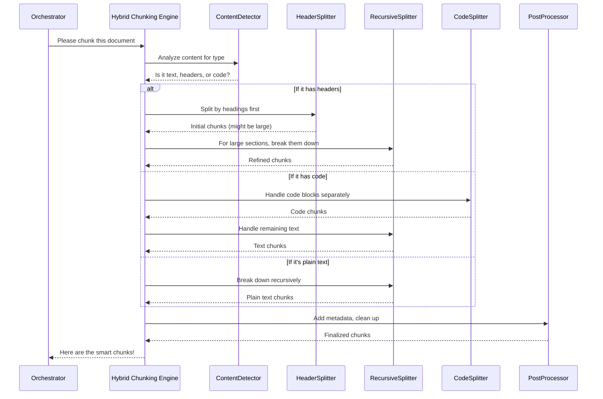

# Chapter 2: Hybrid Chunking Engine

Welcome back! In [Chapter 1: Document Chunking System (Orchestrator)](01_document_chunking_system__orchestrator__.md), we learned that the Orchestrator is the "project manager" of our system. It doesn't do all the detailed work itself, but it knows which "teams" to call for specific tasks.

Today, we're diving into one of the most important "teams" the Orchestrator relies on: the **Hybrid Chunking Engine**. This is the smart part of our system that takes your large documents and carefully breaks them into smaller, meaningful pieces.

#### What Problem Does the Hybrid Chunking Engine Solve?

Imagine you have a huge digital book, like a textbook or a technical manual, in Markdown format. You want to feed this book to an AI (like the kind used in a RAG system) so it can answer questions based on its content.

The problem is, AI models can't read entire books at once. They need smaller, manageable "chunks" of text. But here's the tricky part: if you just cut the book into pieces of exactly 500 words, you might:
*   Cut a sentence in half.
*   Separate a header from its content.
*   Break a code example in the middle.

This would make the chunks confusing and less useful for the AI! It's like trying to understand a recipe when half the ingredients list is on one page and the other half is on the next, with a random chapter title in between.

The **Hybrid Chunking Engine** solves this by acting like a highly skilled editor. It intelligently looks at the structure of your document (like headings, code blocks, or regular paragraphs) and decides the best places to "cut" to keep the meaning and context intact.

#### What Does "Hybrid" Mean Here?

The "Hybrid" in Hybrid Chunking Engine means it uses **multiple smart ways** to break down your document. Instead of just one cutting rule, it has several specialized tools, and it chooses the best tool for each part of your document.

Think of it like a chef with different knives:
*   A **big chef's knife** for cutting large sections.
*   A **pairing knife** for delicate, detailed cuts.
*   A **bread knife** for tricky crusty loaves.

Our Hybrid Chunking Engine uses different "knives" (chunking strategies) depending on what kind of content it finds:

1.  **Header-Based Splitting**: This is like using the table of contents to guide your cuts. If your document has headings (like `# Chapter`, `## Section`, `### Subsection`), this strategy tries to keep each section or subsection together as a chunk. It's great for structured documents.

2.  **Code-Aware Splitting**: When the engine sees a code block (like text wrapped in ```` ``` ````), it uses a special strategy designed for code. This helps prevent breaking code examples in confusing ways, keeping the full code snippet or logical parts of it together.

3.  **Recursive Splitting**: This is the general-purpose "fallback" knife. If a section is still too large *after* header-based splitting, or if there are no headers or code blocks, this strategy recursively breaks down the text into smaller pieces. It tries to split at natural breaks like paragraphs, sentences, or even individual characters if absolutely necessary, always aiming to stay within your desired chunk size.

By combining these strategies, the Hybrid Chunking Engine creates chunks that are much more useful and meaningful for AI models.

#### How to Use the Hybrid Chunking Engine

You can use the Hybrid Chunking Engine directly to chunk any Markdown content. Let's see how!

First, you need to import the `HybridMarkdownChunker` class and prepare some example Markdown content.

```python
from src.chunkers.hybrid_chunker import HybridMarkdownChunker

# Our example document (a very mini book chapter)
my_markdown_content = """
# Chapter 1: Introduction

Welcome to our project! This chapter introduces the core ideas.

## What is Document Chunking?
Document chunking is the process of breaking down large documents into smaller, manageable pieces called 'chunks'. This is essential for AI models.

### Example Code
```python
def chunk_text(text, size):
    # This is a dummy function
    return [text[i:i+size] for i in range(0, len(text), size)]
```

This code snippet shows a very basic way to cut text. However, our system does it much smarter!

"""

print(my_markdown_content)
```
This is our example `my_markdown_content`. Notice it has a main heading (`#`), a subheading (`##`), and even a Python code block (` ```python `).

Now, let's create an instance of our `HybridMarkdownChunker` and use it:

```python
# Create an instance of the Hybrid Chunking Engine
# We tell it our preferred chunk size and overlap (how much chunks can share)
chunker = HybridMarkdownChunker(
    chunk_size=500,     # Target chunk size in "tokens" (AI words)
    chunk_overlap=50    # How much overlap between chunks
)

# Tell the chunker to break down our content!
# We can also add some initial info (metadata) about the content.
chunks = chunker.chunk_document(
    my_markdown_content,
    {'source': 'example_book.md', 'chapter': 'Introduction'}
)

# Let's see what chunks it created!
for i, chunk in enumerate(chunks):
    print(f"--- Chunk {i+1} ---")
    print(chunk.page_content)
    print(f"Metadata: {chunk.metadata}")
    print("-" * 20)
```
When you run this code, you'll see the `my_markdown_content` broken into multiple `Document` objects. Each `Document` has:
*   `page_content`: The actual text of the chunk.
*   `metadata`: Extra information about the chunk, like its source, original headers, and automatically calculated details like token count and a unique `chunk_index`.

You'll notice that the engine intelligently keeps the `# Chapter 1: Introduction` with its introductory text, and the `## What is Document Chunking?` heading with its explanation. Crucially, the ```` ```python ```` code block will likely be kept in its own chunk or mostly intact, even if it's very short, because the `Code-Aware Splitting` strategy prioritizes preserving code blocks.

This example shows how easy it is to get semantically coherent chunks using the `HybridMarkdownChunker`.

#### Under the Hood: How the Engine Works

Let's peek behind the curtain to understand how the Hybrid Chunking Engine intelligently decides where to cut.

Imagine the Orchestrator has handed over a big document to our Hybrid Chunking Engine:



As you can see, the process involves a few key steps:

1.  **Content Detection**: The engine first "reads" the document to figure out what kind of content it primarily contains (e.g., Markdown headers, code blocks, or just plain text).
2.  **Strategy Selection**: Based on the content analysis, it chooses the most appropriate chunking strategy (Header-Based, Code-Aware, or Recursive).
3.  **Splitting**: It uses specialized tools (called "splitters") to perform the actual cuts according to the chosen strategy.
4.  **Refinement & Post-processing**: After the initial cuts, it refines the chunks (e.g., breaking down very large chunks further) and adds useful information (metadata) like the chunk's index, token count, and character count.

#### Diving into the Code

The core logic for the Hybrid Chunking Engine is found in `src/chunkers/hybrid_chunker.py`.

Let's look at how it sets up its "tools" (the splitters) and how it makes decisions:

```python
# src/chunkers/hybrid_chunker.py (simplified)

from langchain_text_splitters import (
    MarkdownHeaderTextSplitter,
    RecursiveCharacterTextSplitter,
    PythonCodeTextSplitter
)
from src.config.settings import config # Import settings for configuration

class HybridMarkdownChunker:
    def __init__(self, chunk_size: int = None, chunk_overlap: int = None):
        self.chunk_size = chunk_size or config.DEFAULT_CHUNK_SIZE
        self.chunk_overlap = chunk_overlap or config.DEFAULT_CHUNK_OVERLAP
        
        # --- Setting up the "knives" (splitters) ---
        # 1. For headers: uses settings from src/config/settings.py
        self.header_splitter = MarkdownHeaderTextSplitter(
            headers_to_split_on=config.HEADER_LEVELS,
            strip_headers=False
        )

        # 2. For general text:
        self.recursive_splitter = RecursiveCharacterTextSplitter(
            chunk_size=self.chunk_size,
            chunk_overlap=self.chunk_overlap,
            # We use a custom function to count tokens for AI models
            length_function=self._token_length,
            separators=config.SEPARATORS # Defines where it prefers to split
        )

        # 3. For Python code:
        self.code_splitter = PythonCodeTextSplitter(
            chunk_size=self.chunk_size,
            chunk_overlap=self.chunk_overlap
        )

    # ... (other methods)
```
In the `__init__` method, the `HybridMarkdownChunker` prepares all its specialized "splitters." Notice it uses `config.HEADER_LEVELS` and `config.SEPARATORS` from the [Configuration Management](03_configuration_management_.md) system, allowing you to easily customize its behavior without changing the code itself.

Next, let's see how `chunk_document` decides which splitting strategy to use:

```python
# src/chunkers/hybrid_chunker.py (simplified)

class HybridMarkdownChunker:
    # ... (init method)

    def _detect_content_type(self, content: str) -> Dict[str, bool]:
        """Analyzes content to determine if it has headers, code, etc."""
        return {
            'has_headers': bool(re.search(r'^#+\s', content, re.MULTILINE)),
            'has_code': '```' in content,
            # ... (other detection logic)
        }

    def chunk_document(self, content: str, metadata: Dict[str, Any] = None) -> List[Document]:
        # ... (performance monitoring, input validation)

        content_analysis = self._detect_content_type(content)

        # --- Decision making: Which strategy to use? ---
        if content_analysis['has_headers']:
            # If it has headers, try to split by them first
            return self._header_recursive_chunking(content, metadata, content_analysis)
        elif content_analysis['has_code']:
            # If it has code, use the special code splitter
            return self._code_aware_chunking(content, metadata)
        else:
            # Otherwise, use the general-purpose recursive splitter
            return self._simple_recursive_chunking(content, metadata)
            
    # ... (other internal splitting methods like _header_recursive_chunking)
```
The `_detect_content_type` method helps the engine "look" at the document and identify its key features. Then, based on this analysis, the `chunk_document` method intelligently calls the appropriate internal function (`_header_recursive_chunking`, `_code_aware_chunking`, or `_simple_recursive_chunking`) to perform the actual splitting.

Finally, after any of these splitting methods produce raw chunks, they go through a post-processing step:

```python
# src/chunkers/hybrid_chunker.py (simplified)

class HybridMarkdownChunker:
    # ... (init, chunk_document, splitting methods)

    def _post_process_chunks(self, chunks: List[Document]) -> List[Document]:
        """Adds useful metadata to each chunk and cleans them up."""
        processed_chunks = []
        chunk_index = 0

        for chunk in chunks:
            # Skip very short chunks (as defined in config)
            if len(chunk.page_content.strip()) < config.MIN_CHUNK_WORDS:
                continue

            # Add more details to each chunk's metadata
            chunk.metadata['chunk_index'] = chunk_index
            chunk.metadata['chunk_tokens'] = self._token_length(chunk.page_content)
            chunk.metadata['chunk_chars'] = len(chunk.page_content)
            chunk.metadata['word_count'] = len(chunk.page_content.split())

            processed_chunks.append(chunk)
            chunk_index += 1 # Only increment for valid chunks

        return processed_chunks
```
The `_post_process_chunks` method ensures that every chunk has consistent and useful metadata, which is crucial for later steps like evaluation (in [Chunk Quality Evaluator](04_chunk_quality_evaluator_.md)) or when using these chunks with AI models.

#### Conclusion

In this chapter, we explored the **Hybrid Chunking Engine**, the intelligent editor of our `chuncking-system`. We learned that it uses multiple strategies – header-based, code-aware, and recursive splitting – to break down large documents into semantically coherent and useful chunks. We saw how to use it directly in Python and got a glimpse into its internal workings, from content detection to strategy selection and post-processing.

This engine is vital because it ensures that the "pieces" of your document are meaningful, which directly impacts how well an AI can understand and use them.

Now that we know how to cut documents smartly, how do we know if our cuts are good? Let's move on to the next chapter to discover how we evaluate the quality of these chunks!

Ready to check the quality? Let's move on to explore the [Chunk Quality Evaluator](04_chunk_quality_evaluator_.md)!

---

<sub><sup>Generated by [AI Codebase Knowledge Builder](https://github.com/The-Pocket/Tutorial-Codebase-Knowledge).</sup></sub> <sub><sup>**References**: [[1]](https://github.com/ai-rio/chuncking-system/blob/34705b324f6b2c41c349afa9662fbea086940ff9/README.md), [[2]](https://github.com/ai-rio/chuncking-system/blob/34705b324f6b2c41c349afa9662fbea086940ff9/src/chunkers/hybrid_chunker.py), [[3]](https://github.com/ai-rio/chuncking-system/blob/34705b324f6b2c41c349afa9662fbea086940ff9/src/chunkers/markdown_processor.py)</sup></sub>