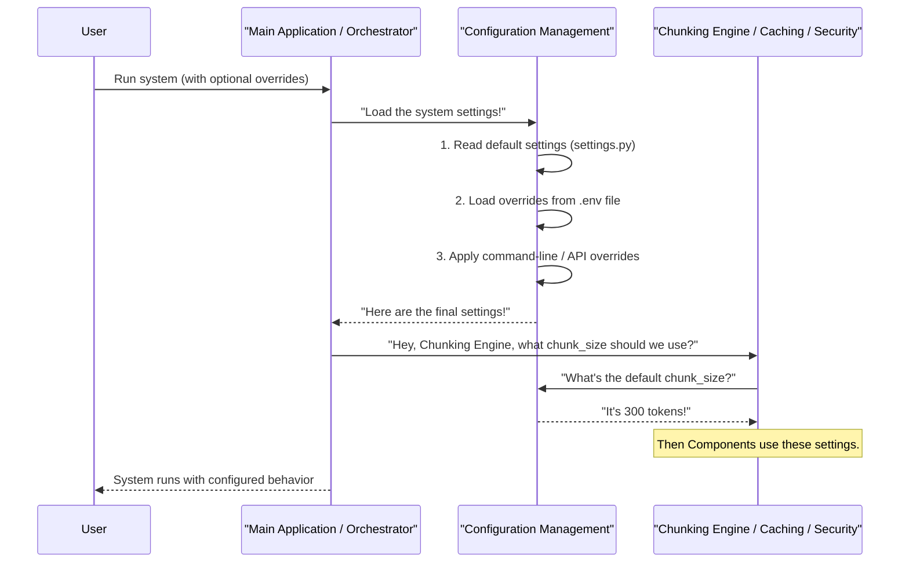

# Chapter 3: Configuration Management

Welcome back! In [Chapter 1: Document Chunking System (Orchestrator)](01_document_chunking_system__orchestrator__.md), we met the "project manager" of our system. Then, in [Chapter 2: Hybrid Chunking Engine](02_hybrid_chunking_engine_.md), we learned how documents are smartly cut into pieces.

Now, imagine you have a special kind of book that needs very small chunks because your AI only understands short sentences. Or perhaps you have a super secret document and want to make sure all security features are turned on. How do you tell the system to behave this way without changing its core programming code?

This is where **Configuration Management** comes in! Think of it as the **central control panel** for our entire `chuncking-system`.

#### What Problem Does Configuration Management Solve?

Every piece of software has settings. Just like your smartphone has settings for screen brightness, Wi-Fi, or notifications, our `chuncking-system` also has many adjustable parameters.

*   Do you want chunks to be 500 "tokens" (AI words) long, or 1000?
*   Should the system save files in a specific folder?
*   Do you want to turn on or off features like caching (remembering past results) or security checks?

If these settings were "hard-coded" (fixed within the program's main logic), you'd have to dive into the code and change it every time you wanted a different behavior. This is tricky, can introduce errors, and makes it hard to use the system in different ways or in different environments (like your testing area versus a live production system).

**Configuration Management** solves this by giving you a simple, safe way to **customize the system's behavior without modifying its core logic.** It allows administrators (or you!) to easily adapt the system to different environments or specific processing needs.

#### Your System's Control Panel

So, what does this "control panel" look like? In our `chuncking-system`, the main place for these settings is a special file and a clever way to organize them.

Our settings are managed by a `ChunkingConfig` class, which acts like a blueprint for all our system's preferences. It defines:

*   **Default Chunk Sizes**: `DEFAULT_CHUNK_SIZE`, `DEFAULT_CHUNK_OVERLAP` (how much chunks can share).
*   **File Paths**: `INPUT_DIR`, `OUTPUT_DIR` (where documents are read from and chunks are saved).
*   **Feature Toggles**: `enable_caching`, `enable_security`, `enable_monitoring` (simple on/off switches for important features).
*   **Quality Thresholds**: `quality_threshold` (how good chunks need to be).
*   And many more!

These settings are neatly organized in `src/config/settings.py`. Let's look at a simplified version of it:

```python
# src/config/settings.py (simplified)
from pydantic_settings import BaseSettings # Helps manage settings neatly

class ChunkingConfig(BaseSettings):
    # Core chunking parameters
    DEFAULT_CHUNK_SIZE: int = 800
    DEFAULT_CHUNK_OVERLAP: int = 150
    MIN_CHUNK_WORDS: int = 10

    # Input and output locations
    INPUT_DIR: str = "data/input/markdown_files"
    OUTPUT_DIR: str = "data/output"

    # Feature switches (on/off)
    enable_caching: bool = True
    enable_security: bool = True
    enable_monitoring: bool = True

    class Config:
        # This tells Pydantic to also look for settings in a .env file
        env_file = ".env"

# This creates a single, easy-to-access object for all our settings
config = ChunkingConfig()
```
This `settings.py` file acts as the "default factory settings" for your `chuncking-system`. It tells the system what to do unless you specify otherwise. The `class Config: env_file = ".env"` line is very important: it means the system can also load settings from a `.env` file, which is often used for settings that change per environment or are sensitive (like API keys).

#### How to Customize Settings

Now for the fun part: how do you actually use this control panel to change the system's behavior? There are a few ways, depending on how much control you need.

**Method 1: Using Environment Variables (via a `.env` file)**

For quick, system-wide overrides that don't involve changing code, you can use a `.env` file. This is a plain text file that sits in the root of your project.

Let's say you want to always use a `DEFAULT_CHUNK_SIZE` of `500` and `disable_caching`. Create a file named `.env` in the main `chuncking-system` directory (the same place as `main.py`):

```bash
# .env file content
DEFAULT_CHUNK_SIZE=500
ENABLE_CACHING=False
```

Now, when you run `main.py` or any part of the system, it will automatically pick up these values from the `.env` file, overriding the defaults set in `src/config/settings.py`.

*What happens?* The `ChunkingConfig` object we saw earlier automatically loads these values when your program starts. So, if `settings.py` says `DEFAULT_CHUNK_SIZE = 800` but your `.env` says `DEFAULT_CHUNK_SIZE=500`, the system will use `500`.

**Method 2: Command Line Arguments**

You've already seen this in [Chapter 1](01_document_chunking_system__orchestrator__.md)! When you run `main.py` from your terminal, you can provide specific settings for that *one run*.

```bash
python main.py \
  --input-file data/input/markdown_files/my_long_article.md \
  --chunk-size 400 \
  --output-dir my_article_chunks
```
*What happens here?*
*   `--chunk-size 400`: This tells the system to use a chunk size of `400` *just for this specific execution*, overriding any defaults from `settings.py` or your `.env` file.
*   `--output-dir my_article_chunks`: This directs the system to save the results in a folder named `my_article_chunks` for this run.

Command line arguments usually have the highest priority, meaning they override `.env` files and the default `settings.py` values.

**Method 3: Direct Python API Usage (Most Control)**

If you're writing your own Python script and want to set specific parameters directly in your code, you can create a custom `ChunkingConfig` object and pass it to the `DocumentChunker` (our Orchestrator).

```python
from src.chunking_system import DocumentChunker
from src.config.settings import ChunkingConfig # Import our config blueprint
from pathlib import Path

# 1. Create your OWN custom settings object
my_special_config = ChunkingConfig(
    DEFAULT_CHUNK_SIZE=300,  # Make chunks very small for quick Q&A
    DEFAULT_CHUNK_OVERLAP=0, # No overlap
    enable_caching=False,    # Turn off caching for this specific process
    OUTPUT_DIR="my_tiny_chunks_output" # Save here
)

# 2. Pass your custom settings to the Orchestrator
# The Orchestrator will now use these settings!
orchestrator = DocumentChunker(config=my_special_config)

# 3. Use the Orchestrator as usual
book_file_path = Path('data/input/markdown_files/example_report.md')
chunking_result = orchestrator.chunk_file(book_file_path)

print(f"Using chunk size: {orchestrator.config.DEFAULT_CHUNK_SIZE}")
print(f"Caching enabled? {orchestrator.config.enable_caching}")

if chunking_result.success:
    print(f"Chunks saved to: {orchestrator.config.OUTPUT_DIR}")
```
*What happens here?* You're explicitly telling the `DocumentChunker` instance exactly what settings to use. This gives you the most precise control over the system's behavior within your Python programs. If you don't pass a `config` object, the `DocumentChunker` will just use the global `config` instance loaded from `src/config/settings.py` and any `.env` overrides.

#### Under the Hood: How Configuration Connects

Let's imagine the flow of information for our configuration settings:



As you can see, the **Configuration Management** component acts like a central dictionary of rules that all other parts of the system can ask for.

When you start the system (either via `main.py` or by creating a `DocumentChunker` in Python):
1.  The `ChunkingConfig` object in `src/config/settings.py` first loads all its *default* values.
2.  It then checks for a `.env` file and **overrides** any defaults with values found there.
3.  Finally, if you provided command-line arguments or directly passed a `ChunkingConfig` object in your Python code, those values **override everything else**. This creates a clear "priority" for settings.

All other parts of the `chuncking-system`, like the [Hybrid Chunking Engine](02_hybrid_chunking_engine_.md) or the [Security Framework](05_security_framework_.md), don't need to know *how* you set the values. They just ask the Configuration Management for the current settings, and they get the most up-to-date, active value.

Let's look at how the [Hybrid Chunking Engine](02_hybrid_chunking_engine_.md) uses these settings:

```python
# src/chunkers/hybrid_chunker.py (simplified)

from src.config.settings import config # Import the global config instance

class HybridMarkdownChunker:
    def __init__(self, chunk_size: int = None, chunk_overlap: int = None):
        # If chunk_size is provided when creating the chunker (e.g., chunker = HybridMarkdownChunker(chunk_size=500)),
        # it uses that value.
        # OTHERWISE, it falls back to the system's global DEFAULT_CHUNK_SIZE from the config!
        self.chunk_size = chunk_size or config.DEFAULT_CHUNK_SIZE
        self.chunk_overlap = chunk_overlap or config.DEFAULT_CHUNK_OVERLAP
        
        # It also uses other settings, like which headers to split on:
        self.header_splitter = MarkdownHeaderTextSplitter(
            headers_to_split_on=config.HEADER_LEVELS, # Uses settings from config
            strip_headers=False
        )
        # ... other splitter setups also use config.SEPARATORS etc.
```
In this snippet, `config.DEFAULT_CHUNK_SIZE` and `config.HEADER_LEVELS` are being read from our central `ChunkingConfig` object. This pattern is used throughout the system, ensuring that changes in your settings are immediately reflected in how the system operates.

#### Why is this so useful?

Configuration Management is a cornerstone of any good, flexible software system.

| Benefit             | Description                                                   | Analogy                                   |
| :------------------ | :------------------------------------------------------------ | :---------------------------------------- |
| **Flexibility**     | Easily change system behavior without modifying core code.    | Changing your phone's screen brightness without reprogramming the phone. |
| **Adaptability**    | Use the same system for different tasks or environments.      | Driving the same car in "Eco Mode" for fuel saving or "Sport Mode" for speed. |
| **Maintainability** | All changeable settings are in one place, making updates and troubleshooting easier. | All the controls for your car are on the dashboard, not hidden in the engine. |
| **Safety**          | Prevents accidental changes to core logic, reducing errors.   | Adjusting the volume on a stereo is safer than rewiring its speakers. |
| **Scalability**     | Easy to deploy and manage across many servers with different needs. | Setting up many identical coffee machines, but each can have custom brew settings. |

#### Conclusion

In this chapter, we've explored **Configuration Management**, the central control panel for our `chuncking-system`. We learned how it allows us to customize everything from chunk sizes to feature toggles without touching the core code. We saw how to use `.env` files, command line arguments, and direct Python code to adjust settings, and we peeked under the hood to understand how these settings are loaded and used by different components like the [Hybrid Chunking Engine](02_hybrid_chunking_engine_.md).

This flexibility is incredibly powerful, making our system adaptable to a wide range of document processing needs.

Now that we know how to configure our system and how it intelligently chunks documents, how do we know if the chunks it creates are actually *good*? That's what we'll find out in the next chapter!

Ready to check the quality? Let's move on to explore the [Chunk Quality Evaluator](04_chunk_quality_evaluator_.md)!

---

<sub><sup>Generated by [AI Codebase Knowledge Builder](https://github.com/The-Pocket/Tutorial-Codebase-Knowledge).</sup></sub> <sub><sup>**References**: [[1]](https://github.com/ai-rio/chuncking-system/blob/34705b324f6b2c41c349afa9662fbea086940ff9/README.md), [[2]](https://github.com/ai-rio/chuncking-system/blob/34705b324f6b2c41c349afa9662fbea086940ff9/src/config/settings.py)</sup></sub>
