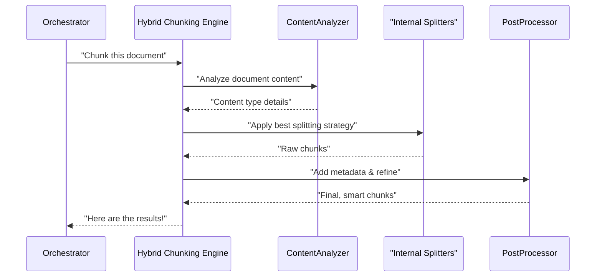

# Chapter 3: Hybrid Chunking Engine

Welcome back! In [Chapter 2: Document Chunking System (Orchestrator)](02_document_chunking_system__orchestrator__.md), we learned that the Orchestrator is like the "project manager" of our `chuncking-system`. It doesn't do all the detailed work itself, but it knows which "teams" to call for specific tasks.

Today, we're diving into one of the most important "teams" the Orchestrator relies on: the **Hybrid Chunking Engine**. This is the smart part of our system that takes your large documents and carefully breaks them into smaller, meaningful pieces ("chunks").

#### What Problem Does the Hybrid Chunking Engine Solve?

Imagine you have a huge, detailed document, like a long technical manual or a research paper, written in Markdown format. You want to use this document with an AI model, perhaps to build a system that can answer questions based on its content (like a Retrieval-Augmented Generation or RAG system).

The challenge is, AI models have a limit to how much text they can process at once. You can't just give them an entire 100-page manual! So, you need to break it into smaller parts. But if you just cut the document into fixed-size pieces (say, exactly 500 words each), you might:

*   Cut a sentence or a paragraph in half.
*   Separate a heading from the text it describes.
*   Break a complete code example right in the middle.

This would make the chunks confusing and much less useful for the AI. It's like cutting a photo into random squares – you lose the overall picture and meaning!

The **Hybrid Chunking Engine** solves this by acting like a very smart "editor". It doesn't just cut blindly. Instead, it intelligently looks at the structure of your document – like headings, code blocks, and plain paragraphs – and decides the best places to "cut" to keep the meaning and context intact within each chunk.

#### What Does "Hybrid" Mean Here?

The "Hybrid" in Hybrid Chunking Engine means it uses **multiple smart ways** to break down your document. Instead of just one cutting rule, it has several specialized tools, and it chooses the best tool for each part of your document.

Think of it like a professional chef with a special set of knives for different jobs:

*   A **heading knife**: This knife is used for documents with clear sections defined by titles (like `# Introduction` or `## Key Concepts`). It ensures that a heading stays with its related content.
*   A **code-block knife**: This knife is specifically for cutting around code examples. It makes sure that entire code blocks are kept together, preventing them from being split in confusing ways.
*   A **general-purpose knife**: For all the other plain text that doesn't have obvious headings or code, this knife carefully slices it into pieces of a target size, trying to find natural breaks like paragraph endings or sentences.

By combining these different "knives" (chunking strategies), the Hybrid Chunking Engine creates chunks that are much more useful and meaningful for AI models. This is crucial because it ensures the AI gets complete ideas and context, leading to better answers and understanding.

#### How to Use the Hybrid Chunking Engine

You can use the Hybrid Chunking Engine directly to chunk any Markdown content. Let's see a simple example!

First, you need to import the `HybridMarkdownChunker` class.

```python
from src.chunkers.hybrid_chunker import HybridMarkdownChunker
from langchain_core.documents import Document # To understand the output

# Our example document (a very mini book chapter)
my_markdown_content = """
# Getting Started

Welcome to our project! This chapter introduces the core ideas.

## Installation Steps
1. Download the latest version.
2. Run `pip install chuncking-system`.

### Example Code
```python
def process_data(data):
    # This is a placeholder function
    return data.upper()
```

This code snippet shows a very basic way to transform text.

"""

print("--- Original Document ---")
print(my_markdown_content)
print("-" * 30)
```

This `my_markdown_content` has a main heading (`#`), a subheading (`##`), a list, and a Python code block (` ```python `).

Now, let's create an instance of our `HybridMarkdownChunker` and use it:

```python
# Create an instance of the Hybrid Chunking Engine
# We tell it our preferred chunk size and overlap (how much chunks can share)
# These values are often loaded from your ChunkingConfig (Chapter 1)
chunker = HybridMarkdownChunker(
    chunk_size=500,     # Target chunk size in "tokens" (AI words)
    chunk_overlap=50    # How many shared tokens between chunks
)

# Tell the chunker to break down our content!
# We can also add some initial info (metadata) about the content.
chunks = chunker.chunk_document(
    my_markdown_content,
    {'source': 'sample_doc.md', 'type': 'tutorial'}
)

# Let's see what chunks it created!
print("\n--- Generated Chunks ---")
for i, chunk in enumerate(chunks):
    print(f"--- Chunk {i+1} ---")
    print(chunk.page_content)
    print(f"Metadata: {chunk.metadata}")
    print("-" * 20)
```

When you run this code, you'll see `my_markdown_content` broken into multiple `Document` objects. Each `Document` is a "chunk" and has two main parts:

*   `page_content`: This is the actual text of the chunk.
*   `metadata`: This is extra information about the chunk. It includes the `source` and `type` we provided, plus automatically calculated details like `chunk_index` (its order), `chunk_tokens` (how many AI words it contains), and `chunk_chars` (how many characters).

You'll notice that the engine intelligently keeps the `# Getting Started` heading with its introductory text, and `## Installation Steps` with its list. Crucially, the ```` ```python ```` code block will likely be kept mostly intact, either as its own chunk or within a larger chunk that doesn't break the code, because the **Code-Aware Splitting** strategy prioritizes preserving code blocks.

This example shows how easy it is to get semantically coherent chunks using the `HybridMarkdownChunker`.

#### Under the Hood: How the Engine Works

Let's peek behind the curtain to understand how the Hybrid Chunking Engine intelligently decides where to cut.

Imagine the [Document Chunking System (Orchestrator)](02_document_chunking_system__orchestrator__.md) has handed over a big document to our Hybrid Chunking Engine:



As you can see, the process involves a few key steps:

1.  **Content Analysis**: The Hybrid Chunking Engine first "reads" the document to figure out what kind of content it primarily contains (e.g., Markdown headers, code blocks, or just plain text).
2.  **Strategy Selection**: Based on this content analysis, it intelligently chooses the most appropriate chunking strategy (Header-Based, Code-Aware, or the general-purpose Recursive).
3.  **Internal Splitting**: It uses specialized tools (called "splitters") to perform the actual cuts according to the chosen strategy.
4.  **Refinement & Post-processing**: After the initial cuts, it refines the chunks (e.g., merging very small chunks or breaking down very large ones further) and adds useful information (metadata) like the chunk's index, token count, and character count.

This entire sequence ensures that the chunks are not only the right size but also preserve the meaning and context from the original document.

#### Diving into the Code

The core logic for the Hybrid Chunking Engine is found in the `src/chunkers/hybrid_chunker.py` file.

Let's look at how it sets up its "tools" (the splitters) and how it makes decisions based on content.

**1. Setting up the "Knives" (`_init_splitters` method)**

When the `HybridMarkdownChunker` is created, it prepares all its specialized "splitters" (our "knives").

```python
# src/chunkers/hybrid_chunker.py (simplified _init_splitters)
from langchain_text_splitters import (
    MarkdownHeaderTextSplitter, # For headings
    RecursiveCharacterTextSplitter, # For general text
    PythonCodeTextSplitter # For Python code
)
from src.config.settings import config # Import settings from Chapter 1

class HybridMarkdownChunker:
    def __init__(self, chunk_size: int = None, chunk_overlap: int = None):
        # ... (other setup)
        self._init_splitters() # This method is called during initialization

    def _init_splitters(self):
        # 1. Header-based splitter: uses settings from Configuration Management
        self.header_splitter = MarkdownHeaderTextSplitter(
            headers_to_split_on=config.HEADER_LEVELS, # e.g., [("#", 1), ("##", 2)]
            strip_headers=False
        )

        # 2. General-purpose recursive splitter: for plain text
        self.recursive_splitter = RecursiveCharacterTextSplitter(
            chunk_size=self.chunk_size,
            chunk_overlap=self.chunk_overlap,
            length_function=self._token_length, # Counts AI tokens
            separators=config.SEPARATORS # Defines where it prefers to split
        )

        # 3. Code-specific splitter: for programming code blocks
        self.code_splitter = PythonCodeTextSplitter(
            chunk_size=self.chunk_size,
            chunk_overlap=self.chunk_overlap
        )
```
In this snippet, the `_init_splitters` method prepares three different kinds of splitters. Notice it uses `config.HEADER_LEVELS` and `config.SEPARATORS` from the [Configuration Management](01_configuration_management_.md) system, allowing you to easily customize its behavior without changing the code itself.

**2. Deciding Which Strategy to Use (`chunk_document` method)**

This is the central method where the Hybrid Chunking Engine decides which splitting strategy is best for the document you provide.

```python
# src/chunkers/hybrid_chunker.py (simplified chunk_document)

class HybridMarkdownChunker:
    # ... (init and _init_splitters methods)

    def _detect_content_type(self, content: str) -> Dict[str, bool]:
        """Analyzes content to determine if it has headers, code, etc."""
        return {
            'has_headers': bool(re.search(r'^#+\s', content, re.MULTILINE)),
            'has_code': '```' in content,
            # ... (other detection logic)
        }

    def chunk_document(self, content: str, metadata: Dict[str, Any] = None) -> List[Document]:
        # ... (performance monitoring, input validation, memory check)

        content_analysis = self._detect_content_type(content)

        # --- Decision making: Which strategy to use? ---
        if content_analysis['has_headers']:
            # If it has headers, try to split by them first, then recursively
            return self._header_recursive_chunking(content, metadata, content_analysis)
        elif content_analysis['has_code']:
            # If it has code, use the special code splitter
            return self._code_aware_chunking(content, metadata)
        else:
            # Otherwise, use the general-purpose recursive splitter
            return self._simple_recursive_chunking(content, metadata)
            
    # ... (internal splitting methods like _header_recursive_chunking, _simple_recursive_chunking, _code_aware_chunking)
```
The `_detect_content_type` method helps the engine "look" at the document and identify its key features (like presence of headers or code blocks). Then, based on this analysis, the `chunk_document` method intelligently calls the appropriate internal function to perform the actual splitting.

**3. Adding Useful Information (`_post_process_chunks` method)**

After any of the splitting methods produce raw chunks, they go through a final `_post_process_chunks` step.

```python
# src/chunkers/hybrid_chunker.py (simplified _post_process_chunks)

class HybridMarkdownChunker:
    # ... (all previous methods)

    def _post_process_chunks(self, chunks: List[Document]) -> List[Document]:
        """Adds useful metadata to each chunk and cleans them up."""
        processed_chunks = []
        chunk_index = 0

        for chunk in chunks:
            # Skip very short chunks (as defined in config)
            if len(chunk.page_content.strip()) < config.MIN_CHUNK_WORDS:
                continue

            # Add more details to each chunk's metadata
            chunk.metadata['chunk_index'] = chunk_index
            chunk.metadata['chunk_tokens'] = self._token_length(chunk.page_content)
            chunk.metadata['chunk_chars'] = len(chunk.page_content)
            chunk.metadata['word_count'] = len(chunk.page_content.split())

            processed_chunks.append(chunk)
            chunk_index += 1 # Only increment for valid chunks

        return processed_chunks
```
The `_post_process_chunks` method ensures that every chunk has consistent and useful metadata. This metadata is crucial for later steps, such as evaluating chunk quality (which we'll cover in a future chapter) or when using these chunks with AI models.

#### Conclusion

In this chapter, we've explored the **Hybrid Chunking Engine**, the intelligent editor of our `chuncking-system`. We learned that it uses multiple strategies – header-based, code-aware, and recursive splitting – to break down large documents into semantically coherent and useful chunks. We saw how to use it directly in Python code and got a glimpse into its internal workings, from content detection to strategy selection and post-processing.

This engine is vital because it ensures that the "pieces" of your document are meaningful, which directly impacts how well an AI can understand and use them for tasks like answering questions.

Now that we know how to cut documents smartly, how do we connect our system to the powerful AI models that will actually use these chunks? Let's move on to the next chapter to discover how we integrate with different AI (LLM) providers!

Ready to connect to AI? Let's move on to explore the [LLM Provider Integration](04_llm_provider_integration_.md)!

---

<sub><sup>Generated by [AI Codebase Knowledge Builder](https://github.com/The-Pocket/Tutorial-Codebase-Knowledge).</sup></sub> <sub><sup>**References**: [[1]](https://github.com/ai-rio/chuncking-system/blob/e1a233785e744443e919c2de3f68d87ab02216d1/docs/tutorial/Chapter 2: Hybrid Chunking Engine.md), [[2]](https://github.com/ai-rio/chuncking-system/blob/e1a233785e744443e919c2de3f68d87ab02216d1/src/chunkers/adaptive_chunker.py), [[3]](https://github.com/ai-rio/chuncking-system/blob/e1a233785e744443e919c2de3f68d87ab02216d1/src/chunkers/hybrid_chunker.py), [[4]](https://github.com/ai-rio/chuncking-system/blob/e1a233785e744443e919c2de3f68d87ab02216d1/src/chunkers/markdown_processor.py), [[5]](https://github.com/ai-rio/chuncking-system/blob/e1a233785e744443e919c2de3f68d87ab02216d1/src/chunkers/strategy_optimizer.py)</sup></sub>
