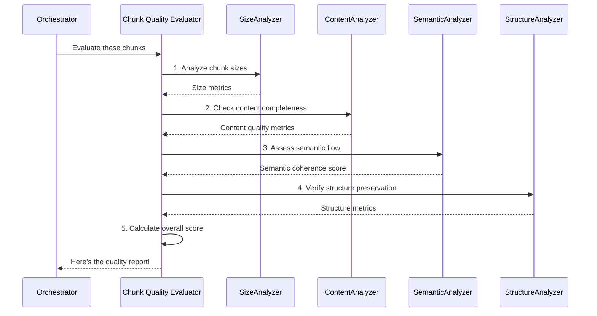

# Chapter 4: Chunk Quality Evaluator

Welcome back! In [Chapter 1: Document Chunking System (Orchestrator)](01_document_chunking_system__orchestrator__.md), we learned that the Orchestrator is the "project manager" of our system. Then, in [Chapter 2: Hybrid Chunking Engine](02_hybrid_chunking_engine_.md), we saw how our system intelligently breaks down large documents into smaller pieces, called "chunks." We also looked at [Chapter 3: Configuration Management](03_configuration_management_.md), which showed us how to customize these processes.

Now, imagine you've asked the [Hybrid Chunking Engine](02_hybrid_chunking_engine_.md) to chop up a big book. How do you know if the "chunks" it created are actually good? Are they truly useful for an AI model, or did it accidentally cut sentences in half, or create chunks that are too small to be meaningful?

This is where the **Chunk Quality Evaluator** comes in! Think of it as the **quality inspector** for your document pieces. After the chunks are made, this component meticulously checks them to make sure they meet high standards.

#### What Problem Does the Chunk Quality Evaluator Solve?

When you break a large document into chunks, the goal is often to use these chunks with an Artificial Intelligence (AI) model, especially in systems like Retrieval-Augmented Generation (RAG). For RAG, the quality of your chunks directly impacts how well the AI can understand and answer questions.

If your chunks are:
*   **Too short or empty**: They might lack enough context for the AI.
*   **Too long**: They might exceed the AI's input limit or contain irrelevant information, making the AI less efficient.
*   **Cut in the middle of a sentence or code block**: They become confusing and hard for the AI to interpret correctly.
*   **Missing important structural information**: Like a header separated from its content, making the context unclear.

The **Chunk Quality Evaluator** solves these problems by systematically checking various aspects of each chunk and giving you a "report card." This report card helps you understand if your chunking process is working well and provides recommendations for improvement.

#### What Makes a Chunk "Good Quality"?

Our Chunk Quality Evaluator looks at several key aspects to determine a chunk's quality:

1.  **Size Distribution**: Are the chunks generally consistent in size? Are there too many very small or very large ones? (e.g., aiming for chunks around 800 tokens, are most chunks actually close to that?)
2.  **Content Completeness**: Does each chunk contain complete thoughts or sentences? Or are there fragments that stop abruptly? (e.g., does it end with a period, question mark, or is it a complete code block?)
3.  **Semantic Coherence**: Does the content within a chunk, and especially the content between adjacent chunks, flow logically? Is the meaning preserved? (e.g., checking if one chunk is semantically related to the next one).
4.  **Structure Preservation**: Has the chunking process managed to keep important structural elements (like headings, code blocks, or lists) intact within their relevant content?

The evaluator assigns scores for each of these areas and then combines them into an **overall quality score**, usually out of 100. This score tells you at a glance how well your chunks are performing.

#### How to Use the Chunk Quality Evaluator

You can use the `ChunkQualityEvaluator` to inspect any list of `Document` objects (which is the format our [Hybrid Chunking Engine](02_hybrid_chunking_engine_.md) produces).

First, let's create some dummy chunks, as if they came from our chunking engine:

```python
from src.chunkers.evaluators import ChunkQualityEvaluator
from langchain_core.documents import Document

# Imagine these chunks were created by the Hybrid Chunking Engine
example_chunks = [
    Document(page_content="This is the first sentence. And the second sentence ends here.", metadata={'chunk_index': 0}),
    Document(page_content="Here begins a new paragraph. This chunk is quite long.", metadata={'chunk_index': 1}),
    Document(page_content="```python\ndef hello():\n    print('Hello')\n```", metadata={'chunk_index': 2, 'content_type': 'code'}),
    Document(page_content="This is a very short. incomplete", metadata={'chunk_index': 3}), # An incomplete chunk
    Document(page_content="Chapter 1: Introduction", metadata={'chunk_index': 4, 'Header 1': 'Chapter 1: Introduction'}), # A header chunk
    Document(page_content=""), # An empty chunk
]

print(f"Number of chunks for evaluation: {len(example_chunks)}")
```
We have a list of `Document` objects. Each `Document` has `page_content` (the text) and `metadata` (extra info, like its `chunk_index` or if it's a code block).

Now, let's create an instance of our `ChunkQualityEvaluator` and tell it to evaluate these chunks:

```python
# Create an instance of the Quality Evaluator
evaluator = ChunkQualityEvaluator()

# Tell the evaluator to inspect our chunks!
quality_metrics = evaluator.evaluate_chunks(example_chunks)

# Let's see the overall score!
print(f"Overall Quality Score: {quality_metrics['overall_score']:.1f}/100")

# You can also print more detailed metrics
print(f"Empty chunks detected: {quality_metrics['content_quality']['empty_chunks']}")
print(f"Incomplete sentences detected: {quality_metrics['content_quality']['incomplete_sentences']}")
```
When you run this code, the `evaluate_chunks` method will return a dictionary (`quality_metrics`) containing many details about the chunks, including the `overall_score`. For our `example_chunks`, it would detect an empty chunk and an incomplete sentence.

For a more human-readable summary, you can generate a detailed report:

```python
# Generate a formatted report (like the one you'd see in the data/output/reports folder)
report_content = evaluator.generate_report(example_chunks)

# Print the report to your console
print("\n--- Chunk Quality Report ---")
print(report_content)

# You can also save this report to a file
# evaluator.generate_report(example_chunks, output_path="my_chunks_report.md")
# This would save the report to a Markdown file.
```
This will print a nicely formatted Markdown report summarizing all the quality metrics, including recommendations for improvement based on the findings. This report is what you'd typically find in the `data/output/reports` directory after a full run of the `chuncking-system`.

#### Under the Hood: How the Evaluator Works

When the [Document Chunking System (Orchestrator)](01_document_chunking_system__orchestrator__.md) asks the `ChunkQualityEvaluator` to do its job, here's a simplified view of what happens:



As you can see, the `ChunkQualityEvaluator` acts like a lead inspector, delegating specific checks to its internal "teams" (methods) that specialize in different aspects of quality:

1.  It first checks the **size distribution** to see if chunks are consistently sized.
2.  Then, it examines **content quality**, looking for issues like empty chunks or incomplete sentences.
3.  Next, it dives into **semantic coherence**, ensuring the meaning flows well between chunks.
4.  Finally, it verifies **structure preservation**, checking if headers, code blocks, and lists are kept together.
5.  After all checks are done, it combines these findings into a single, easy-to-understand **overall quality score**.

#### Diving into the Code

The core logic for the Chunk Quality Evaluator is found in `src/chunkers/evaluators.py`.

Let's look at a simplified version of the `evaluate_chunks` method:

```python
# src/chunkers/evaluators.py (simplified)

class ChunkQualityEvaluator:
    def __init__(self):
        # Setup tools like a text vectorizer for semantic analysis
        self.vectorizer = TfidfVectorizer(...) # For comparing text similarity
        # ... and so on

    def evaluate_chunks(self, chunks: List[Document]) -> Dict[str, Any]:
        """Comprehensive chunk quality evaluation"""

        if not chunks:
            return {'error': 'No chunks to evaluate'}

        metrics = {
            'total_chunks': len(chunks),
            'size_distribution': self._analyze_size_distribution(chunks),
            'content_quality': self._analyze_content_quality(chunks),
            'semantic_coherence': self._analyze_semantic_coherence(chunks),
            'structural_preservation': self._analyze_structure_preservation(chunks)
        }

        # Calculate the final overall score based on all individual metrics
        metrics['overall_score'] = self._calculate_overall_score(metrics)

        return metrics
```
The `evaluate_chunks` method is the main entry point. It calls several internal helper methods (starting with `_analyze_`) to gather different quality metrics. Each `_analyze_` method focuses on a specific aspect of chunk quality.

For example, let's look at how `_analyze_content_quality` might check for incomplete sentences:

```python
# src/chunkers/evaluators.py (simplified)

class ChunkQualityEvaluator:
    # ... (init and evaluate_chunks methods)

    def _analyze_content_quality(self, chunks: List[Document]) -> Dict[str, Any]:
        """Analyze content quality metrics, like incomplete sentences"""
        quality_metrics = {
            'empty_chunks': 0,
            'very_short_chunks': 0,
            'incomplete_sentences': 0, # Counter for incomplete sentences
        }

        for chunk in chunks:
            content = chunk.page_content.strip()

            if not content:
                quality_metrics['empty_chunks'] += 1
                continue

            # Check if it's a structural element (like header, code, list)
            # These are allowed to not end with punctuation
            is_structural = re.match(r'^#+\s', content) or '```' in content or chunk.metadata.get('content_type') == 'code'

            # If it's not a structural element and doesn't end with typical punctuation
            if not is_structural and not re.search(r'[.!?:]$', content):
                quality_metrics['incomplete_sentences'] += 1

        # Calculate percentages for the report
        total_chunks = len(chunks)
        quality_metrics['incomplete_sentences_pct'] = (quality_metrics['incomplete_sentences'] / total_chunks * 100) if total_chunks > 0 else 0

        return quality_metrics
```
This simplified snippet from `_analyze_content_quality` shows how it iterates through chunks, checks if they are empty, too short, or if a general text chunk ends abruptly (without common punctuation). It cleverly accounts for cases where a chunk might be a header or code block, which naturally might not end with a period.

Finally, all these individual scores are combined to produce the `overall_score`:

```python
# src/chunkers/evaluators.py (simplified)

class ChunkQualityEvaluator:
    # ... (all analyze methods)

    def _calculate_overall_score(self, metrics: Dict[str, Any]) -> float:
        """Calculate overall quality score (0-100) based on weighted metrics"""
        try:
            # Assign weights to different quality aspects
            size_score = metrics['size_distribution']['size_consistency'] * 20
            
            content_metrics = metrics['content_quality']
            # Penalize empty/short/incomplete chunks
            content_score = (100 - content_metrics['empty_chunks_pct']) * 0.5 + \
                            (100 - content_metrics['very_short_chunks_pct']) * 0.3 + \
                            (100 - content_metrics['incomplete_sentences_pct']) * 0.2
            content_score = (content_score / 100) * 30 # Scale to contribute 30% to total

            coherence_score = metrics['semantic_coherence']['coherence_score'] * 25 # Contributes 25%

            structure_metrics = metrics['structural_preservation']
            # Reward for preserving headers, code, lists, links
            structure_score = (structure_metrics['chunks_with_headers_pct'] * 0.4 +
                               structure_metrics['chunks_with_code_pct'] * 0.3 +
                               structure_metrics['chunks_with_lists_pct'] * 0.2 +
                               structure_metrics['chunks_with_links_pct'] * 0.1)
            structure_score = (structure_score / 100) * 25 # Scale to contribute 25% to total
            
            overall_score = size_score + (content_score) + coherence_score + structure_score
            return min(100, max(0, overall_score)) # Ensure score is between 0 and 100

        except Exception as e:
            # Log any errors and return a low score
            self.logger.error("Error calculating overall quality score", error=str(e))
            return 0.0
```
This method takes the scores from all the individual analyses and combines them into one final `overall_score`. It assigns different "weights" to each quality aspect (e.g., semantic coherence might be slightly more important for RAG than exact size consistency, depending on the weights). This flexibility allows the system to adapt to different quality priorities.

#### Why is Chunk Quality Evaluation So Important?

| Benefit                          | Description                                                                       | Analogy                                                     |
| :------------------------------- | :-------------------------------------------------------------------------------- | :---------------------------------------------------------- |
| **Better AI Performance (RAG)**  | High-quality chunks lead to more accurate and relevant answers from AI models.    | Giving an AI clear, complete puzzle pieces instead of jumbled ones. |
| **Debugging Chunking Issues**    | Helps identify *why* your chunks might not be working well for your AI.           | Spotting if your custom-cut wood pieces are too short or have rough edges *before* you try to build. |
| **Informed Decision Making**     | Provides data to fine-tune chunking settings (e.g., `chunk_size`, `overlap`).    | Adjusting oven temperature (settings) based on how well the cake bakes (quality). |
| **Consistent Quality**           | Ensures that chunks maintain a desired standard across different documents.        | A quality control check on a production line, ensuring every product meets standards. |
| **Cost Efficiency**              | Optimal chunks can reduce the number of tokens sent to AI models, saving money.   | Not paying for extra, irrelevant pieces of wood you don't need. |

#### Conclusion

In this chapter, we explored the **Chunk Quality Evaluator**, the diligent quality inspector of our `chuncking-system`. We learned why evaluating chunk quality is crucial for tasks like Retrieval-Augmented Generation (RAG) and how the evaluator assesses chunks based on size, content, semantic coherence, and structure. We saw how to use it to get detailed metrics and human-readable reports, and we peeked behind the curtain to understand how it performs its various checks.

Knowing your chunks are of high quality is a vital step in building a reliable and effective RAG system.

Now that we know how to chunk documents and evaluate their quality, how do we make sure this entire process is secure and safe for sensitive information? Let's move on to the next chapter to discover the **Security Framework**!

Ready to secure our system? Let's move on to explore the [Security Framework](05_security_framework_.md)!

---

<sub><sup>Generated by [AI Codebase Knowledge Builder](https://github.com/The-Pocket/Tutorial-Codebase-Knowledge).</sup></sub> <sub><sup>**References**: [[1]](https://github.com/ai-rio/chuncking-system/blob/34705b324f6b2c41c349afa9662fbea086940ff9/README.md), [[2]](https://github.com/ai-rio/chuncking-system/blob/34705b324f6b2c41c349afa9662fbea086940ff9/data/output/reports/sample_document_quality_report.md), [[3]](https://github.com/ai-rio/chuncking-system/blob/34705b324f6b2c41c349afa9662fbea086940ff9/src/chunkers/evaluators.py)</sup></sub>