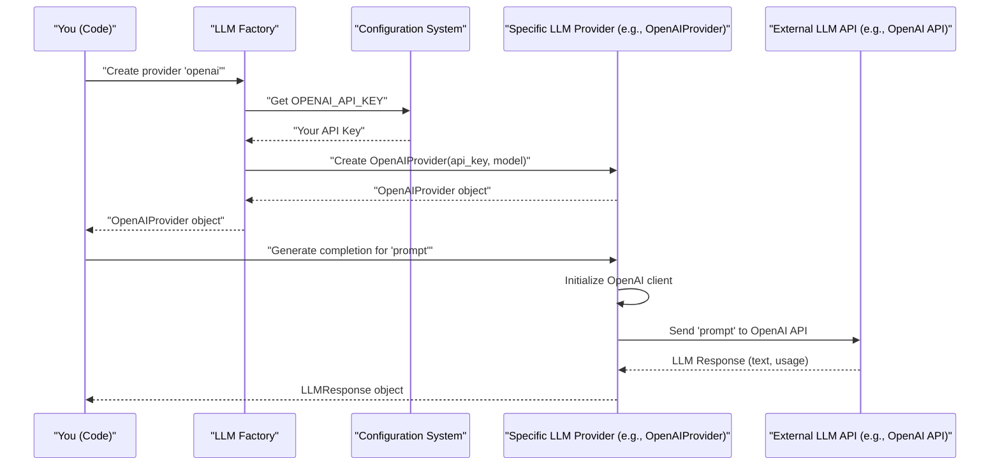

# Chapter 4: LLM Provider Integration

Welcome back! In [Chapter 3: Hybrid Chunking Engine](03_hybrid_chunking_engine_.md), we learned how our system intelligently breaks down large documents into smaller, meaningful "chunks." These chunks are now perfectly prepared to be understood by powerful Artificial Intelligence (AI) models, specifically Large Language Models (LLMs).

<<<<<<< HEAD
But here's a new challenge: there isn't just one LLM in the world! Companies like OpenAI, Anthropic, and Jina AI all offer their own amazing LLMs, each with different strengths, pricing, and ways you talk to them (their "API" or Application Programming Interface).
=======
But here's a new challenge: there isn't just one LLM in the world! Companies like OpenAI, Anthropic, and Jina AI all offer their own amazing LLMs, each with different strengths, pricing, and ways you talk to them (their "API" or Application Programming Interface). Additionally, we have **Docling**, which is an open-source document processing library that runs locally without requiring external APIs.

> **🎉 NEW: Docling Integration Complete!**  
> As of January 2025, our system now supports **Docling** - a powerful open-source document processing library that can handle PDFs, DOCX, PPTX, HTML, and images locally. This integration provides the foundation for advanced document understanding capabilities without requiring external APIs!
>>>>>>> feat/quality-enhancement

#### What Problem Does LLM Provider Integration Solve?

Imagine you've bought a new smart device, maybe a fancy new light bulb. Some light bulbs work with a "Philips Hue" app, others with "Google Home," and some with "Apple HomeKit." If you want to use different brands of light bulbs, you'd end up needing multiple apps and juggling between them. It would be a hassle!

The same problem happens with LLMs. If our `chuncking-system` wanted to use OpenAI's models *and* Anthropic's models *and* Jina AI's models, we would have to write completely different code for each one every time we wanted to do something like:

*   **Count tokens**: How many "AI words" are in a piece of text? (Important because LLMs have limits and costs are based on tokens).
*   **Generate text**: Ask the LLM to write a sentence or a paragraph.
*   **Create embeddings**: Turn text into a special list of numbers that helps computers understand the meaning of the text.

Writing separate code for each LLM provider would be complex, error-prone, and very difficult to maintain. If a new LLM provider comes out, or an existing one changes its "controls," we'd have to rewrite significant parts of our system.

**LLM Provider Integration** solves this problem by acting like a **"universal remote control"** or a **"universal adapter"** for all these different LLMs. It gives our system a consistent way to talk to any LLM, no matter who made it. We just tell our system, "Hey, use OpenAI for this," or "Hey, use Anthropic for that," and our system knows exactly how to communicate, without us having to change our core code.

This "universal remote" is super important for our system's "AI-powered adaptive chunking" and "semantic coherence" features, because it means we can always pick the best LLM for the job, or switch if one becomes too expensive or another performs better.

#### Key Concepts of LLM Provider Integration

Let's break down how this "universal remote" works:

1.  **The Universal Blueprint (`BaseLLMProvider`)**:
    *   This is like the instruction manual for *any* remote control. It says, "Every remote control *must* have a 'Power On/Off' button, a 'Volume Up' button, and a 'Channel Change' button."
    *   In our system, `BaseLLMProvider` is an abstract class (a blueprint) that defines what *every* LLM provider adapter *must* be able to do. For example, it says they must have a way to `generate_completion`, `count_tokens`, and `generate_embeddings`.

2.  **Specific Adapters (e.g., `OpenAIProvider`, `AnthropicProvider`, `JinaProvider`)**:
    *   These are the actual remote controls for specific brands, like the "OpenAI Remote" or the "Anthropic Remote."
    *   Each of these classes (like `OpenAIProvider` in `src/llm/providers/openai_provider.py`) implements the blueprint. They know exactly how to call OpenAI's specific API to turn text into embeddings or generate new text.

<<<<<<< HEAD
=======
> **Note about Docling**: While Docling is mentioned in this tutorial, it's important to understand that Docling is different from other LLM providers. Docling is an open-source document processing library that runs locally on your machine to convert documents (PDFs, DOCX, etc.) into text. It doesn't provide LLM services like text generation or embeddings. Instead, it helps prepare documents for processing by other LLM providers. You'll find the Docling integration in `src/chunkers/docling_processor.py` rather than in the LLM providers directory.

>>>>>>> feat/quality-enhancement
3.  **The LLM Factory (`LLMFactory`)**:
    *   Think of this as the "shop" where you get your universal remote. You go in and say, "I need a remote for my OpenAI TV," and the shop gives you the pre-configured OpenAI remote.
    *   The `LLMFactory` (in `src/llm/factory.py`) is responsible for giving you the correct LLM provider adapter. You just tell it which provider you want (e.g., "openai"), and it creates the right `OpenAIProvider` object for you, making sure it has the correct API key from your [Configuration Management](01_configuration_management_.md).

4.  **Important LLM Operations**:
    *   **Counting Tokens**: LLMs process text in "tokens," which are like AI words. Counting them accurately is vital for predicting costs and ensuring your text fits within the LLM's maximum input limit.
    *   **Text Generation (Completions)**: This is when you give the LLM a prompt (a question or a starting sentence) and it writes a response or completes the text.
    *   **Creating Embeddings**: This is a powerful feature where the LLM converts text into a list of numbers. Text with similar meanings will have similar lists of numbers. This is crucial for "semantic search" (finding chunks that mean similar things, not just have the same keywords) and powers many AI applications.

#### How to Use LLM Provider Integration

You won't typically interact directly with `OpenAIProvider` or `AnthropicProvider`. Instead, you'll use the `LLMFactory` to get the right provider for you.

Let's say you want to use an OpenAI model to count tokens and generate a short response.

First, make sure you have your OpenAI API key set up. As we learned in [Chapter 1: Configuration Management](01_configuration_management_.md), you can put it in a `.env` file in your project's main directory:

```bash
# .env file content
OPENAI_API_KEY="your_actual_openai_api_key_here"
```

Now, let's use the `LLMFactory` in Python:

```python
from src.llm.factory import LLMFactory

# 1. Ask the factory to create an OpenAI LLM provider for us.
#    It automatically loads the API key from your config/environment.
try:
    openai_llm = LLMFactory.create_provider(provider_name="openai", model="gpt-3.5-turbo")
    print("✅ OpenAI LLM provider created successfully!")
except ValueError as e:
    print(f"❌ Error creating OpenAI LLM provider: {e}")
    print("Please make sure your OPENAI_API_KEY is set in .env or environment variables.")
    openai_llm = None # Set to None if creation failed

if openai_llm:
    # 2. Count tokens in a sample text
    sample_text = "The quick brown fox jumps over the lazy dog."
    tokens = openai_llm.count_tokens(sample_text)
    print(f"\n'{sample_text}' has {tokens} tokens.")

    # 3. Generate a text completion (ask a question)
    prompt = "Write a very short, friendly greeting."
    completion_response = openai_llm.generate_completion(prompt, max_tokens=20)
    print(f"\nLLM generated greeting: '{completion_response.content}'")
    print(f"Model used: {completion_response.model}, Tokens used: {completion_response.tokens_used}")

    # 4. Generate embeddings for a text
    embedding_text = "What is the capital of France?"
    embeddings_response = openai_llm.generate_embeddings(texts=[embedding_text])
    print(f"\nGenerated embedding for '{embedding_text}'.")
    print(f"Embedding dimensions: {len(embeddings_response.embeddings[0])}, Tokens used: {embeddings_response.tokens_used}")
    # The actual embedding is a long list of numbers, so we just print its length.
```

**What happens here?**

1.  `LLMFactory.create_provider("openai", ...)`: This is where the magic happens. The `LLMFactory` knows that "openai" means it should create an `OpenAIProvider`. It gets your `OPENAI_API_KEY` from your configuration (e.g., from `.env`) and uses it to set up the `OpenAIProvider`.
2.  `openai_llm.count_tokens(sample_text)`: The `OpenAIProvider` now takes your text and sends it to OpenAI's specific token-counting service. It returns the exact count.
3.  `openai_llm.generate_completion(prompt, ...)`: Your prompt is sent to OpenAI's chat completion API. The `OpenAIProvider` handles all the necessary formatting and communication. You get back an `LLMResponse` object containing the generated text, how many tokens were used, and other details.
4.  `openai_llm.generate_embeddings(texts=[embedding_text])`: Similarly, the text is sent to OpenAI's embedding service. The `OpenAIProvider` retrieves the numerical representation (the embedding) and wraps it in an `EmbeddingResponse` object.

You could swap `"openai"` for `"anthropic"` (if you had an `ANTHROPIC_API_KEY`) and use `anthropic_llm.generate_completion(...)` with almost the exact same code! That's the power of the "universal remote."

<<<<<<< HEAD
=======
#### Using Docling for Document Processing

While Docling doesn't follow the LLM provider pattern (since it's a document processor, not an LLM), it's still an important part of our system. Here's how you can use Docling to process different document formats:

```python
from src.chunkers.docling_processor import DoclingProcessor

# Create a DoclingProcessor instance
docling_processor = DoclingProcessor()

# Process a PDF file
pdf_documents = docling_processor.process_document("path/to/document.pdf")

# Process a DOCX file
docx_documents = docling_processor.process_document("path/to/document.docx")

# Process an HTML file
html_documents = docling_processor.process_document("path/to/document.html")

# Each document is converted to LangChain Document objects
for doc in pdf_documents:
    print(f"Content: {doc.page_content}")
    print(f"Metadata: {doc.metadata}")
```

**What makes Docling special:**
- **Local Processing**: No API keys needed - everything runs on your machine
- **Multi-Format Support**: Handles PDFs, DOCX, PPTX, HTML, and images
- **Automatic Fallback**: If Docling library isn't installed, it uses mock processing
- **Integration**: Seamlessly integrates with our existing chunking system

>>>>>>> feat/quality-enhancement
#### Under the Hood: How LLM Provider Integration Works

Let's see the sequence of events when you ask the `LLMFactory` for a provider and then use it:



Here's a closer look at the key components:

**1. The `BaseLLMProvider` Blueprint (`src/llm/providers/base.py`)**

This is the abstract class that sets the rules for all LLM providers. Any class that wants to be an LLM provider *must* implement these methods.

```python
# src/llm/providers/base.py (simplified)
from abc import ABC, abstractmethod
from typing import List, Optional, Dict, Any
from dataclasses import dataclass

@dataclass
class LLMResponse: # Data structure for text generation results
    content: str
    tokens_used: int
    # ... more fields

@dataclass
class EmbeddingResponse: # Data structure for embedding results
    embeddings: List[List[float]]
    tokens_used: int
    # ... more fields

class BaseLLMProvider(ABC):
    def __init__(self, api_key: str, model: str, **kwargs):
        self.api_key = api_key
        self.model = model
        self._client = None # To hold the actual API client (e.g., OpenAI.client)

    @property
    @abstractmethod
    def provider_name(self) -> str:
        """Returns the name of the provider (e.g., 'openai')"""
        pass

    @abstractmethod
    def _initialize_client(self) -> None:
        """Sets up the specific API client (e.g., OpenAI.client)"""
        pass

    @abstractmethod
    def generate_completion(self, prompt: str, **kwargs) -> LLMResponse:
        """Abstract method to generate text based on a prompt."""
        pass

    @abstractmethod
    def generate_embeddings(self, texts: List[str], **kwargs) -> EmbeddingResponse:
        """Abstract method to get embeddings for texts."""
        pass

    @abstractmethod
    def count_tokens(self, text: str) -> int:
        """Abstract method to count tokens in a given text."""
        pass

    # ... other abstract methods like get_max_tokens, is_available
```
This `BaseLLMProvider` acts as a contract. Any new LLM provider we add (like a future "GoogleProvider") just needs to follow this contract, ensuring it has `generate_completion`, `generate_embeddings`, and `count_tokens` methods.

**2. A Specific Adapter (`src/llm/providers/openai_provider.py`)**

This is an actual implementation that knows how to talk to OpenAI's services. It fulfills the `BaseLLMProvider` blueprint.

```python
# src/llm/providers/openai_provider.py (simplified)
from typing import List, Optional, Dict, Any
from .base import BaseLLMProvider, LLMResponse, EmbeddingResponse, TokenizationError, CompletionError

try:
    from openai import OpenAI # The actual OpenAI library
    import tiktoken # For OpenAI token counting
except ImportError:
    OpenAI = None
    tiktoken = None

class OpenAIProvider(BaseLLMProvider):
    def __init__(self, api_key: str, model: str = "gpt-3.5-turbo", **kwargs):
        super().__init__(api_key, model, **kwargs)
        self.embedding_model = kwargs.get("embedding_model", "text-embedding-ada-002")
        self._tokenizer = None # Will store the tiktoken tokenizer

    @property
    def provider_name(self) -> str:
        return "openai"

    def _initialize_client(self) -> None:
        """Initializes the OpenAI API client."""
        if OpenAI is None:
            raise CompletionError("OpenAI package not installed.")
        self._client = OpenAI(api_key=self.api_key)

    def generate_completion(self, prompt: str, **kwargs) -> LLMResponse:
        """Sends a request to OpenAI's chat completion API."""
        client = self.get_client() # Gets the initialized OpenAI client
        response = client.chat.completions.create(
            model=self.model,
            messages=[{"role": "user", "content": prompt}],
            **kwargs
        )
        return LLMResponse(
            content=response.choices[0].message.content,
            tokens_used=response.usage.total_tokens,
            model=self.model,
            provider=self.provider_name,
            # ... more metadata
        )

    def generate_embeddings(self, texts: List[str], **kwargs) -> EmbeddingResponse:
        """Sends a request to OpenAI's embedding API."""
        client = self.get_client()
        response = client.embeddings.create(
            model=self.embedding_model,
            input=texts,
            **kwargs
        )
        embeddings = [embedding.embedding for embedding in response.data]
        return EmbeddingResponse(
            embeddings=embeddings,
            tokens_used=response.usage.total_tokens,
            model=self.embedding_model,
            provider=self.provider_name,
            # ... more metadata
        )

    def count_tokens(self, text: str) -> int:
        """Uses OpenAI's tiktoken library to accurately count tokens."""
        if tiktoken is None:
            raise TokenizationError("tiktoken package not installed.")
        tokenizer = tiktoken.encoding_for_model(self.model) # Gets model-specific tokenizer
        return len(tokenizer.encode(text))
    # ... (other methods)
```
Notice how `OpenAIProvider` uses `openai.OpenAI` for API calls and `tiktoken` for accurate token counting. Other providers like `AnthropicProvider` (in `src/llm/providers/anthropic_provider.py`) or `JinaProvider` (in `src/llm/providers/jina_provider.py`) would use their own specific libraries and API calls but would still follow the same `generate_completion`, `generate_embeddings`, and `count_tokens` methods defined in `BaseLLMProvider`.

**3. The `LLMFactory` (`src/llm/factory.py`)**

This class acts as the central point for creating LLM provider instances.

```python
# src/llm/factory.py (simplified)
from typing import Dict, Type, Optional
from src.config.settings import config # Our settings from Chapter 1
from .providers import BaseLLMProvider, OpenAIProvider, AnthropicProvider, JinaProvider

class LLMFactory:
    _providers: Dict[str, Type[BaseLLMProvider]] = {
        "openai": OpenAIProvider,
        "anthropic": AnthropicProvider,
        "jina": JinaProvider,
    }
<<<<<<< HEAD
=======
    # Note: Docling is not included here as it's a document processor, not an LLM provider
>>>>>>> feat/quality-enhancement

    @classmethod
    def create_provider(
        cls, # Use cls for class methods
        provider_name: Optional[str] = None,
        model: Optional[str] = None,
        **kwargs
    ) -> BaseLLMProvider:
        # Get provider name and model from config if not specified
        provider_name = provider_name or config.LLM_PROVIDER
        model = model or config.LLM_MODEL

        if provider_name not in cls._providers:
            raise ValueError(f"Unknown provider: {provider_name}")

        provider_class = cls._providers[provider_name] # Get the class (e.g., OpenAIProvider)

        api_key = cls._get_api_key(provider_name) # Get API key from config

        if not api_key:
            raise ValueError(f"No API key found for provider: {provider_name}")

        # Create an instance of the specific provider class
        return provider_class(api_key=api_key, model=model, **kwargs)

    @classmethod
    def _get_api_key(cls, provider_name: str) -> str:
        """Gets the API key from our ChunkingConfig based on provider name."""
        key_mapping = {
            "openai": config.OPENAI_API_KEY,
            "anthropic": config.ANTHROPIC_API_KEY,
            "jina": config.JINA_API_KEY,
        }
        # Note: Docling doesn't need API keys as it runs locally
        return key_mapping.get(provider_name, "")

    # ... (methods to register new providers or get available providers)
```
The `LLMFactory` maintains a dictionary `_providers` that maps a simple name (like `"openai"`) to the actual Python class (`OpenAIProvider`). When you call `create_provider`, it looks up the class, fetches the correct API key from our `ChunkingConfig` (remember [Chapter 1: Configuration Management](01_configuration_management_.md)?), and then creates an instance of that class.

#### Why is LLM Provider Integration So Useful?

| Benefit               | Description                                                                                                    | Analogy                                                                                                    |
| :-------------------- | :------------------------------------------------------------------------------------------------------------- | :--------------------------------------------------------------------------------------------------------- |
| **Flexibility**       | Easily switch between different LLM providers (OpenAI, Anthropic, Jina AI) without changing core code.         | Using a universal remote to switch from your TV to your sound system seamlessly.                         |
| **Future-Proofing**   | Simple to add support for new LLM providers as they emerge, by just creating a new adapter.                    | Just needing to add a small plugin to your universal remote for a new smart device, not buying a new remote. |
| **Consistent API**    | All LLM operations (token counting, completion, embeddings) are accessed through the same method names.        | Every remote has a "volume up" button, even if it's placed differently or works a bit differently internally. |
| **Simplified Usage**  | Users of the `chuncking-system` don't need to learn the specific APIs of each LLM provider.                    | You just press "volume up," you don't need to know the complex electronics behind it.                      |
| **AI Agnosticism**    | The system isn't tied to one AI provider, allowing for optimal performance and cost-effectiveness.               | Not being locked into one brand of car; you can choose the best one for your trip.                           |

#### Conclusion

In this chapter, we've explored **LLM Provider Integration**, the "universal remote control" that allows our `chuncking-system` to seamlessly communicate with various Large Language Model providers. We learned how it provides a consistent way to count tokens, generate text, and create numerical embeddings, enabling our system to leverage different AI models without complex code changes. We saw how the `LLMFactory` helps you get the right provider and how `BaseLLMProvider` creates a consistent blueprint for all specific LLM provider implementations.

This integration is crucial for ensuring our system's adaptability, performance, and long-term viability in the rapidly evolving world of AI.

Now that our system can generate smart chunks and communicate with powerful LLMs, how do we make sure those chunks are truly *good* enough for AI to use? Let's move on to the next chapter to discover how we evaluate the quality of our chunks!

Ready to ensure quality? Let's move on to explore the [Chunk Quality Evaluator](05_chunk_quality_evaluator_.md)!

---

<sub><sup>Generated by [AI Codebase Knowledge Builder](https://github.com/The-Pocket/Tutorial-Codebase-Knowledge).</sup></sub> <sub><sup>**References**: [[1]](https://github.com/ai-rio/chuncking-system/blob/e1a233785e744443e919c2de3f68d87ab02216d1/src/llm/factory.py), [[2]](https://github.com/ai-rio/chuncking-system/blob/e1a233785e744443e919c2de3f68d87ab02216d1/src/llm/providers/anthropic_provider.py), [[3]](https://github.com/ai-rio/chuncking-system/blob/e1a233785e744443e919c2de3f68d87ab02216d1/src/llm/providers/base.py), [[4]](https://github.com/ai-rio/chuncking-system/blob/e1a233785e744443e919c2de3f68d87ab02216d1/src/llm/providers/jina_provider.py), [[5]](https://github.com/ai-rio/chuncking-system/blob/e1a233785e744443e919c2de3f68d87ab02216d1/src/llm/providers/openai_provider.py), [[6]](https://github.com/ai-rio/chuncking-system/blob/e1a233785e744443e919c2de3f68d87ab02216d1/src/utils/llm_client.py)</sup></sub>
