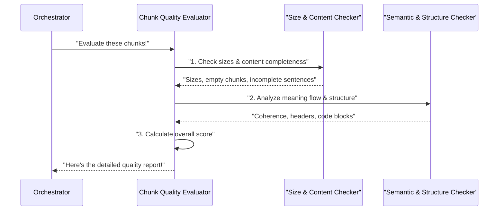

# Chapter 5: Chunk Quality Evaluator

Welcome back! In [Chapter 4: LLM Provider Integration](04_llm_provider_integration_.md), we learned how our `chuncking-system` can talk to powerful Artificial Intelligence (AI) models. Before that, in [Chapter 3: Hybrid Chunking Engine](03_hybrid_chunking_engine_.md), we saw how our system intelligently breaks down large documents into smaller pieces, called "chunks." And, of course, [Chapter 1: Configuration Management](01_configuration_management_.md) taught us how to customize all these processes with simple settings.

Now, imagine you've processed a huge document, like a long technical manual, and the [Hybrid Chunking Engine](03_hybrid_chunking_engine_.md) has created hundreds of chunks. How do you know if these chunks are actually *good*? Are they truly useful for an AI model to understand and answer questions, or did the chunking process accidentally cut sentences in half, or create chunks that are too small to be meaningful?

This is where the **Chunk Quality Evaluator** comes in! Think of it as the **quality inspector** for your document pieces. After the chunks are made, this component meticulously checks them to make sure they meet high standards, providing a "report card" on their usefulness.

#### What Problem Does the Chunk Quality Evaluator Solve?

When you break a large document into chunks, the main goal is often to use these chunks effectively with an AI model, especially in systems designed for answering questions based on documents (like Retrieval-Augmented Generation, or RAG). For RAG to work well, the quality of your chunks is super important.

If your chunks are:
*   **Too short or empty**: They might not contain enough context for the AI to understand.
*   **Too long**: They might exceed the AI's input limit, cost more to process, or contain irrelevant information, making the AI less efficient.
*   **Cut in the middle of a sentence, a paragraph, or a code block**: They become confusing and hard for the AI to interpret correctly. It's like giving someone half a word – they can't understand the full meaning!
*   **Missing important structural information**: Like a heading separated from its content, making it hard for the AI to grasp the overall structure of the document.

The **Chunk Quality Evaluator** solves these problems by systematically checking various aspects of each chunk and giving you a detailed "report card." This report helps you understand if your chunking process is working as intended and provides recommendations for how to make it even better.

#### What Makes a Chunk "Good Quality"?

Our Chunk Quality Evaluator looks at several key aspects to determine a chunk's quality. Each aspect helps ensure the chunks are truly useful for AI models:

1.  **Size Consistency**: This checks if the chunks are generally similar in length (e.g., in characters or "AI words" called tokens). If your target is 500 tokens, are most chunks close to that, or are some very small and others very large? Consistency helps AI models process information predictably.
2.  **Content Completeness**: This ensures each chunk contains complete thoughts, sentences, or intact structural elements like full code blocks. It tries to catch issues like a sentence stopping abruptly in the middle, which would confuse an AI.
3.  **Semantic Coherence**: This measures how well the meaning flows within a chunk, and crucially, between adjacent chunks. If one chunk is about "space travel" and the next is suddenly about "baking recipes" without a clear transition, coherence is low. High semantic coherence means related ideas stay together.
4.  **Structural Preservation**: This verifies that important parts of your document's structure, like main headings, subheadings, code blocks, or lists, are kept together with their relevant content within a single chunk. This helps the AI understand the document's organization.

The evaluator assigns scores for each of these areas and then combines them into an **overall quality score**, usually out of 100. This score tells you at a glance how well your chunks are performing.

#### How to Use the Chunk Quality Evaluator

You can use the `ChunkQualityEvaluator` to inspect any list of `Document` objects. Remember, `Document` objects are the format our [Hybrid Chunking Engine](03_hybrid_chunking_engine_.md) produces, containing `page_content` (the text) and `metadata` (extra information).

First, let's create some simple example chunks, just like our `Hybrid Chunking Engine` might produce:

```python
from src.chunkers.evaluators import ChunkQualityEvaluator
from langchain_core.documents import Document

# Imagine these chunks were created by our chunking engine
example_chunks = [
    Document(page_content="This is a complete sentence. It ends here.", metadata={'chunk_index': 0}),
    Document(page_content="Here begins a new paragraph. This one is quite short.", metadata={'chunk_index': 1}),
    Document(page_content="```python\ndef greet(name):\n    return f'Hello, {name}'\n```", metadata={'chunk_index': 2, 'content_type': 'code'}),
    Document(page_content="This chunk is not complete. It just stops", metadata={'chunk_index': 3}), # An incomplete chunk
    Document(page_content=""), # An empty chunk
    Document(page_content="# Introduction", metadata={'chunk_index': 5, 'Header 1': 'Introduction'}) # A header chunk
]

print(f"We have {len(example_chunks)} chunks ready for inspection!")
```
Here, we've prepared a list of `Document` objects. Notice some are good, but others intentionally represent common chunking problems like incomplete sentences or empty content.

Now, let's create an instance of our `ChunkQualityEvaluator` and tell it to evaluate these chunks:

```python
# Create our quality inspector!
evaluator = ChunkQualityEvaluator()

# Ask the evaluator to inspect our chunks!
quality_metrics = evaluator.evaluate_chunks(example_chunks)

# Let's see the overall score!
print(f"\nOverall Quality Score: {quality_metrics['overall_score']:.1f}/100")

# We can also look at specific findings:
print(f"Empty chunks detected: {quality_metrics['content_quality']['empty_chunks']}")
print(f"Incomplete sentences: {quality_metrics['content_quality']['incomplete_sentences']}")
```
When you run this, the `evaluate_chunks` method will return a dictionary (`quality_metrics`) with detailed information, including the `overall_score`. For our `example_chunks`, it would correctly identify the empty chunk and the incomplete sentence.

To get a more human-friendly summary, you can generate a detailed report, which is usually saved to a Markdown file:

```python
# Generate a nicely formatted report.
# You can optionally save it to a file, just like our system does!
report_content = evaluator.generate_report(example_chunks, output_path="my_quality_report.md")

# Print the report content to your console to see it now
print("\n--- Chunk Quality Report ---")
print(report_content)

print("\n(Check 'my_quality_report.md' file in your project directory for the full report!)")
```
This will print a well-structured Markdown report summarizing all the quality metrics, along with helpful recommendations for improvement. This is exactly the kind of report you would find in your `data/output/reports` directory after a full run of the `chuncking-system`.

#### Under the Hood: How the Evaluator Works

When the [Document Chunking System (Orchestrator)](02_document_chunking_system__orchestrator__.md) hands over a list of chunks to the `ChunkQualityEvaluator` and asks it to do its job, here's a simplified view of what happens inside:



As you can see, the `ChunkQualityEvaluator` acts like a lead inspector. It delegates specific checks to its internal "teams" (specialized methods) that focus on different aspects of quality:

1.  It first sends chunks to a "Size & Content Checker" to analyze if chunk sizes are consistent, and to spot problems like empty chunks, very short chunks, or sentences that stop in the middle.
2.  Next, it passes the chunks to a "Semantic & Structure Checker." This team uses clever techniques (like comparing text meanings with tools from [LLM Provider Integration](04_llm_provider_integration_.md)) to assess how well the meaning flows between chunks (semantic coherence) and if important structural elements (like headings and code) are preserved.
3.  Finally, after all individual checks are done, the `ChunkQualityEvaluator` takes all these findings and combines them into a single, easy-to-understand **overall quality score**.

#### Diving into the Code

The core logic for the `ChunkQualityEvaluator` is found in the `src/chunkers/evaluators.py` file.

Let's look at a simplified version of the `__init__` method, where the evaluator sets up its tools, and the main `evaluate_chunks` method:

```python
# src/chunkers/evaluators.py (simplified)
import numpy as np
from typing import List, Dict, Any
from langchain_core.documents import Document
from sklearn.feature_extraction.text import TfidfVectorizer # For comparing text similarity
import re # For checking content patterns

class ChunkQualityEvaluator:
    def __init__(self):
        # We need a tool to measure how similar text pieces are to each other
        self.vectorizer = TfidfVectorizer(max_features=1000, stop_words='english')
        
        # This is a setting for what we consider "very short" for a chunk (in words)
        self.min_words_for_very_short = 10 

    def evaluate_chunks(self, chunks: List[Document]) -> Dict[str, Any]:
        """Comprehensive chunk quality evaluation - main method."""
        if not chunks:
            return {'error': 'No chunks to evaluate'}

        # Call specialized internal methods to gather different metrics
        metrics = {
            'total_chunks': len(chunks),
            'size_distribution': self._analyze_size_distribution(chunks),
            'content_quality': self._analyze_content_quality(chunks),
            'semantic_coherence': self._analyze_semantic_coherence(chunks),
            'structural_preservation': self._analyze_structure_preservation(chunks)
        }

        # Combine all individual findings into one overall score
        metrics['overall_score'] = self._calculate_overall_score(metrics)
        return metrics
```
The `__init__` method prepares a `TfidfVectorizer` which is a common tool for comparing text. The `evaluate_chunks` method then orchestrates the entire evaluation by calling other private methods (starting with `_analyze_`) that handle specific quality checks.

For example, let's look at a simplified version of how `_analyze_content_quality` might check for incomplete sentences:

```python
# src/chunkers/evaluators.py (simplified _analyze_content_quality)
# ... (imports and ChunkQualityEvaluator class structure)

class ChunkQualityEvaluator:
    # ... (init and evaluate_chunks methods)

    def _analyze_content_quality(self, chunks: List[Document]) -> Dict[str, Any]:
        """Analyze content quality, checking for empty chunks, very short ones, and incomplete sentences."""
        quality_metrics = {
            'empty_chunks': 0,
            'very_short_chunks': 0,
            'incomplete_sentences': 0,
        }

        for chunk in chunks:
            content = chunk.page_content.strip()

            if not content: # Is the chunk empty?
                quality_metrics['empty_chunks'] += 1
                continue
            
            if len(content.split()) < self.min_words_for_very_short: # Is it very short?
                quality_metrics['very_short_chunks'] += 1
            
            # Check if it's a structural element (like a header or code) which doesn't need punctuation
            is_structural = re.match(r'^#+\s', content) or '```' in content or chunk.metadata.get('content_type') == 'code'
            
            # If it's regular text and doesn't end with proper punctuation, it might be incomplete
            if not is_structural and not re.search(r'[.!?:]$', content):
                quality_metrics['incomplete_sentences'] += 1
            
        total_chunks = len(chunks)
        # Calculate percentages for the final report
        quality_metrics['empty_chunks_pct'] = (quality_metrics['empty_chunks'] / total_chunks * 100) if total_chunks > 0 else 0
        quality_metrics['incomplete_sentences_pct'] = (quality_metrics['incomplete_sentences'] / total_chunks * 100) if total_chunks > 0 else 0
        # ... (similar calculations for other metrics)
        
        return quality_metrics
```
This simplified snippet shows how the `_analyze_content_quality` method goes through each chunk, checks its length, and uses simple rules (like checking for ending punctuation or common code patterns) to identify potential issues.

Finally, all these individual scores are combined to produce the `overall_score`:

```python
# src/chunkers/evaluators.py (simplified _calculate_overall_score)
# ... (all previous methods)

class ChunkQualityEvaluator:
    # ... (all analyze methods)

    def _calculate_overall_score(self, metrics: Dict[str, Any]) -> float:
        """Calculate the overall quality score (0-100) by combining all metrics."""
        
        # Assign different "weights" to how important each quality aspect is
        # (These weights can be adjusted based on your specific needs!)
        
        size_score_contribution = metrics['size_distribution']['size_consistency'] * 20 # 20% of total score
        
        content_metrics = metrics['content_quality']
        # Penalize for empty, very short, or incomplete chunks
        content_quality_score = (100 - content_metrics['empty_chunks_pct']) * 0.5 + \
                                (100 - content_metrics['very_short_chunks_pct']) * 0.3 + \
                                (100 - content_metrics['incomplete_sentences_pct']) * 0.2
        content_score_contribution = (content_quality_score / 100) * 30 # 30% of total score

        coherence_score_contribution = metrics['semantic_coherence']['coherence_score'] * 25 # 25% of total score

        structure_metrics = metrics['structural_preservation']
        # Reward for preserving headers, code, lists, etc.
        structural_preservation_score = (structure_metrics['chunks_with_headers_pct'] * 0.4 +
                                       structure_metrics['chunks_with_code_pct'] * 0.3 +
                                       structure_metrics['chunks_with_lists_pct'] * 0.2)
        structure_score_contribution = (structural_preservation_score / 100) * 25 # 25% of total score
        
        # Add up all contributions for the final score
        overall_score = size_score_contribution + content_score_contribution + \
                        coherence_score_contribution + structure_score_contribution
        
        # Ensure the score is always between 0 and 100
        return min(100, max(0, overall_score))
```
This method takes the scores from all the individual analyses and combines them into one final `overall_score`. It assigns different "weights" to each quality aspect (e.g., content quality and semantic coherence might be given higher weight for most AI use cases than exact size consistency). This flexibility allows the system to adapt to different quality priorities.

#### Why is Chunk Quality Evaluation So Important?

| Benefit                          | Description                                                                                             | Analogy                                                                                                    |
| :------------------------------- | :------------------------------------------------------------------------------------------------------ | :--------------------------------------------------------------------------------------------------------- |
| **Better AI Performance (RAG)**  | High-quality, meaningful chunks lead to more accurate, relevant, and comprehensive answers from AI models. | Giving an AI clear, complete puzzle pieces instead of jumbled, half-cut ones makes the final picture clear. |
| **Debugging Chunking Issues**    | Helps you identify *why* your chunks might not be working well for your AI applications.                | Spotting if your custom-cut wood pieces are too short or have rough edges *before* you try to build something. |
| **Informed Decision Making**     | Provides data to help you fine-tune chunking settings (like `chunk_size` or `overlap`).                 | Adjusting oven temperature (settings) based on how well your cake bakes (quality).                         |
| **Consistent Quality**           | Ensures that chunks maintain a desired standard across different documents and processing runs.         | A quality control check on a production line, ensuring every product meets standards.                      |
| **Cost Efficiency**              | Optimal chunks can reduce the amount of irrelevant or redundant text sent to AI models, saving money on API calls. | Not paying for extra, irrelevant pieces of wood you don't need for your building project.                    |

#### Conclusion

In this chapter, we explored the **Chunk Quality Evaluator**, the diligent quality inspector of our `chuncking-system`. We learned why evaluating chunk quality is crucial for tasks like Retrieval-Augmented Generation (RAG) and how the evaluator assesses chunks based on their size, content completeness, semantic coherence, and structural preservation. We saw how to use it to get detailed metrics and human-readable reports, and we peeked behind the curtain to understand how it performs its various checks.

Knowing your chunks are of high quality is a vital step in building a reliable and effective AI system. It ensures that the effort you put into chunking pays off with better AI performance and more meaningful results.

Now that we know how to smartly cut documents and evaluate their quality, how do we make sure this entire process is secure and safe for sensitive information? Let's move on to the next chapter to discover the **Security Framework**!

Ready to secure our system? Let's move on to explore the [Security Framework](06_security_framework_.md)!

---

<sub><sup>Generated by [AI Codebase Knowledge Builder](https://github.com/The-Pocket/Tutorial-Codebase-Knowledge).</sup></sub> <sub><sup>**References**: [[1]](https://github.com/ai-rio/chuncking-system/blob/e1a233785e744443e919c2de3f68d87ab02216d1/data/output/reports/sample_document_quality_report.md), [[2]](https://github.com/ai-rio/chuncking-system/blob/e1a233785e744443e919c2de3f68d87ab02216d1/docs/tutorial/Chapter 4: Chunk Quality Evaluator.md), [[3]](https://github.com/ai-rio/chuncking-system/blob/e1a233785e744443e919c2de3f68d87ab02216d1/src/chunkers/evaluators.py)</sup></sub>
