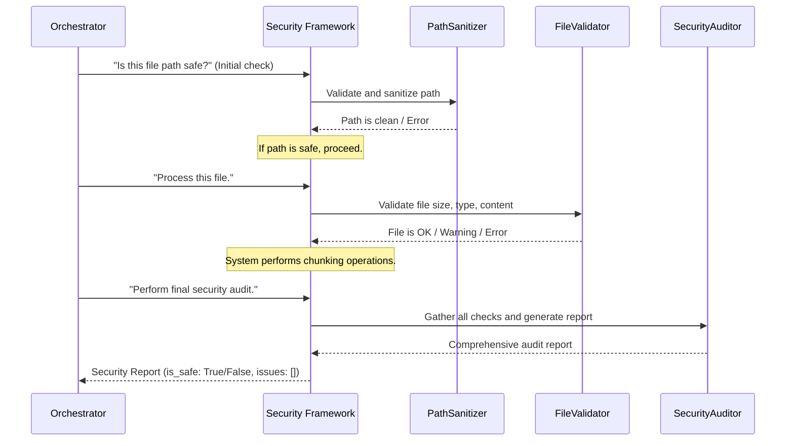

# Chapter 5: Security Framework

Welcome back! In [Chapter 4: Chunk Quality Evaluator](04_chunk_quality_evaluator_.md), we learned how to check if our document "chunks" are good quality and useful for AI models. But imagine you're working with important, perhaps even secret, documents. How do you make sure that while your system is smartly chunking your files, it's also keeping everything safe and secure from harm?

This is where the **Security Framework** comes in! Think of it as the **vigilant bodyguard** for your entire `chuncking-system`. Its main job is to protect your system and your data from threats, ensuring every operation is safe and compliant.

#### What Problem Does the Security Framework Solve?

When a system handles files and processes data, it's always at risk.
*   What if someone tries to feed it a file that's actually a virus?
*   What if a malicious file tries to sneakily access other parts of your computer?
*   How do you ensure that only allowed types of files are processed?
*   How do you prevent data corruption or unauthorized changes?

If you just take any file and process it without checks, you're opening the door to potential security disasters. The **Security Framework** solves these critical problems by acting as a strong line of defense. It rigorously checks everything coming in and going out, making sure no dangerous content or unauthorized access attempts succeed.

#### Your System's Vigilant Bodyguard

Our Security Framework is like a team of specialized security professionals working together:

1.  **Input Validation (The Gatekeeper)**: Before any file is even touched, the "gatekeeper" checks if the file path is safe and if the file type is allowed. It's like checking someone's ID and making sure they're on the guest list before they enter a party.
    *   *Example*: Is this a `.md` file, or is it a sneaky `.exe` file trying to get in?
    *   *Example*: Is the file path trying to go to `../../sensitive_data` to snoop around?

2.  **Content Scanning (The X-Ray Machine)**: Once a file is deemed safe to open, the "X-ray machine" scans its content for any dangerous "patterns" or suspicious code. Even if a file has a safe name, its contents might be harmful.
    *   *Example*: Does the text contain hidden `script` tags or strange `eval()` commands that could execute malicious code?

3.  **Checksum Validation (The Fingerprint Expert)**: This team member creates a unique digital "fingerprint" (a checksum) for files. If the file is changed even slightly, its fingerprint changes, immediately telling us it's been tampered with.
    *   *Example*: You've processed a file, saved it, and later someone tries to use it again. The system can check its fingerprint to ensure it hasn't been corrupted or altered since the last time.

4.  **Security Auditing (The Detective)**: After everything is done, a "detective" performs a full investigation, gathering all security checks and presenting a clear report on the file's safety status. It's like a detailed incident report summarizing all the security findings.

By combining these roles, the Security Framework ensures that your `chuncking-system` operates in a secure and trustworthy manner.

#### How to Use the Security Framework

The great news is that the [Document Chunking System (Orchestrator)](01_document_chunking_system__orchestrator__.md) automatically coordinates with the Security Framework! When you call `orchestrator.chunk_file()`, it first sends the file path and then the processed chunks to the security team for checks.

You can enable or disable the security features via [Configuration Management](03_configuration_management_.md) by setting the `enable_security` flag in your `settings.py` or `.env` file:

```python
# In src/config/settings.py or your .env file
# Enable all security checks by default
enable_security: bool = True
```
If `enable_security` is `False`, the system will skip many of the security checks (though basic path sanitization might still occur for system stability).

While the Orchestrator uses it behind the scenes, you can also directly ask the Security Framework to audit a specific file. This is useful if you want to understand its security findings or troubleshoot an issue.

```python
from src.utils.security import audit_file_security
from pathlib import Path

# Prepare a sample file path (imagine this is a real file on your system)
safe_file_path = Path("data/input/markdown_files/your_book.md")

# Ask the Security Framework to audit the file
security_report = audit_file_security(safe_file_path)

# Print the overall security status
print(f"Audit for {safe_file_path.name}: {security_report['overall_status']}")

# If there were any issues, they'll be listed
if security_report['issues']:
    print("Issues found:")
    for issue in security_report['issues']:
        print(f"- {issue}")
else:
    print("No security issues detected.")

# Example of a potentially unsafe path (DO NOT run with actual sensitive paths!)
# malicious_path = Path("/etc/passwd") # This path would likely be blocked
# malicious_report = audit_file_security(malicious_path)
# print(f"\nAudit for {malicious_path.name}: {malicious_report['overall_status']}")
```
When you run this, `audit_file_security` will return a dictionary (`security_report`) detailing various checks like path sanitization, file size, MIME type, and content safety. For a clean markdown file, it should report `passed`. If you try a path like `/etc/passwd`, it would likely `failed` due to "Access to blocked path."

#### Under the Hood: How the Bodyguard Works

When the [Document Chunking System (Orchestrator)](01_document_chunking_system__orchestrator__.md) hands over a file to the Security Framework, here's how our "bodyguard team" works:



As you can see, the Security Framework orchestrates its own specialized components:

1.  **Path Sanitizer**: First, the `PathSanitizer` cleans and validates the incoming file path to prevent tricks like trying to navigate to restricted directories (`../../..`).
2.  **File Validator**: Next, the `FileValidator` checks the file's properties (like size and allowed file type) and even scans its content for suspicious code patterns.
3.  **Security Auditor**: Finally, the `SecurityAuditor` acts as the overall manager, running all these checks and compiling a detailed report about the file's security status. This report includes `overall_status` (e.g., `passed`, `warning`, `failed`) and any specific `issues` found.

#### Diving into the Code

The core logic for the Security Framework is found in `src/utils/security.py`.

Let's look at the `SecurityConfig` first, which defines the rules for our bodyguard:

```python
# src/utils/security.py (simplified)
from dataclasses import dataclass
from typing import Set

@dataclass
class SecurityConfig:
    """Security configuration settings."""
    max_file_size_mb: int = 100 # Maximum file size
    allowed_extensions: Set[str] = None # What file types are allowed
    blocked_extensions: Set[str] = None # What file types are never allowed
    blocked_paths: Set[str] = None # Directories the system should never access
    enable_content_validation: bool = True # Should we scan file content?
    
    def __post_init__(self):
        # Default allowed extensions if not provided
        if self.allowed_extensions is None:
            self.allowed_extensions = {'.md', '.txt'}
        # Default blocked extensions
        if self.blocked_extensions is None:
            self.blocked_extensions = {'.exe', '.bat', '.js'}
        # Default blocked paths (sensitive system directories)
        if self.blocked_paths is None:
            self.blocked_paths = {'/etc', '/root'}
```
This `SecurityConfig` is directly used by the different security components. It allows you to customize allowed file types, maximum sizes, and which sensitive system paths are always off-limits, all manageable through [Configuration Management](03_configuration_management_.md).

Next, let's see how the `PathSanitizer` cleans up file paths:

```python
# src/utils/security.py (simplified)
from pathlib import Path
import re # For regular expressions to find patterns

class PathSanitizer:
    def __init__(self, config: Optional[SecurityConfig] = None):
        self.config = config or SecurityConfig()
        self.dangerous_patterns = [
            r'\.\.',  # Looks for '..' (parent directory traversal)
            r'[<>:"|?*]',  # Invalid characters for filenames
        ]

    def sanitize_path(self, path: Union[str, Path]) -> Path:
        original_path_str = str(path)
        
        # Check for directory traversal directly
        if '..' in original_path_str:
            raise ValidationError("Path traversal detected")
        
        path_obj = Path(path).resolve() # Convert to full, real path
        
        # Check against general dangerous patterns
        for pattern in self.dangerous_patterns:
            if re.search(pattern, str(path_obj), re.IGNORECASE):
                # Skip '..' here, already handled
                if pattern == r'\.\.': continue
                raise ValidationError(f"Dangerous path pattern detected: {pattern}")
        
        # Check if path tries to access blocked system directories
        for blocked_path in self.config.blocked_paths:
            if str(path_obj).startswith(blocked_path):
                raise ValidationError(f"Access to blocked path: {blocked_path}")
        
        return path_obj
```
The `sanitize_path` method is crucial. It immediately flags paths containing `..` (which could allow access to parent directories), checks for invalid characters, and ensures the path doesn't try to go into system-sensitive `blocked_paths` defined in our `SecurityConfig`.

The `FileValidator` then checks the content of the file:

```python
# src/utils/security.py (simplified)
import re

class FileValidator:
    def __init__(self, config: Optional[SecurityConfig] = None):
        self.config = config or SecurityConfig()

    def validate_content_safety(self, file_path: Path) -> None:
        """Validate file content for safety (basic checks)."""
        if not self.config.enable_content_validation:
            return
        
        with open(file_path, 'r', encoding='utf-8', errors='ignore') as f:
            content = f.read(10240) # Read first 10KB for quick scan
        
        suspicious_patterns = [
            r'<script[^>]*>',  # HTML script tags (potential XSS)
            r'javascript:',     # JavaScript URLs
            r'eval\s*\(',       # eval() calls in code
        ]
        
        for pattern in suspicious_patterns:
            if re.search(pattern, content, re.IGNORECASE):
                raise ValidationError(f"Potentially unsafe content detected: {pattern}")
        
        if '\x00' in content: # Check for null bytes, often found in binary files
            raise ValidationError("Binary content detected")
```
This `validate_content_safety` method opens the file (safely, for reading only) and scans the beginning of its content for known `suspicious_patterns` that often indicate malicious code or binary data.

Finally, the `SecurityAuditor` orchestrates all these checks and summarizes the findings:

```python
# src/utils/security.py (simplified)
from datetime import datetime

class SecurityAuditor:
    def __init__(self, config: Optional[SecurityConfig] = None):
        self.config = config or SecurityConfig()
        self.path_sanitizer = PathSanitizer(config)
        self.file_validator = FileValidator(config)
        # self.checksum_validator = ChecksumValidator() # Also used for integrity checks

    def audit_file(self, file_path: Union[str, Path]) -> Dict[str, Any]:
        report = {
            'file_path': str(file_path),
            'timestamp': datetime.now().isoformat(),
            'checks': {}, 'warnings': [], 'errors': [], 'overall_status': 'unknown', 'is_safe': False
        }
        try:
            # 1. Path sanitization check
            self.path_sanitizer.sanitize_path(file_path)
            report['checks']['path_sanitization'] = 'passed'
            
            # 2. File existence, size, type, and content checks
            self.file_validator.validate_file_size(Path(file_path))
            report['checks']['file_size'] = 'passed'
            self.file_validator.validate_mime_type(Path(file_path))
            report['checks']['mime_type'] = 'passed'
            self.file_validator.validate_content_safety(Path(file_path))
            report['checks']['content_safety'] = 'passed'

            # (Additional checks like checksum validation would go here)
            
            report['overall_status'] = 'passed'
            report['is_safe'] = True
        except ValidationError as e:
            report['errors'].append(f"Validation failed: {e}")
            report['overall_status'] = 'failed'
            report['is_safe'] = False
        except Exception as e:
            report['errors'].append(f"Audit error: {e}")
            report['overall_status'] = 'error'
            report['is_safe'] = False
        return report
```
The `audit_file` method within `SecurityAuditor` brings together all the validation steps. It tries each check (path, size, MIME type, content safety) and records the results. If any check fails, it captures the error and marks the `overall_status` as `failed` or `warning`, making `is_safe` false. This comprehensive report is then returned to the Orchestrator.

#### Why is Security Framework So Important?

| Benefit               | Description                                                           | Analogy                                   |
| :-------------------- | :-------------------------------------------------------------------- | :---------------------------------------- |
| **Data Protection**   | Prevents unauthorized access, modification, or leakage of sensitive documents. | Guarding your vault of valuable information. |
| **System Integrity**  | Protects the system from malicious inputs that could corrupt or crash it. | Fortifying your house against intruders. |
| **Compliance**        | Helps meet industry regulations and legal requirements for data handling. | Following strict security rules for a bank or hospital. |
| **Trust & Reliability** | Ensures users that the system is safe and dependable, building confidence. | A reliable car with strong brakes and airbags. |
| **Threat Prevention** | Identifies and blocks common attack vectors like path traversal and code injection. | A robust alarm system that alerts you to danger immediately. |

#### Conclusion

In this chapter, we've explored the **Security Framework**, the vigilant bodyguard of our `chuncking-system`. We learned how it protects our system and data by performing rigorous input validation, path sanitization, content scanning, and comprehensive security audits. We saw how it integrates with the Orchestrator and how you can manually audit files for peace of mind.

Ensuring your system is secure is just as important as ensuring it's smart and efficient. Now that our system is safe and our chunks are of high quality, how do we keep an eye on everything to make sure it's always running smoothly and efficiently in a real-world setting? That's what we'll discover in the next chapter!

Ready to monitor our system's heartbeat? Let's move on to explore [Enterprise Observability & Monitoring](06_enterprise_observability___monitoring_.md)!

---

<sub><sup>Generated by [AI Codebase Knowledge Builder](https://github.com/The-Pocket/Tutorial-Codebase-Knowledge).</sup></sub> <sub><sup>**References**: [[1]](https://github.com/ai-rio/chuncking-system/blob/34705b324f6b2c41c349afa9662fbea086940ff9/README.md), [[2]](https://github.com/ai-rio/chuncking-system/blob/34705b324f6b2c41c349afa9662fbea086940ff9/debug_permission.py), [[3]](https://github.com/ai-rio/chuncking-system/blob/34705b324f6b2c41c349afa9662fbea086940ff9/src/utils/security.py), [[4]](https://github.com/ai-rio/chuncking-system/blob/34705b324f6b2c41c349afa9662fbea086940ff9/src/utils/validators.py)</sup></sub>
