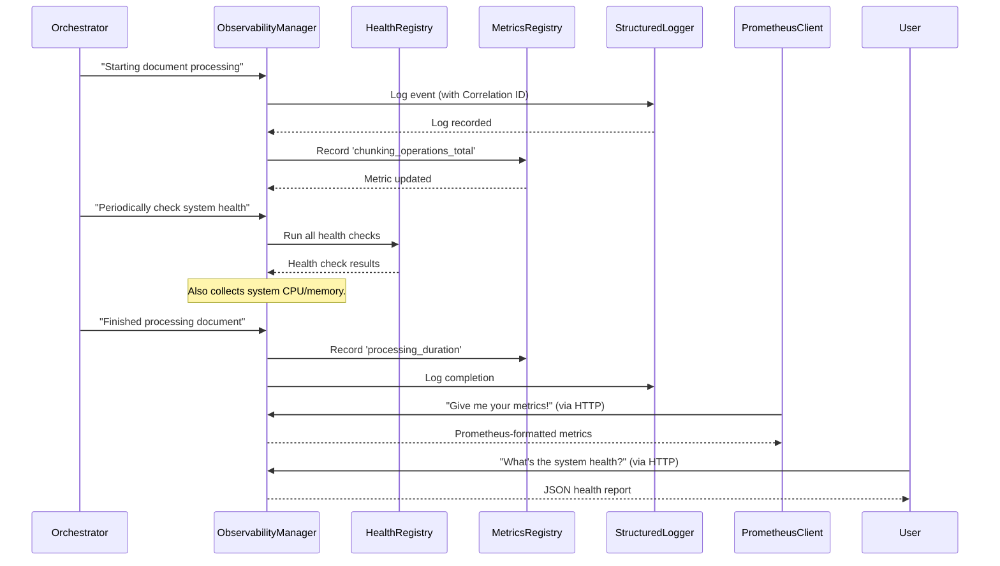

# Chapter 6: Enterprise Observability & Monitoring

Welcome back! In [Chapter 5: Security Framework](05_security_framework_.md), we explored how our `chuncking-system` acts as a vigilant bodyguard, protecting your valuable documents from security threats. But what happens once your system is running in the real world, processing documents day in and day out? How do you know if it's working properly, if it's fast enough, or if something is about to go wrong before it actually breaks?

This is where **Enterprise Observability & Monitoring** comes in! Think of this component as the **system's control tower**, or even a **pilot's cockpit**. Just like a pilot needs to constantly monitor all the aircraft systems (engine temperature, fuel levels, altitude, speed) to ensure a safe and smooth flight, our system needs constant eyes and ears on its own "health" and "performance."

#### What Problem Does Enterprise Observability & Monitoring Solve?

When a software system is operating, especially in a "production" environment where real users depend on it, you can't just cross your fingers and hope for the best. You need to know:
*   **Is it alive?** (Is the power on?)
*   **Is it healthy?** (Are all the engines running correctly?)
*   **Is it performing well?** (Are we flying fast enough? Are we using too much fuel?)
*   **Is it about to fail?** (Is an engine overheating?)
*   **What happened when it did fail?** (Why did that engine stop working?)

If you don't have this information, problems can go unnoticed for a long time, leading to slow performance, errors, or even a complete system shutdown. This can frustrate users and cost money.

**Enterprise Observability & Monitoring** solves this by providing **real-time insights** into your system's heartbeat. It collects vital signs, runs check-ups, keeps detailed diaries of events, and can even shout for help when it spots trouble. This allows operators to quickly understand the system's status, diagnose issues, and keep everything running smoothly.

#### Your System's Control Tower: Key Concepts

Our Observability & Monitoring component is built on a few core ideas, much like a control tower uses different tools to keep track of flights:

1.  **Metrics (The Gauges & Dials)**:
    *   **What they are**: Numbers that measure specific aspects of your system over time.
    *   **Examples**: CPU usage (how busy your computer's brain is), memory (how much RAM the system is using), processing speed (how fast documents are chunked), number of documents processed, number of errors.
    *   **How they help**: They tell you *how much* of something is happening. "Our CPU usage is 70%." "We processed 100 documents in the last minute."

2.  **Health Checks (The Pre-flight Checklist)**:
    *   **What they are**: Simple "yes/no" or "good/bad" checks to see if different parts of the system are working as expected.
    *   **Examples**: "Is the database reachable?" "Can we write files to disk?" "Is the main chunking engine initialized?"
    *   **How they help**: They tell you *if* a component is functioning. "The file system check passed." "The chunking engine is ready."

3.  **Logging with Correlation IDs (The Flight Recorder)**:
    *   **What they are**: Detailed records of events happening inside the system. Every significant action (like starting to chunk a document, finishing a security scan, or encountering an error) is written down.
    *   **Correlation IDs**: Imagine a unique "flight number" for each document being processed. Every log message related to that document will include this same "flight number."
    *   **How they help**: If something goes wrong, you can look at the logs and, using the correlation ID, trace *exactly* what happened step-by-step for that specific document, even if many documents are being processed at the same time.

4.  **Alerting (The Warning Lights)**:
    *   **What they are**: Automated notifications generated when metrics or health checks cross a "danger zone."
    *   **Examples**: "CPU usage is above 90% for 5 minutes!", "Disk space is running low!", "Error rate is too high!"
    *   **How they help**: Instead of constantly staring at dashboards, alerts tell you immediately when a problem needs your attention, often before users even notice.

5.  **Dashboards (The Control Panel Screens)**:
    *   **What they are**: Visual displays that combine metrics, health statuses, and sometimes logs into easy-to-understand charts, graphs, and tables.
    *   **How they help**: Provide a quick overview of the system's status, allowing you to spot trends or issues at a glance. We use Grafana for this.

#### How to Use Enterprise Observability & Monitoring

The good news is that our [Document Chunking System (Orchestrator)](01_document_chunking_system__orchestrator__.md) is designed to automatically feed data to the Observability & Monitoring component! You don't need to write extra code to collect basic system metrics or run standard health checks.

To enable or disable monitoring, you can use our [Configuration Management](03_configuration_management_.md) by setting the `enable_monitoring` flag in your `src/config/settings.py` file or your `.env` file:

```python
# In src/config/settings.py or your .env file
# Enable all monitoring features by default
ENABLE_MONITORING=True
```
If `ENABLE_MONITORING` is `False`, the system will skip most of the monitoring data collection, which can save a tiny bit of resources but will leave you "flying blind."

To actually *see* the monitoring data, our system provides special web (HTTP) endpoints. This means you can open your web browser or use a simple command-line tool (`curl`) to ask the system for its health or metrics.

First, you need to start the separate monitoring server. This server is a small program that exposes the monitoring information.

**1. Start the Standalone Monitoring Server**

Open a new terminal window (don't close this one, it needs to keep running):

```bash
python -m src.api.health_endpoints
```
You'll see messages like `Health check server running on http://localhost:8000`. This means the monitoring server is now active and listening for requests on your computer's port `8000`.

**2. Access Health Check Endpoints**

Now, in another terminal (or your web browser, e.g., `http://localhost:8000/monitoring/health`), you can ask the system for its health:

```bash
# Basic health check
curl http://localhost:8000/monitoring/health
```
**Expected Output (simplified):**
```json
{
  "status": "healthy",
  "message": "System health: 4/4 components healthy",
  "uptime": 3600.0,
  "response_time_ms": 1.23,
  "timestamp": "2024-07-26T10:00:00.000000"
}
```
This tells you the overall health status of the system.

You can also get a more detailed view:

```bash
# Detailed health check
curl http://localhost:8000/monitoring/health/detailed
```
**Expected Output (simplified):**
```json
{
  "overall_status": "healthy",
  "components": {
    "cpu": {"status": "healthy", "message": "CPU usage: 15.0%"},
    "memory": {"status": "healthy", "message": "Memory usage: 40.5%"},
    "disk": {"status": "healthy", "message": "Disk usage: 25.0%"},
    "process": {"status": "healthy", "message": "Process healthy..."}
  },
  "summary": {"total_components": 4, "healthy_components": 4, "unhealthy_components": 0}
}
```
This output lists the health status for each internal component (CPU, memory, disk, and the application process itself).

**3. Access Metrics Endpoints**

You can also ask the system for its performance metrics. These are often in a special format called "Prometheus format," which is easily understood by monitoring tools like Prometheus and Grafana.

```bash
# Get Prometheus-compatible metrics
curl http://localhost:8000/monitoring/metrics
```
**Expected Output (simplified):**
```
# HELP system.cpu_percent CPU usage in percent.
# TYPE system.cpu_percent gauge
system_cpu_percent 15.0
# HELP system.memory_percent Memory usage in percent.
# TYPE system.memory_percent gauge
system_memory_percent 40.5
# HELP chunking_operations_total Total number of chunking operations.
# TYPE chunking_operations_total counter
chunking_operations_total 12
... (many more metrics) ...
```
This shows you raw metrics like CPU usage, memory usage, and the total number of chunking operations performed.

**4. Record Your Own Metrics (Python API)**

While the system automatically collects many metrics, you can also record your own custom "business" metrics from anywhere in your Python code. This is like adding new gauges to your control panel for things specific to *your* use of the system.

```python
from src.utils.observability import record_metric, MetricType

# Imagine this is happening inside the chunking process
# Record that a document started processing
record_metric(
    "document_processing_started",
    1, # Increment by 1
    MetricType.COUNTER,
    "documents_count",
    labels={"status": "in_progress", "source": "web_upload"}
)

# Simulate some work and record duration
import time
start = time.time()
time.sleep(0.5) # Doing some chunking work
duration_ms = (time.time() - start) * 1000

# Record the duration of a chunking operation
record_metric(
    "chunking_duration_ms",
    duration_ms,
    MetricType.HISTOGRAM, # Measures distribution of values
    "milliseconds",
    labels={"chunk_size": "large"}
)

# Update a "gauge" metric (like a thermometer)
current_queue_size = 5
record_metric(
    "processing_queue_size",
    current_queue_size,
    MetricType.GAUGE, # Measures current value
    "items"
)

print("Custom metrics recorded!")
```
This example shows how easy it is to `record_metric` with a `name`, `value`, `MetricType` (like `COUNTER` for things that count up, `GAUGE` for current values, `HISTOGRAM` for durations), a `unit`, and optional `labels` to add more detail.

#### Under the Hood: How the Control Tower Works

When the [Document Chunking System (Orchestrator)](01_document_chunking_system__orchestrator__.md) is managing a document, it continuously sends updates to the Observability & Monitoring "control tower."


Here's a simplified breakdown of the process:

1.  **Orchestrator sends events**: Whenever something important happens (a document starts, a chunk is created, an error occurs, or an operation completes), the Orchestrator (or other parts of the system) notifies the `ObservabilityManager`.
2.  **`ObservabilityManager` coordinates**: This is the central hub. It decides where to send the information:
    *   **`StructuredLogger`**: For detailed text records of events, ensuring each log has a unique `correlation_id` so you can follow a single "flight" (document processing) through the system.
    *   **`MetricsRegistry`**: For numerical data that needs to be aggregated and tracked over time (like counters, gauges, and histograms).
    *   **`HealthRegistry`**: For running periodic checks on different components (CPU, memory, disk, etc.) and the application itself.
3.  **Data Collection**:
    *   System resources (CPU, memory, disk) are collected automatically in the background by `ObservabilityManager`.
    *   Application-specific metrics (like chunking duration or number of errors) are recorded when key operations happen using `record_metric`.
4.  **Exposure**: The collected health data and metrics are made available through HTTP endpoints, usually on a separate port (like `8000`). Monitoring tools like Prometheus can regularly "scrape" (read) these metrics to store them and trigger alerts.
5.  **Dashboards**: Tools like Grafana connect to Prometheus (which stores our metrics) and display them on a user-friendly dashboard, giving you a live view of your system.

#### Diving into the Code

The core of Enterprise Observability & Monitoring is in `src/utils/observability.py` and its exposed HTTP endpoints are defined in `src/api/health_endpoints.py`.

Let's look at how the main `ObservabilityManager` is set up:

```python
# src/utils/observability.py (simplified)

class ObservabilityManager:
    def __init__(self, max_concurrent_health_checks: int = 10, health_check_timeout: float = 30.0):
        self.logger = StructuredLogger("observability_manager") # Our special logger
        self.metrics_registry = MetricsRegistry()               # Stores all metrics
        self.health_registry = HealthRegistry(                  # Runs health checks
            max_concurrent_checks=max_concurrent_health_checks,
            check_timeout_seconds=health_check_timeout
        )
        # self.dashboard_generator = DashboardGenerator(...) # Generates Grafana configs
        
        self._register_default_health_checks() # Sets up CPU, memory, disk checks
        self._start_background_monitoring()    # Starts collecting system metrics constantly
```
When the `ObservabilityManager` is created (which happens automatically when the system starts), it sets up its `StructuredLogger`, `MetricsRegistry`, and `HealthRegistry`. It also immediately registers default health checks for system resources and starts a background process to continuously collect CPU, memory, and disk usage.

Now, let's see how easy it is to record a metric using the manager:

```python
# src/utils/observability.py (simplified)

class ObservabilityManager:
    # ... (init method)

    def record_metric(self, name: str, value: Union[int, float], 
                     metric_type: MetricType, unit: str = "units", labels: Optional[Dict[str, str]] = None,
                     help_text: Optional[str] = None):
        """Record a custom metric."""
        metric = CustomMetric( # Creates a data object for the metric
            name=name,
            value=value,
            metric_type=metric_type,
            unit=unit,
            labels=labels or {},
            help_text=help_text
        )
        self.metrics_registry.register_metric(metric) # Hands it to the registry to store
```
The `record_metric` method simply creates a `CustomMetric` object (a structured way to hold metric data) and then hands it over to the `MetricsRegistry` to store and manage.

Next, how the health checks are exposed through the `HealthEndpoint` (from `src/api/health_endpoints.py`):

```python
# src/api/health_endpoints.py (simplified)

class HealthEndpoint:
    def __init__(self, system_monitor: Optional[SystemMonitor] = None, observability_manager: Optional[ObservabilityManager] = None):
        self.logger = get_logger(__name__)
        # This SystemMonitor holds references to HealthChecker, MetricsCollector etc.
        self.system_monitor = system_monitor or SystemMonitor()
        self.observability = observability_manager or get_observability_manager()

    def health_check(self, component: Optional[str] = None) -> Tuple[Dict[str, Any], int]:
        """Basic health check endpoint."""
        # ... (timing and error handling logic) ...
        
        if component:
            # Check a specific component using the HealthChecker
            result = self.system_monitor.health_checker.run_check(component)
            # ... (format response) ...
        else:
            # Get overall health using the HealthChecker
            overall_health = self.system_monitor.health_checker.get_overall_health()
            # ... (format response) ...
        
        # Record a metric for the health check request itself!
        self.observability.record_metric(
            "health_check_requests_total", 1, MetricType.COUNTER, "requests",
            {"component": component or "all", "status": response["status"]}
        )
        return response, status_code
```
The `health_check` method within the `HealthEndpoint` class uses the `SystemMonitor` (which internally uses the `HealthChecker`) to get the health status of individual components or the system as a whole. It then formats this information into a JSON response. Notice how even the health check requests themselves are recorded as metrics!

Finally, let's see how Prometheus metrics are exported:

```python
# src/api/health_endpoints.py (simplified)

class MetricsEndpoint:
    def __init__(self, system_monitor: Optional[SystemMonitor] = None, observability_manager: Optional[ObservabilityManager] = None):
        self.logger = get_logger(__name__)
        self.system_monitor = system_monitor or SystemMonitor()
        self.observability = observability_manager or get_observability_manager()

    def prometheus_metrics(self) -> Tuple[str, int]:
        """Export metrics in Prometheus format."""
        # This calls the ObservabilityManager to get all metrics
        metrics_text = self.observability.export_prometheus_metrics()
        
        # ... (add some high-level system status metrics) ...
        
        return metrics_text, HTTPStatus.OK
```
The `prometheus_metrics` method of `MetricsEndpoint` simply calls `self.observability.export_prometheus_metrics()`, which asks the `MetricsRegistry` to convert all the stored metrics into a format that Prometheus can easily understand and collect.

#### Why is Enterprise Observability & Monitoring So Important?

| Benefit                    | Description                                                            | Analogy                                        |
| :------------------------- | :--------------------------------------------------------------------- | :--------------------------------------------- |
| **Early Problem Detection**| Spot issues (like high CPU, low disk) before they become critical.     | Detecting an engine warning light before it fails completely. |
| **Faster Troubleshooting** | Use logs and traces to quickly pinpoint the cause of an error.         | Using the flight recorder to understand what led to an incident. |
| **Performance Optimization**| Identify bottlenecks and areas for improvement based on real data.     | Knowing if your car is using too much fuel or struggling uphill. |
| **Proactive Management**   | Be alerted to problems automatically, reducing manual checking.        | An autopilot that alerts you when something is wrong. |
| **Trust & Reliability**    | Ensures the system is stable and dependable for users.                | Passengers trusting a flight crew that monitors everything. |
| **Compliance & Reporting** | Provides historical data for audits and performance reports.           | Maintaining a detailed logbook of all flights and maintenance. |

#### Conclusion

In this chapter, we've explored **Enterprise Observability & Monitoring**, the control tower of our `chuncking-system`. We learned how it provides real-time insights into the system's health and performance through metrics, health checks, structured logging with correlation IDs, and intelligent alerting. We saw how to activate and interact with these monitoring features via HTTP endpoints and how to record custom metrics.

Having robust observability and monitoring in place means you're never "flying blind" with your system, allowing you to ensure its reliability and efficiency in any real-world scenario.

Now that our system is smart, secure, and fully monitored, let's look at the foundational tools it uses to interact with files and paths on your computer.

Ready to understand how we handle files safely and efficiently? Let's move on to explore [File & Path Utilities](07_file___path_utilities_.md)!

---

<sub><sup>Generated by [AI Codebase Knowledge Builder](https://github.com/The-Pocket/Tutorial-Codebase-Knowledge).</sup></sub> <sub><sup>**References**: [[1]](https://github.com/ai-rio/chuncking-system/blob/34705b324f6b2c41c349afa9662fbea086940ff9/README.md), [[2]](https://github.com/ai-rio/chuncking-system/blob/34705b324f6b2c41c349afa9662fbea086940ff9/dashboards/prometheus-alerts.yml), [[3]](https://github.com/ai-rio/chuncking-system/blob/34705b324f6b2c41c349afa9662fbea086940ff9/dashboards/prometheus.yml), [[4]](https://github.com/ai-rio/chuncking-system/blob/34705b324f6b2c41c349afa9662fbea086940ff9/src/api/health_endpoints.py), [[5]](https://github.com/ai-rio/chuncking-system/blob/34705b324f6b2c41c349afa9662fbea086940ff9/src/utils/monitoring.py), [[6]](https://github.com/ai-rio/chuncking-system/blob/34705b324f6b2c41c349afa9662fbea086940ff9/src/utils/observability.py)</sup></sub>
