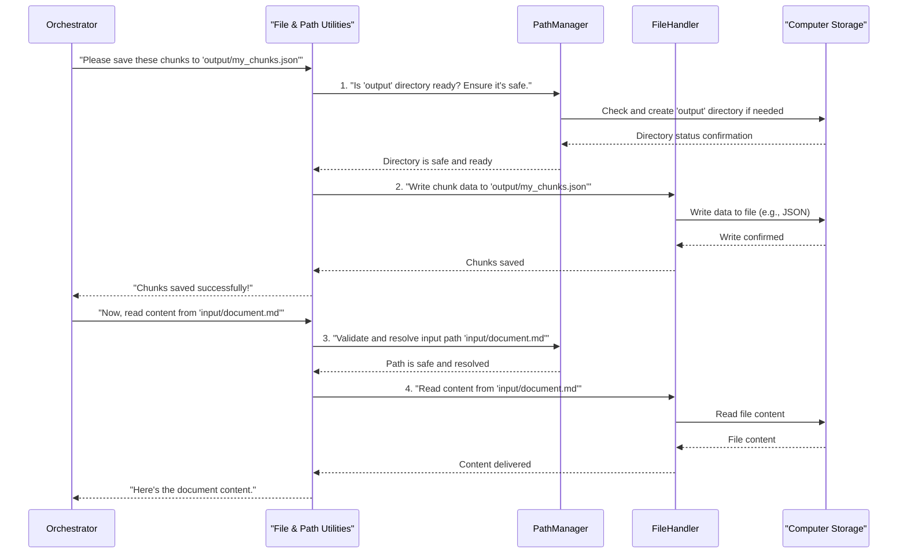

# Chapter 7: File & Path Utilities

Welcome back! In [Chapter 6: Security Framework](06_security_framework_.md), we learned how our system acts like a vigilant bodyguard, protecting your valuable documents and the system itself from potential threats. We saw how crucial it is to validate inputs and ensure safety.

But imagine our `chuncking-system` has just finished processing a big document. It has all these valuable "chunks" ready. Where should they go? How do we make sure they're saved correctly and safely? And what if we needed to find all the original documents to process in the first place?

This is where the **File & Path Utilities** come in! Think of these as the **system's robust file managers and librarians**. Their main job is to safely handle all interactions with your computer's file system – finding files, creating necessary folders, and making sure all file paths are secure.

#### What Problem Do File & Path Utilities Solve?

Working with files and folders sounds simple, but it can get tricky!
*   **Finding files**: If you have hundreds of Markdown files scattered in different folders, how do you find just the ones you need?
*   **Saving results**: How do you make sure the system saves its output (like your precious chunks) in the right place, and even creates that folder if it doesn't exist?
*   **Path security**: What if someone tries to trick the system with a tricky file path (like `../../secret_files/password.txt`) to access sensitive information outside of where it should be? This links directly to what we learned in the [Security Framework](06_security_framework_.md)!
*   **Cross-platform compatibility**: File paths look different on Windows (like `C:\Users\Documents`) versus macOS/Linux (like `/home/user/documents`). How do we write code that works everywhere?

The **File & Path Utilities** solve these problems by providing a set of reliable, smart tools. They ensure that all file inputs and outputs are handled without error, and most importantly, without security risks. They are the trustworthy hands that interact with your computer's storage.

#### Your System's File Manager & Librarian

Our File & Path Utilities are like having a very organized and careful librarian for your digital documents. They consist of a few key components:

1.  **File Handler (The Librarian)**: This component knows how to `read` documents from files and `save` your processed chunks into various formats (like JSON or CSV). It ensures the right encoding is used and handles common errors during saving/loading.

2.  **Path Manager (The Navigator & Architect)**: This is the smart part that understands how file paths work. It can:
    *   **Resolve paths**: Convert a short path like `my_doc.md` into its full, exact location on your computer.
    *   **Create structures**: Build entire sets of folders (like `output/chunks`, `output/reports`, `output/logs`) for your results.
    *   **Ensure safety**: Work with the [Security Framework](06_security_framework_.md) to check if a path is trying to go to a restricted area and block it.
    *   **Generate unique names**: If you save `report.md` and it already exists, it can automatically suggest `report_1.md`.

3.  **Markdown File Manager (The Specialized Librarian)**: This component builds on the `PathManager` but specializes in Markdown files. It knows all the common Markdown file extensions (like `.md`, `.markdown`) and can specifically find, read, and write Markdown content while also extracting useful info from them.

Together, these components ensure that files are accessed correctly, paths are managed securely, and your system's data is always where it should be.

#### How to Use File & Path Utilities

The [Document Chunking System (Orchestrator)](02_document_chunking_system__orchestrator__.md) automatically uses these utilities behind the scenes for reading your input documents and saving the output chunks and reports. You've already seen this in action when you ran `python main.py --input-file ... --output-dir ...`.

However, you can also use these utilities directly in your own Python code if you need to perform specific file operations.

First, you'll need to import the relevant classes:

```python
from src.utils.file_handler import FileHandler
from src.utils.path_utils import PathManager, MarkdownFileManager
from pathlib import Path
from langchain_core.documents import Document # Chunks are often Document objects

# Create instances of our managers
path_manager = PathManager()
markdown_manager = MarkdownFileManager()
# FileHandler methods are static, so no instance needed for it
```
Now, let's explore some common tasks:

**1. Creating Output Directories**

Before saving anything, it's good practice to make sure the folders exist.

```python
# Define where you want your outputs to go
my_output_base_dir = Path("my_project_output_data")

# Use PathManager to create the standard sub-folders
# This creates: my_project_output_data, my_project_output_data/chunks, etc.
created_dirs = path_manager.create_output_structure(my_output_base_dir)

print(f"Base output directory: {created_dirs['base']}")
print(f"Chunks directory: {created_dirs['chunks']}")

# Output: The directories will be created on your disk.
# Base output directory: my_project_output_data
# Chunks directory: my_project_output_data/chunks
```
The `create_output_structure` method ensures that your output folders are ready, creating them if they don't exist, and returning a dictionary of all the created paths.

**2. Finding Markdown Files**

Let's say you have a folder full of documents and want to find all the Markdown files within it.

```python
# For demonstration, let's imagine these files exist:
# data/temp_input/doc1.md
# data/temp_input/report.txt

input_directory = "data/temp_input" # A folder where your Markdown files are
markdown_files = markdown_manager.find_markdown_files(input_directory)

print(f"Found Markdown files in '{input_directory}':")
for file_path in markdown_files:
    print(f"- {file_path.name}")

# Example Output (assuming doc1.md exists and report.txt does not):
# Found Markdown files in 'data/temp_input':
# - doc1.md
```
This will print out the names of Markdown files, ignoring other file types, because `find_markdown_files` specifically looks for known Markdown extensions.

**3. Reading File Content**

Once you have a file path, you can easily read its content.

```python
# For demonstration, imagine this file exists:
# data/temp_read_me.md with content "Hello **World**!"

file_to_read = Path("data/temp_read_me.md")
content = markdown_manager.read_file(file_to_read)

print(f"Content of {file_to_read.name}:\n'{content}'")

# Example Output:
# Content of temp_read_me.md:
# 'Hello **World**!'
```
The `read_file` method ensures proper encoding and handles potential issues like permission errors.

**4. Saving Chunks to a File**

After the chunking process (using the [Hybrid Chunking Engine](03_hybrid_chunking_engine_.md)), you'll have a list of `Document` objects. You can save them in different formats.

```python
# Imagine these are chunks from our Hybrid Chunking Engine
my_chunks = [
    Document(page_content="This is the first chunk.", metadata={"source": "book.md", "index": 0}),
    Document(page_content="This is the second part.", metadata={"source": "book.md", "index": 1})
]

# Define an output path (using our earlier created directory)
output_file_path = created_dirs['chunks'] / "my_processed_chunks.json"

# Save the chunks as a JSON file
FileHandler.save_chunks(my_chunks, str(output_file_path), format='json')

print(f"Chunks saved to: {output_file_path}")

# Output:
# Chunks saved to: my_project_output_data/chunks/my_processed_chunks.json
# A file named 'my_processed_chunks.json' will be created in that folder.
```
The `save_chunks` method handles converting your `Document` objects into a format suitable for saving and writes them to the specified path. It also automatically creates the parent directory if it doesn't exist, thanks to the help of `PathManager`.

**5. Getting File Information**

You might want to know details about a file, like its size or when it was last changed.

```python
# For demonstration, imagine this file exists:
# data/temp_info.txt

info_file = Path("data/temp_info.txt")
file_info = path_manager.get_file_info(info_file)

print(f"File Name: {file_info['name']}")
print(f"File Size (bytes): {file_info['size_bytes']}")
print(f"Is Readable: {file_info['is_readable']}")

# Example Output (values depend on your specific file):
# File Name: temp_info.txt
# File Size (bytes): 16
# Is Readable: True
```
The `get_file_info` method provides a comprehensive dictionary of details about a given file.

These examples show how easily and safely you can perform common file system operations using the built-in utilities.

#### Under the Hood: How the File Managers Work

When the [Document Chunking System (Orchestrator)](02_document_chunking_system__orchestrator__.md) needs to interact with the file system, it calls upon the File & Path Utilities.



Here's a simplified breakdown of the process:

1.  **Orchestrator Requests**: The Orchestrator asks the File & Path Utilities to perform a file operation (e.g., save chunks, read a document, create a folder).
2.  **Path Management First**: The request first goes to the `PathManager` (or `MarkdownFileManager`, which uses `PathManager` internally). This is crucial for security. The `PathManager` verifies that the path is safe, resolves it to its full form, and ensures that any necessary parent directories are created.
3.  **File Handling**: Once the path is validated and prepared, the actual reading or writing of file content is delegated to the `FileHandler` (or `MarkdownFileManager`'s `read_file`/`write_file` methods). These components handle the specifics of opening, reading/writing, and closing files, including managing different file formats.
4.  **Error Handling**: Throughout this process, robust error handling ensures that issues like "file not found," "permission denied," or "disk full" are caught and reported gracefully, preventing the entire system from crashing.

#### Diving into the Code

The core logic for File & Path Utilities is found primarily in `src/utils/file_handler.py` and `src/utils/path_utils.py`.

Let's look at a simplified `FileHandler.save_chunks` method, focusing on directory creation and one format:

```python
# src/utils/file_handler.py (simplified)
import json
from pathlib import Path
from langchain_core.documents import Document # Chunks are Document objects

class FileHandler:
    @staticmethod
    def save_chunks(chunks: list[Document], output_path: str, format: str = 'json'):
        """Save chunks in specified format (simplified for JSON)."""
        output_path_obj = Path(output_path)
        
        # 1. Create output directory if it doesn't exist
        output_path_obj.parent.mkdir(parents=True, exist_ok=True)
        
        # 2. Prepare data and save for JSON format
        if format == 'json':
            chunks_data = []
            for chunk in chunks:
                chunks_data.append({
                    'content': chunk.page_content,
                    'metadata': chunk.metadata
                })
            
            with open(output_path_obj, 'w', encoding='utf-8') as f:
                json.dump(chunks_data, f, indent=2, ensure_ascii=False)
        # ... (other formats like 'csv', 'pickle' would be here) ...
```
This snippet shows how `save_chunks` first ensures the parent directory exists using `mkdir(parents=True, exist_ok=True)`. Then, for JSON, it transforms the `Document` objects into a dictionary format and safely writes them to the file. (Error handling for permission issues and other exceptions is present in the full code for robustness but omitted here for simplicity).

Next, let's look at a snippet from `PathManager` for creating directories and getting file info:

```python
# src/utils/path_utils.py (simplified)
import os
from pathlib import Path

class PathManager:
    # ... (init method) ...

    def create_output_structure(self, base_output_dir: Path) -> dict:
        """Create standard output directory structure."""
        base_path = Path(base_output_dir)
        
        directories = {
            'base': base_path,
            'chunks': base_path / 'chunks',
            'reports': base_path / 'reports',
        }
        
        for name, dir_path in directories.items():
            dir_path.mkdir(parents=True, exist_ok=True) # Create each folder
        return directories

    def get_file_info(self, file_path: Path) -> dict:
        """Get comprehensive file information."""
        path = Path(file_path)
        info = { 'path': str(path), 'name': path.name, 'exists': path.exists() }
        
        if path.exists():
            stat = path.stat() # Get file system stats
            info.update({
                'size_bytes': stat.st_size,
                'is_readable': os.access(path, os.R_OK), # Check if readable
            })
        return info
```
`create_output_structure` directly uses `Path.mkdir(parents=True, exist_ok=True)` which is Python's robust way to create directories and all their missing parent folders, avoiding errors if they already exist. `get_file_info` uses `Path.stat()` to get file system details and `os.access()` to check permissions. (Error handling is in the full code).

Finally, a snippet from `MarkdownFileManager` to show how it reads files:

```python
# src/utils/path_utils.py (simplified)
from pathlib import Path

class MarkdownFileManager(PathManager): # It inherits from PathManager!
    MARKDOWN_EXTENSIONS = ['.md', '.markdown'] # Defines accepted extensions

    def read_file(self, file_path: Path) -> str:
        """Read markdown file content."""
        path = Path(file_path)
        
        if not path.exists():
            raise FileNotFoundError(f"File not found: {path}")
            
        with open(path, 'r', encoding='utf-8') as f:
            return f.read()
```
The `read_file` method uses a standard `with open(...)` block to read the file. Notice how `MarkdownFileManager` inherits from `PathManager`, meaning it gets all the `PathManager`'s features (like path resolution and security checks, though simplified in this example) automatically!

#### Why are File & Path Utilities So Important?

| Benefit               | Description                                                           | Analogy                                   |
| :-------------------- | :-------------------------------------------------------------------- | :---------------------------------------- |
| **Reliability**       | Ensures file operations succeed consistently, preventing crashes.    | A sturdy toolbox for all your construction needs. |
| **Security**          | Protects against malicious paths and unauthorized file access.         | A secure safe deposit box for your valuables. |
| **Consistency**       | Provides a uniform way to interact with the file system across the application. | A standard operating procedure for library tasks. |
| **Cross-Platform**    | Handles differences between operating systems (Windows, Linux, macOS) automatically. | A universal adapter that works in any country. |
| **User Experience**   | Prevents errors like "directory not found" by creating needed folders. | A helpful assistant who anticipates your needs and sets things up. |

#### Conclusion

In this chapter, we've explored **File & Path Utilities**, the robust file managers and librarians of our `chuncking-system`. We learned how they solve critical problems like finding files, creating directories, handling various file formats, and, most importantly, ensuring all path operations are secure. We saw how to use these utilities directly in Python for common tasks like reading, writing, and listing files, and we peeked under the hood to understand how `FileHandler`, `PathManager`, and `MarkdownFileManager` work together to provide reliable and safe file system interactions.

These utilities are the foundation upon which all other data processing in our system relies, ensuring that your documents are handled with care from start to finish.

This chapter concludes our journey through the `chuncking-system`! We've covered everything from the orchestrating brain to the intelligent chunking engine, configuration, quality evaluation, robust security, and finally, the fundamental file management.

Thank you for joining this tutorial! We hope you now have a clear understanding of how the `chuncking-system` works and how its various components come together to create a powerful and reliable document processing solution.

---

<sub><sup>Generated by [AI Codebase Knowledge Builder](https://github.com/The-Pocket/Tutorial-Codebase-Knowledge).</sup></sub> <sub><sup>**References**: [[1]](https://github.com/ai-rio/chuncking-system/blob/e1a233785e744443e919c2de3f68d87ab02216d1/docs/tutorial/Chapter 7: File & Path Utilities.md), [[2]](https://github.com/ai-rio/chuncking-system/blob/e1a233785e744443e919c2de3f68d87ab02216d1/src/utils/file_handler.py), [[3]](https://github.com/ai-rio/chuncking-system/blob/e1a233785e744443e919c2de3f68d87ab02216d1/src/utils/path_utils.py)</sup></sub>
