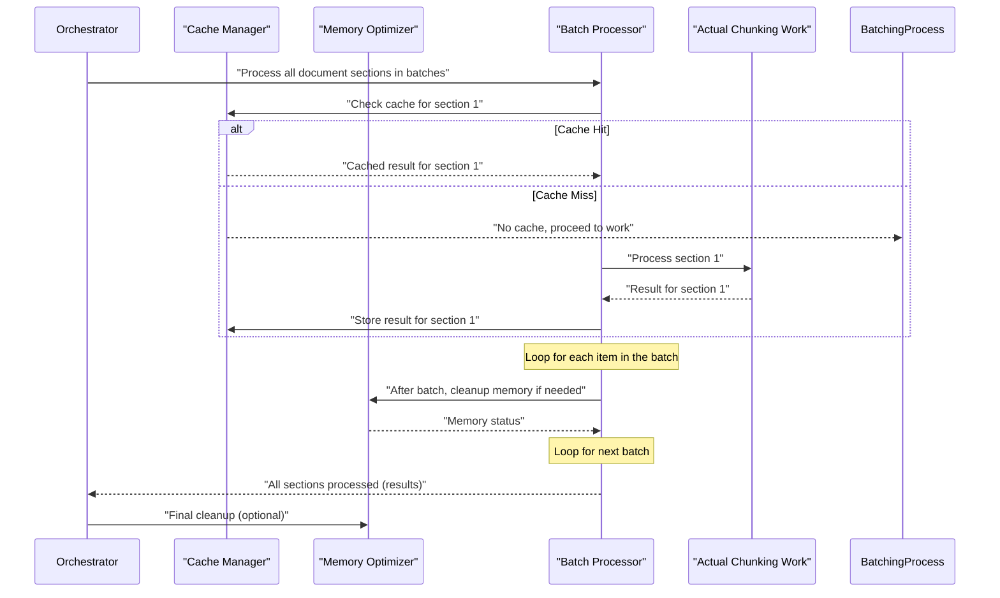

# Chapter 8: Performance Optimization & Caching

Welcome back! In [Chapter 7: File & Path Utilities](07_file___path_utilities_.md), we learned how our `chuncking-system` expertly handles finding, reading, and saving your documents, ensuring everything is in its right place and safe. We now know how to configure the system, chunk documents intelligently, evaluate their quality, keep them secure, and manage their files.

But here's a thought: what if you have to process an *entire library* of books, or a very, very long document, perhaps hundreds of megabytes in size? This can be super slow and might even make your computer run out of memory! We want our `chuncking-system` to be fast, efficient, and capable of handling even the biggest tasks smoothly.

This is where **Performance Optimization & Caching** comes in! Think of it as the **system's speed booster and smart memory keeper**. Its main job is to make sure your document processing happens as quickly as possible, without hogging all your computer's resources.

#### What Problem Does Performance Optimization & Caching Solve?

Imagine you're running a busy restaurant:

*   **Speed (Performance Optimization)**: You want to serve customers quickly. If cooking a dish takes too long, customers get impatient. In our system, "cooking" a document (chunking it, evaluating it) can take time, especially for large files. Performance optimization means finding ways to cook faster!
*   **Memory (Memory Optimization)**: When you're cooking many dishes at once, you need enough counter space and ingredients. If you run out, everything slows down or even grinds to a halt. In computers, "memory" (RAM) is like your counter space. Our system needs to manage it wisely to prevent slowdowns or crashes, especially with huge documents.
*   **Remembering Previous Work (Intelligent Caching)**: What if a customer orders a dish you just made five minutes ago for someone else? Instead of cooking it from scratch, you might have some ready in the fridge! Caching means the system "remembers" results from previous calculations or processes. If you ask it to chunk the *exact same document* with the *exact same settings* again, it can just give you the saved result instantly, without doing all the work again.
*   **Handling Many Orders Efficiently (Batch Processing)**: Instead of cooking one dish at a time, you might put several identical dishes in a large oven to bake simultaneously. Batch processing means the system handles many documents or many parts of a document in optimized groups, making the whole process more efficient.

Without these features, processing an entire book could take ages, or your computer might struggle to keep up. **Performance Optimization & Caching** ensures the `chuncking-system` can process large volumes of data quickly and reliably, even on standard computers.

#### Key Concepts of Performance Optimization & Caching

Our "speed booster and smart memory keeper" has several powerful tools:

1.  **Intelligent Caching (The Smart Fridge)**:
    *   **In-Memory Cache (`InMemoryCache`)**: This is like your kitchen fridge. It's super fast because it stores frequently used, small results directly in your computer's quick memory (RAM). But like a fridge, it has limited space.
    *   **File Cache (`FileCache`)**: This is like your pantry or a larger freezer. It stores bigger results on your computer's hard drive. It's slower than the in-memory cache but can store much more data persistently (even after you turn off your computer).
    *   **Cache Manager (`CacheManager`)**: This is the kitchen manager who decides what goes into which fridge/pantry, checks if food is expired, and handles getting things out quickly. It uses both in-memory and file cache to balance speed and storage.

2.  **Memory Optimization (The Kitchen Cleaner)**:
    *   **Memory Optimizer (`MemoryOptimizer`)**: This component actively manages your computer's RAM. It can trigger "garbage collection" (like throwing out cooking scraps) to free up memory, and it monitors usage to prevent your system from getting overwhelmed.

3.  **Batch Processing (The Big Oven)**:
    *   **Batch Processor (`BatchProcessor`)**: This component helps when you have many small tasks (like processing many chunks or many small files). Instead of doing them one by one, it groups them into "batches" and processes them together, which is often much more efficient.

4.  **Performance Monitoring (The Kitchen Timer)**:
    *   **Performance Monitor (`PerformanceMonitor`)**: This is the watchful eye that measures how fast everything is running. It tracks how long operations take, how much memory they use, and even CPU usage. This data helps us understand if our optimizations are actually working!

Together, these components ensure that the `chuncking-system` runs smoothly and efficiently, even when faced with enormous tasks.

#### How to Use Performance Optimization & Caching

Most of the time, the [Document Chunking System (Orchestrator)](02_document_chunking_system__orchestrator__.md) automatically uses these features for you. For example, when you ask it to chunk a file, it will:
*   First check its cache to see if it already has the result.
*   Use batch processing internally if needed for certain steps.
*   Monitor performance while it works.
*   Trigger memory cleanups if things get too crowded.

You can enable or disable caching using your [Configuration Management](01_configuration_management_.md) settings:

```python
# In src/config/settings.py or your .env file
enable_caching: bool = True # Set to False to disable caching
```

However, you can also use some of these utilities directly for specific needs.

**1. Caching a Function (The Smart Fridge)**

Let's say you have a function that does some heavy calculation. You can use the `cached_operation` decorator to make it remember its results.

```python
from src.utils.cache import cached_operation
import time

# Imagine this function takes a long time to run
@cached_operation(operation="complex_calc", ttl_seconds=60) # Cache for 60 seconds
def calculate_complex_result(number):
    print(f"Calculating result for {number}...")
    time.sleep(2) # Simulate heavy work
    return number * 2 + 5

print("First call:")
result1 = calculate_complex_result(10)
print(f"Result: {result1}")

print("\nSecond call (same input):")
result2 = calculate_complex_result(10) # This should be instant!
print(f"Result: {result2}")

# Output:
# First call:
# Calculating result for 10...
# Result: 25
#
# Second call (same input):
# Result: 25
# (Notice "Calculating result for 10..." does not print the second time)
```
In this example, the `@cached_operation` decorator wraps `calculate_complex_result`. The first time you call it with `10`, it performs the calculation. The second time, because the input (`10`) is the same and the cache hasn't expired, it instantly returns the stored result without re-running the slow `time.sleep(2)` part.

**2. Monitoring Performance (The Kitchen Timer)**

You can use the `monitor_performance` decorator to automatically track how long a function takes and its memory usage.

```python
from src.utils.performance import monitor_performance
import time

@monitor_performance("example_task")
def process_data_batch(data_items):
    """Simulates processing a batch of data."""
    print(f"Processing {len(data_items)} items...")
    time.sleep(0.5) # Simulate some work
    return [item.upper() for item in data_items]

my_list = ["apple", "banana", "cherry"]
processed_list = process_data_batch(my_list)
print(f"Processed: {processed_list}")

# Output:
# Processing 3 items...
# Processed: ['APPLE', 'BANANA', 'CHERRY']
# (You'll also see log messages from the PerformanceMonitor about duration and memory)
```
When `process_data_batch` runs, the `monitor_performance` decorator automatically records its start and end times, memory usage, and other metrics. This data is collected by the `default_performance_monitor` for later analysis.

**3. Triggering Memory Cleanup (The Kitchen Cleaner)**

If you are performing many operations that might use a lot of memory, you can manually ask the system to clean up.

```python
from src.utils.performance import default_memory_optimizer

# Simulate creating some large objects (which would take up memory)
large_list = [i * 100 for i in range(1_000_000)]
another_large_list = [f"data_{i}" for i in range(1_000_000)]

print("Memory before cleanup...")

# This will force Python's garbage collector to free up unused memory
cleanup_stats = default_memory_optimizer.force_garbage_collection()

print(f"Memory after cleanup. Freed: {cleanup_stats['memory_freed_mb']:.2f} MB")

# Output (numbers will vary based on your system):
# Memory before cleanup...
# Memory after cleanup. Freed: 18.50 MB
```
`force_garbage_collection()` explicitly tells Python to clean up any memory that's no longer being used. This is powerful for long-running processes or when handling very large files.

**4. Processing in Batches (The Big Oven)**

If you have a long list of items you need to process, but doing them one by one is inefficient, `BatchProcessor` can help.

```python
from src.utils.performance import BatchProcessor

# Imagine we have 15 small tasks
tasks = [f"Task {i}" for i in range(1, 16)]

# Create a batch processor that handles 5 tasks at a time
batch_processor = BatchProcessor(batch_size=5)

def my_task_processor(task_name):
    """A simple function to process each task."""
    # print(f"  Working on: {task_name}") # Uncomment to see individual task processing
    return f"Done with {task_name}"

print(f"Starting batch processing for {len(tasks)} tasks (batch size {batch_processor.batch_size})...")
processed_results = batch_processor.process_batches(tasks, my_task_processor)

print("\nAll tasks processed!")
for result in processed_results:
    # print(result) # Uncomment to see all results
    pass # Print nothing for brevity

# Output:
# Starting batch processing for 15 tasks (batch size 5)...
# (You'll see debug logs for each batch being processed)
# All tasks processed!
```
The `process_batches` method automatically divides your `items` into groups of `batch_size`, passes each group to your `processor_func`, and even calls `memory_optimizer.cleanup_if_needed()` after each batch to keep memory usage in check.

#### Under the Hood: How the Speed Booster and Memory Keeper Works

When the [Document Chunking System (Orchestrator)](02_document_chunking_system__orchestrator__.md) (or your own code using these utilities) wants to process a large document, here's a simplified view of how these components interact to optimize performance:



Here's a closer look at the key components from the provided code, greatly simplified for clarity:

**1. `InMemoryCache` and `FileCache` (`src/utils/cache.py`)**

These are the actual storage units for cached data.

```python
# src/utils/cache.py (simplified InMemoryCache)
from datetime import datetime, timedelta

class InMemoryCache:
    def __init__(self, max_size: int = 1000, default_ttl_seconds: int = 3600):
        self.max_size = max_size
        self.default_ttl = default_ttl_seconds
        self.cache = {} # Stores {'key': CacheEntry(...)}

    def get(self, key: str) -> Any:
        if key not in self.cache or self.cache[key].is_expired():
            return None
        self.cache[key].touch() # Update 'last_accessed'
        return self.cache[key].value

    def put(self, key: str, value: Any, ttl_seconds: Optional[int] = None) -> None:
        ttl = ttl_seconds or self.default_ttl
        expires_at = datetime.now() + timedelta(seconds=ttl) if ttl > 0 else None
        # Simplified: no size_bytes calculation
        self.cache[key] = CacheEntry(key=key, value=value, created_at=datetime.now(), expires_at=expires_at)
        self._evict_if_needed() # Remove oldest if cache is full

    def _evict_if_needed(self) -> None:
        """Evict oldest entry if cache is full."""
        while len(self.cache) > self.max_size:
            lru_key = min(self.cache.keys(), key=lambda k: self.cache[k].last_accessed)
            del self.cache[lru_key]

# src/utils/cache.py (simplified FileCache)
import json
import pickle # Used to save/load Python objects to/from files
import hashlib
from pathlib import Path

class FileCache:
    def __init__(self, cache_dir: Union[str, Path], max_size_mb: int = 100):
        self.cache_dir = Path(cache_dir)
        self.cache_dir.mkdir(parents=True, exist_ok=True) # Ensure cache dir exists
        self.max_size_bytes = max_size_mb * 1024 * 1024
        self.index = {} # Stores metadata about cached files
        self._load_index()

    def _get_cache_path(self, key: str) -> Path:
        key_hash = hashlib.md5(key.encode()).hexdigest()
        return self.cache_dir / f"{key_hash}.cache" # Unique filename based on key

    def get(self, key: str) -> Any:
        # Simplified: no expiration check here for brevity
        cache_path = self._get_cache_path(key)
        if cache_path.exists():
            with open(cache_path, 'rb') as f: # 'rb' for read binary (for pickle)
                return pickle.load(f)
        return None

    def put(self, key: str, value: Any, ttl_seconds: Optional[int] = None) -> None:
        cache_path = self._get_cache_path(key)
        with open(cache_path, 'wb') as f: # 'wb' for write binary
            pickle.dump(value, f) # Save Python object as binary
        self.index[key] = {'size_bytes': cache_path.stat().st_size} # Store size
        self._save_index()
        self._cleanup_if_needed()
```
`InMemoryCache` uses a dictionary for fast access and removes the "Least Recently Used" (LRU) item when it's full. `FileCache` uses `pickle` to save Python objects directly to files on disk and keeps an `index.json` file to know where everything is. Both have `get` (retrieve) and `put` (store) methods.

**2. `CacheManager` (`src/utils/cache.py`)**

This class orchestrates the use of both in-memory and file caches.

```python
# src/utils/cache.py (simplified CacheManager.cache_file_result decorator)
from functools import wraps

class CacheManager:
    def __init__(self, cache_dir: Optional[Union[str, Path]] = None):
        self.memory_cache = InMemoryCache()
        self.file_cache = FileCache(cache_dir) if cache_dir else None

    # This is a decorator, used with @cache_file_result(...) above a function
    def cache_file_result(self, file_path: Union[str, Path], operation: str, ttl_seconds: int = 3600):
        def decorator(func: Callable) -> Callable:
            @wraps(func)
            def wrapper(*args, **kwargs):
                # Generate a unique key for this function call and inputs
                cache_key = f"{operation}:{file_path}:{hash(str(args) + str(sorted(kwargs.items())))}"

                # 1. Try In-Memory Cache first (fastest)
                result = self.memory_cache.get(cache_key)
                if result is not None:
                    return result # Found it in memory, return immediately!

                # 2. Try File Cache if not in memory
                if self.file_cache:
                    result = self.file_cache.get(cache_key)
                    if result is not None:
                        # If found in file cache, put it in memory cache for next time
                        self.memory_cache.put(cache_key, result, ttl_seconds=min(ttl_seconds, 1800))
                        return result # Found it in file, return!

                # 3. If still not found, actually run the original function
                actual_result = func(*args, **kwargs)

                # 4. Store the result in both caches for future use
                self.memory_cache.put(cache_key, actual_result, ttl_seconds=min(ttl_seconds, 1800))
                if self.file_cache:
                    self.file_cache.put(cache_key, actual_result, ttl_seconds=ttl_seconds)

                return actual_result
            return wrapper
        return decorator

# Global instance for easy use (used by @cached_operation in example)
default_cache_manager = CacheManager(cache_dir="cache_data")
```
The `CacheManager` provides the `cache_file_result` decorator. When a function is wrapped with this decorator, it first checks the `InMemoryCache`, then the `FileCache`. Only if the result isn't found in either does it run the actual function. The result is then stored in both caches. This layered approach ensures maximum speed while also providing persistent storage.

**3. `MemoryOptimizer` (`src/utils/performance.py`)**

This class helps manage your computer's memory.

```python
# src/utils/performance.py (simplified MemoryOptimizer)
import gc # Python's garbage collection module
import psutil # For getting system resource info

class MemoryOptimizer:
    def __init__(self, auto_cleanup_threshold_mb: float = 500.0):
        self.auto_cleanup_threshold = auto_cleanup_threshold_mb

    def force_garbage_collection(self) -> Dict[str, int]:
        """Manually tells Python to free up unused memory."""
        # gc.collect(2) cleans up all generations of objects
        collected_count = gc.collect(2)
        return {'total_collected': collected_count}

    def cleanup_if_needed(self) -> bool:
        """Checks current memory and cleans up if a threshold is exceeded."""
        current_memory_mb = self._get_memory_usage_mb()
        if current_memory_mb > self.auto_cleanup_threshold:
            self.force_garbage_collection()
            return True
        return False
    
    def _get_memory_usage_mb(self) -> float:
        """Helper to get current process memory usage."""
        try:
            process = psutil.Process()
            return process.memory_info().rss / (1024 * 1024)
        except Exception:
            return 0.0

# Global instance for easy use (used by default_memory_optimizer)
default_memory_optimizer = MemoryOptimizer()
```
The `MemoryOptimizer` uses `gc.collect()` to force Python to free up memory from objects that are no longer needed. The `cleanup_if_needed` method provides a smart way to trigger this only when memory usage goes above a certain limit, preventing unnecessary cleanups that could themselves be slow.

**4. `BatchProcessor` (`src/utils/performance.py`)**

This class helps process large lists of items efficiently.

```python
# src/utils/performance.py (simplified BatchProcessor)
from typing import List, Any, Callable

class BatchProcessor:
    def __init__(self, batch_size: int = 10, memory_optimizer: Optional[MemoryOptimizer] = None):
        self.batch_size = batch_size
        self.memory_optimizer = memory_optimizer or MemoryOptimizer()
        # self.performance_monitor is also part of this in the full code

    def process_batches(
        self,
        items: List[Any],
        processor_func: Callable # The function that processes one item
    ) -> List[Any]:
        results = []
        for i in range(0, len(items), self.batch_size):
            batch = items[i:i + self.batch_size] # Get a slice of items for the batch
            
            batch_results = []
            for item in batch:
                try:
                    result = processor_func(item) # Process each item in the batch
                    batch_results.append(result)
                except Exception:
                    batch_results.append(None) # Handle errors gracefully
            
            results.extend(batch_results) # Add batch results to overall results
            
            self.memory_optimizer.cleanup_if_needed() # Clean memory after each batch
            
        return results
```
The `process_batches` method iterates through the `items` list, creating `batch_size` chunks (or whatever `items` represents) at a time. After processing each batch, it calls `self.memory_optimizer.cleanup_if_needed()` to ensure that memory is freed up regularly, which is very helpful for large-scale operations.

**5. `PerformanceMonitor` (`src/utils/performance.py`)**

This is the component that tracks how well the system is doing.

```python
# src/utils/performance.py (simplified PerformanceMonitor)
import time
from datetime import datetime
from contextlib import contextmanager

class PerformanceMonitor:
    def __init__(self, enable_detailed_monitoring: bool = True):
        self.enable_detailed = enable_detailed_monitoring
        self.metrics = [] # Stores all collected performance data

    @contextmanager
    def monitor_operation(self, operation: str, **custom_metrics):
        """Context manager to easily monitor a block of code."""
        start_time = datetime.now()
        # In full code, this would capture memory, CPU, etc.
        
        try:
            yield # Run the code inside the 'with' block
        finally:
            end_time = datetime.now()
            duration_ms = (end_time - start_time).total_seconds() * 1000
            
            # Store the metrics for this operation
            self.metrics.append({
                'operation': operation,
                'duration_ms': duration_ms,
                'start_time': start_time,
                'end_time': end_time,
                **custom_metrics
            })
            # In full code, it also logs details and captures memory_after, peak_memory etc.

# Global instance for easy use (used by @monitor_performance)
default_performance_monitor = PerformanceMonitor()
```
The `PerformanceMonitor`'s `monitor_operation` context manager allows you to easily wrap any block of code or function (using `@monitor_performance`) to automatically measure its duration and resource usage. This collected data can then be used to generate reports, helping identify bottlenecks.

#### Why are Performance Optimization & Caching So Important?

| Benefit               | Description                                                                                             | Analogy                                                                                                    |
| :-------------------- | :------------------------------------------------------------------------------------------------------ | :--------------------------------------------------------------------------------------------------------- |
| **Speed & Responsiveness** | Significantly reduces processing time for large documents or repeated tasks.                        | Customers getting their food much faster, leading to a smoother experience.                                |
| **Resource Efficiency** | Manages memory effectively, preventing slowdowns, crashes, and allowing processing on standard hardware. | Having a clean, organized kitchen with efficient use of counter space and ingredients.                       |
| **Cost Savings**      | For cloud-based LLM operations, faster processing and less redundant work can reduce API costs.        | Not re-buying ingredients you already have, or not paying for extra kitchen time you don't need.           |
| **Scalability**       | Enables the system to handle larger volumes of data and more complex workloads efficiently.             | The restaurant can now serve twice as many customers without breaking a sweat.                             |
| **Smooth Experience** | A fast and responsive system provides a much better user experience.                                  | Diners enjoying their meal without long waits or service interruptions.                                     |

#### Conclusion

In this chapter, we've explored **Performance Optimization & Caching**, the speed booster and smart memory keeper of our `chuncking-system`. We learned how intelligent caching saves time by remembering past results, how memory optimization keeps our system running smoothly, and how batch processing handles large workloads efficiently. We also saw how performance monitoring helps us keep an eye on how well everything is working.

These features are crucial for making our `chuncking-system` powerful enough to handle entire books and vast document collections quickly and reliably.

Now that our system is fast, efficient, and reliable, how do we get a deeper understanding of its inner workings, not just for speed, but for everything happening inside? Let's move on to the final chapter to discover **Enterprise Observability & Monitoring**!

Ready to get a complete picture of your system? Let's move on to explore [Enterprise Observability & Monitoring](09_enterprise_observability___monitoring_.md)!

---

<sub><sup>Generated by [AI Codebase Knowledge Builder](https://github.com/The-Pocket/Tutorial-Codebase-Knowledge).</sup></sub> <sub><sup>**References**: [[1]](https://github.com/ai-rio/chuncking-system/blob/e1a233785e744443e919c2de3f68d87ab02216d1/src/utils/cache.py), [[2]](https://github.com/ai-rio/chuncking-system/blob/e1a233785e744443e919c2de3f68d87ab02216d1/src/utils/performance.py)</sup></sub>
