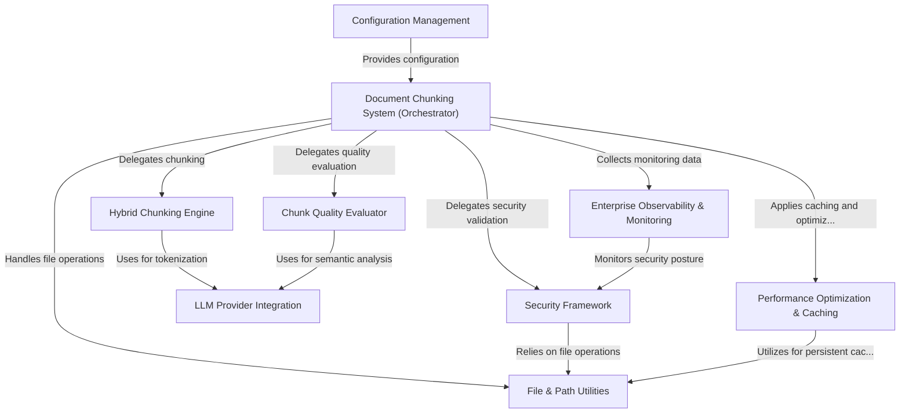

# Tutorial: chuncking-system

This project is a sophisticated **Document Chunking System** that acts like a *smart editor* for large documents. Its main purpose is to automatically break down complex texts, like books or manuals, into smaller, meaningful pieces called "chunks." It uses *multiple intelligent strategies* to ensure these chunks are high-quality, preserve context, and are ready for use by AI models (like in RAG applications). The system is highly customizable through its *central control panel*, ensures *data safety* with robust security checks, and provides *real-time insights* into its performance, making it reliable for enterprise use.

## Visual Overview

## Chapters

1. [Configuration Management
](01_configuration_management_.md)
2. [Document Chunking System (Orchestrator)
](02_document_chunking_system__orchestrator__.md)
3. [Hybrid Chunking Engine
](03_hybrid_chunking_engine_.md)
4. [LLM Provider Integration
](04_llm_provider_integration_.md)
5. [Chunk Quality Evaluator
](05_chunk_quality_evaluator_.md)
6. [Security Framework
](06_security_framework_.md)
7. [File & Path Utilities
](07_file___path_utilities_.md)
8. [Performance Optimization & Caching
](08_performance_optimization___caching_.md)
9. [Enterprise Observability & Monitoring
](09_enterprise_observability___monitoring_.md)

---

Generated by [AI Codebase Knowledge Builder](https://github.com/The-Pocket/Tutorial-Codebase-Knowledge).
