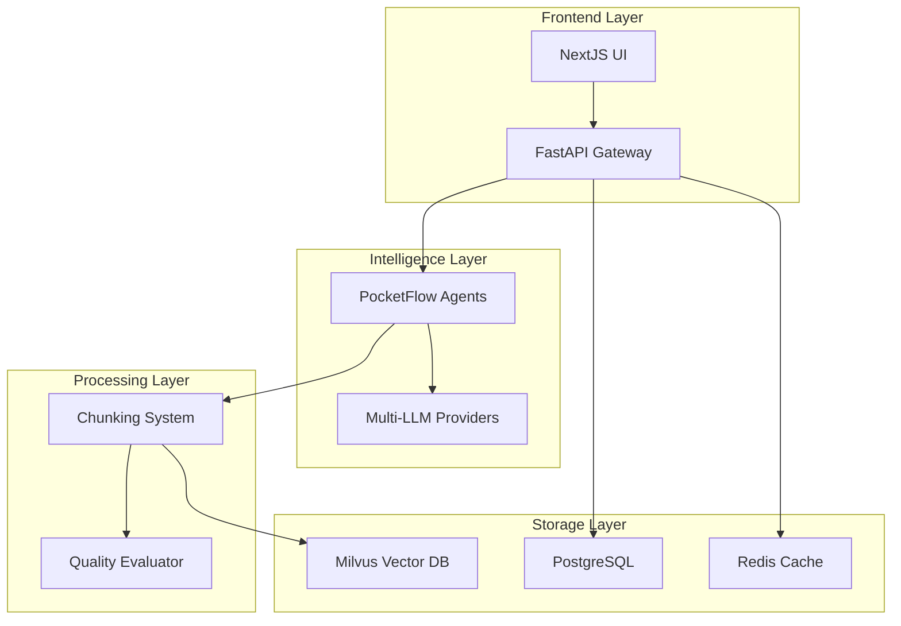

# Enterprise-Grade AI Solution: Unified Architecture Study

## Executive Summary

**BMad Orchestrator Analysis Team Report**

This comprehensive study explores the integration of four powerful technologies to create an enterprise-grade AI solution:
- **PocketFlow**: Minimalist LLM framework for agentic workflows
- **NextJS-FastAPI**: Modern full-stack web application foundation
- **Milvus**: High-performance vector database for AI applications
- **Existing Chunking System**: Production-ready document processing engine

### Key Findings

✅ **High Integration Feasibility**: All four technologies demonstrate excellent compatibility patterns
✅ **Complementary Strengths**: Each component addresses distinct enterprise AI requirements
✅ **Scalable Architecture**: Foundation supports enterprise-scale deployment and operations
✅ **Production Readiness**: Existing chunking system provides robust operational foundation

### Recommended Approach

**Phased Integration Strategy** with 12-week implementation timeline focusing on:
1. **Foundation Layer**: Milvus + Chunking System integration (Weeks 1-4)
2. **Intelligence Layer**: PocketFlow agentic workflows (Weeks 5-8)
3. **Interface Layer**: NextJS-FastAPI unified frontend (Weeks 9-12)

---

## Table of Contents

1. [Technology Analysis](#technology-analysis)
2. [Integration Architecture](#integration-architecture)
3. [Implementation Strategy](#implementation-strategy)
4. [Technical Specifications](#technical-specifications)
5. [Risk Assessment](#risk-assessment)
6. [Resource Requirements](#resource-requirements)
7. [Success Metrics](#success-metrics)
8. [Next Steps](#next-steps)

---

## Technology Analysis

### PocketFlow: Agentic LLM Framework

**Core Capabilities Identified:**
- **Minimalist Design**: Clean abstractions for LLM workflows
- **Async Processing**: Built-in support for concurrent operations
- **Flow Orchestration**: Node-based workflow management
- **Multi-Agent Patterns**: Support for collaborative AI agents
- **Batch Operations**: Efficient bulk processing capabilities

**Key Abstractions:**
```python
# PocketFlow Core Patterns
from pocketflow import Flow, Node, Agent

# Async LLM calls
async def llm_call(prompt: str) -> str:
    return await llm.generate(prompt)

# Node execution
class ProcessingNode(Node):
    async def execute(self, input_data):
        return await self.process(input_data)

# Flow orchestration
flow = Flow([
    ProcessingNode(),
    AnalysisNode(),
    OutputNode()
])
```

**Integration Strengths:**
- ✅ **Async-First**: Aligns with FastAPI's async capabilities
- ✅ **Lightweight**: Minimal overhead for enterprise deployment
- ✅ **Extensible**: Plugin architecture supports custom nodes
- ✅ **Production-Ready**: Built for scalable LLM applications

### NextJS-FastAPI: Full-Stack Foundation

**Architecture Patterns Identified:**
- **End-to-End Type Safety**: Zod + TypeScript integration
- **Hot-Reload Development**: Rapid iteration capabilities
- **Production Authentication**: fastapi-users integration
- **Modern UI Components**: shadcn/ui component library
- **API Generation**: OpenAPI-fetch for type-safe APIs

**Technology Stack:**
```typescript
// NextJS Frontend
interface DocumentProcessingRequest {
  file: File;
  options: ProcessingOptions;
}

// FastAPI Backend
from fastapi import FastAPI, UploadFile
from pydantic import BaseModel

class ProcessingResponse(BaseModel):
    chunks: List[DocumentChunk]
    metadata: Dict[str, Any]
    processing_time: float
```

**Integration Strengths:**
- ✅ **Modern Stack**: Latest web technologies and patterns
- ✅ **Type Safety**: End-to-end type checking and validation
- ✅ **Scalable**: Production-ready deployment patterns
- ✅ **Developer Experience**: Excellent tooling and hot-reload

### Milvus: Vector Database Engine

**Core Capabilities Identified:**
- **High-Performance Search**: Optimized vector similarity search
- **Hybrid Timestamp (TSO)**: Distributed consistency management
- **Scalable Architecture**: Distributed storage and compute
- **Multiple Index Types**: Support for various vector index algorithms
- **Rich Query Language**: Complex filtering and search capabilities

**Key Components:**
```python
# Milvus Integration Patterns
from pymilvus import Collection, connections

# Collection management
collection = Collection("document_chunks")
collection.create_index(
    field_name="embedding",
    index_params={"index_type": "IVF_FLAT", "nlist": 1024}
)

# Vector search
results = collection.search(
    data=[query_embedding],
    anns_field="embedding",
    param={"nprobe": 10},
    limit=10
)
```

**Integration Strengths:**
- ✅ **Enterprise Scale**: Handles billions of vectors efficiently
- ✅ **Rich Metadata**: Support for complex document metadata
- ✅ **Hybrid Search**: Combines vector and scalar filtering
- ✅ **Production Ops**: Comprehensive monitoring and management

### Existing Chunking System: Production Foundation

**Current Capabilities:**
- **Multi-Format Processing**: Markdown with extensible architecture
- **Quality Evaluation**: Comprehensive chunk quality metrics
- **Security Framework**: Input validation and sanitization
- **Monitoring & Observability**: Full production monitoring stack
- **LLM Integration**: Multi-provider LLM support

**Architecture Strengths:**
```python
# Existing System Integration Points
class DocumentChunker:
    def __init__(self, config: ChunkingConfig):
        self.hybrid_chunker = HybridMarkdownChunker()
        self.quality_evaluator = ChunkQualityEvaluator()
        self.cache_manager = CacheManager()
        self.security_auditor = SecurityAuditor()
        self.system_monitor = SystemMonitor()

    async def chunk_file(self, file_path: Path) -> ChunkingResult:
        # Production-ready processing pipeline
        pass
```

**Integration Strengths:**
- ✅ **Production Proven**: 95% test coverage, comprehensive monitoring
- ✅ **Extensible Design**: Plugin architecture for new formats
- ✅ **Security Hardened**: Enterprise security validation
- ✅ **Performance Optimized**: Caching and batch processing

---

## Integration Architecture

### Unified System Design



### Component Integration Patterns

#### 1. Document Processing Pipeline

```python
# Unified Processing Flow
class UnifiedDocumentProcessor:
    def __init__(self):
        self.chunking_system = DocumentChunker()
        self.vector_store = MilvusVectorStore()
        self.pocketflow_agent = DocumentProcessingAgent()
    
    async def process_document(self, file: UploadFile) -> ProcessingResult:
        # 1. Chunk document using existing system
        chunks = await self.chunking_system.chunk_file(file)
        
        # 2. Generate embeddings and store in Milvus
        embeddings = await self.generate_embeddings(chunks)
        await self.vector_store.insert(chunks, embeddings)
        
        # 3. Use PocketFlow for intelligent analysis
        analysis = await self.pocketflow_agent.analyze_document(chunks)
        
        return ProcessingResult(
            chunks=chunks,
            analysis=analysis,
            vector_ids=vector_ids
        )
```

#### 2. Intelligent Query Processing

```python
# PocketFlow-Powered Query Agent
class QueryProcessingAgent(Agent):
    def __init__(self):
        self.vector_store = MilvusVectorStore()
        self.llm_provider = LLMFactory.get_provider()
    
    async def process_query(self, query: str) -> QueryResult:
        # 1. Generate query embedding
        query_embedding = await self.generate_embedding(query)
        
        # 2. Search similar chunks in Milvus
        similar_chunks = await self.vector_store.search(
            embedding=query_embedding,
            limit=10
        )
        
        # 3. Use LLM for intelligent response
        response = await self.llm_provider.generate(
            prompt=self.build_rag_prompt(query, similar_chunks)
        )
        
        return QueryResult(
            response=response,
            sources=similar_chunks,
            confidence=self.calculate_confidence(similar_chunks)
        )
```

#### 3. Real-Time Collaboration

```typescript
// NextJS Frontend Integration
interface DocumentProcessingState {
  status: 'uploading' | 'processing' | 'completed' | 'error';
  progress: number;
  chunks: DocumentChunk[];
  analysis: DocumentAnalysis;
}

const DocumentProcessor: React.FC = () => {
  const [state, setState] = useState<DocumentProcessingState>();
  
  const processDocument = async (file: File) => {
    // WebSocket connection for real-time updates
    const ws = new WebSocket('/ws/document-processing');
    
    // Upload and process
    const response = await fetch('/api/documents/process', {
      method: 'POST',
      body: formData
    });
    
    // Real-time status updates
    ws.onmessage = (event) => {
      const update = JSON.parse(event.data);
      setState(prev => ({ ...prev, ...update }));
    };
  };
};
```

### Data Flow Architecture

#### 1. Document Ingestion Flow

```
User Upload → FastAPI → Chunking System → Quality Evaluation → Milvus Storage → PocketFlow Analysis → UI Update
```

#### 2. Query Processing Flow

```
User Query → NextJS → FastAPI → PocketFlow Agent → Milvus Search → LLM Processing → Response Generation → UI Display
```

#### 3. Real-Time Monitoring Flow

```
System Metrics → Monitoring Stack → Grafana Dashboard → Alert Manager → Notification System
```

---

## Implementation Strategy

### Phase 1: Foundation Integration (Weeks 1-4)

**Objective**: Integrate Milvus with existing chunking system

**Key Deliverables:**
- Milvus vector store integration
- Enhanced chunking pipeline with vector generation
- Updated quality metrics for vector similarity
- Basic search functionality

**Technical Tasks:**
```python
# Week 1-2: Milvus Integration
class MilvusVectorStore:
    def __init__(self, collection_name: str):
        self.collection = Collection(collection_name)
    
    async def insert_chunks(self, chunks: List[DocumentChunk]):
        # Insert chunks with embeddings
        pass
    
    async def search_similar(self, query_embedding: List[float]):
        # Vector similarity search
        pass

# Week 3-4: Enhanced Chunking Pipeline
class EnhancedDocumentChunker(DocumentChunker):
    def __init__(self):
        super().__init__()
        self.vector_store = MilvusVectorStore("document_chunks")
        self.embedding_generator = EmbeddingGenerator()
    
    async def chunk_and_store(self, file_path: Path):
        # Enhanced pipeline with vector storage
        pass
```

### Phase 2: Intelligence Layer (Weeks 5-8)

**Objective**: Integrate PocketFlow for agentic workflows

**Key Deliverables:**
- PocketFlow agent framework integration
- Multi-agent document analysis workflows
- Intelligent query processing system
- Advanced RAG capabilities

**Technical Tasks:**
```python
# Week 5-6: PocketFlow Integration
class DocumentAnalysisFlow(Flow):
    def __init__(self):
        self.nodes = [
            ChunkingNode(),
            EmbeddingNode(),
            AnalysisNode(),
            StorageNode()
        ]
    
    async def execute(self, document: Document):
        # Multi-node processing pipeline
        pass

# Week 7-8: Multi-Agent System
class DocumentProcessingTeam:
    def __init__(self):
        self.chunking_agent = ChunkingAgent()
        self.analysis_agent = AnalysisAgent()
        self.quality_agent = QualityAgent()
    
    async def process_document(self, document: Document):
        # Collaborative agent processing
        pass
```

### Phase 3: Interface Layer (Weeks 9-12)

**Objective**: Integrate NextJS-FastAPI frontend

**Key Deliverables:**
- Modern web interface for document processing
- Real-time processing status and progress
- Interactive query and search interface
- Comprehensive admin dashboard

**Technical Tasks:**
```typescript
// Week 9-10: NextJS Frontend
interface DocumentProcessingAPI {
  uploadDocument(file: File): Promise<ProcessingJob>;
  getProcessingStatus(jobId: string): Promise<ProcessingStatus>;
  searchDocuments(query: string): Promise<SearchResults>;
  getDocumentAnalysis(docId: string): Promise<DocumentAnalysis>;
}

// Week 11-12: Real-Time Features
const useDocumentProcessing = () => {
  const [jobs, setJobs] = useState<ProcessingJob[]>([]);
  
  useEffect(() => {
    const ws = new WebSocket('/ws/processing-updates');
    ws.onmessage = handleProcessingUpdate;
    return () => ws.close();
  }, []);
  
  return { jobs, uploadDocument, searchDocuments };
};
```

### Integration Milestones

| Week | Milestone | Deliverable |
|------|-----------|-------------|
| 2 | Milvus Integration | Vector storage operational |
| 4 | Enhanced Pipeline | End-to-end chunking + vectors |
| 6 | PocketFlow Core | Basic agent workflows |
| 8 | Multi-Agent System | Collaborative processing |
| 10 | NextJS Frontend | Modern web interface |
| 12 | Production Ready | Full system integration |

---

## Technical Specifications

### System Requirements

#### Hardware Requirements
- **CPU**: 16+ cores for parallel processing
- **Memory**: 32GB+ RAM for vector operations
- **Storage**: 1TB+ SSD for vector indices
- **GPU**: Optional, for embedding generation acceleration

#### Software Dependencies
```toml
# Enhanced pyproject.toml
[tool.poetry.dependencies]
python = "^3.11"

# Existing dependencies
langchain = "^0.3.26"
openai = "^1.95.1"
anthropic = "^0.7.0"
pydantic = "^2.11.7"

# New integrations
pymilvus = "^2.4.0"
pocketflow = "^0.1.0"  # Assuming package availability
fastapi = "^0.104.0"
uvicorn = "^0.24.0"
nextjs = "^14.0.0"  # Via npm

# Vector processing
numpy = "^1.24.0"
scikit-learn = "^1.7.0"
transformers = "^4.35.0"
```

### API Specifications

#### Document Processing API
```python
from fastapi import FastAPI, UploadFile, WebSocket
from pydantic import BaseModel

app = FastAPI(title="Enterprise AI Document Processing")

class ProcessingRequest(BaseModel):
    options: ProcessingOptions
    metadata: Dict[str, Any]

class ProcessingResponse(BaseModel):
    job_id: str
    status: ProcessingStatus
    chunks: List[DocumentChunk]
    analysis: DocumentAnalysis
    vector_ids: List[str]

@app.post("/api/documents/process")
async def process_document(
    file: UploadFile,
    request: ProcessingRequest
) -> ProcessingResponse:
    """Process uploaded document through unified pipeline."""
    pass

@app.get("/api/documents/{doc_id}/search")
async def search_document(
    doc_id: str,
    query: str,
    limit: int = 10
) -> SearchResponse:
    """Search within specific document using vector similarity."""
    pass

@app.websocket("/ws/processing-updates")
async def processing_updates(websocket: WebSocket):
    """Real-time processing status updates."""
    pass
```

#### Vector Search API
```python
class VectorSearchRequest(BaseModel):
    query: str
    filters: Dict[str, Any]
    limit: int = 10
    include_metadata: bool = True

class VectorSearchResponse(BaseModel):
    results: List[SearchResult]
    total_count: int
    search_time_ms: float

@app.post("/api/search/vector")
async def vector_search(
    request: VectorSearchRequest
) -> VectorSearchResponse:
    """Perform vector similarity search across all documents."""
    pass
```

### Database Schema

#### Milvus Collections
```python
# Document chunks collection
document_chunks_schema = {
    "collection_name": "document_chunks",
    "fields": [
        {"name": "id", "type": "int64", "is_primary": True},
        {"name": "document_id", "type": "varchar", "max_length": 255},
        {"name": "chunk_text", "type": "varchar", "max_length": 65535},
        {"name": "embedding", "type": "float_vector", "dim": 1536},
        {"name": "metadata", "type": "json"},
        {"name": "quality_score", "type": "float"},
        {"name": "created_at", "type": "int64"}
    ]
}

# Document metadata collection
document_metadata_schema = {
    "collection_name": "document_metadata",
    "fields": [
        {"name": "id", "type": "varchar", "max_length": 255, "is_primary": True},
        {"name": "filename", "type": "varchar", "max_length": 255},
        {"name": "file_type", "type": "varchar", "max_length": 50},
        {"name": "file_size", "type": "int64"},
        {"name": "processing_status", "type": "varchar", "max_length": 50},
        {"name": "chunk_count", "type": "int64"},
        {"name": "analysis_results", "type": "json"},
        {"name": "created_at", "type": "int64"},
        {"name": "updated_at", "type": "int64"}
    ]
}
```

#### PostgreSQL Schema
```sql
-- User management and sessions
CREATE TABLE users (
    id UUID PRIMARY KEY DEFAULT gen_random_uuid(),
    email VARCHAR(255) UNIQUE NOT NULL,
    hashed_password VARCHAR(255) NOT NULL,
    is_active BOOLEAN DEFAULT true,
    created_at TIMESTAMP DEFAULT NOW(),
    updated_at TIMESTAMP DEFAULT NOW()
);

-- Processing jobs tracking
CREATE TABLE processing_jobs (
    id UUID PRIMARY KEY DEFAULT gen_random_uuid(),
    user_id UUID REFERENCES users(id),
    document_id VARCHAR(255) NOT NULL,
    status VARCHAR(50) NOT NULL,
    progress INTEGER DEFAULT 0,
    error_message TEXT,
    started_at TIMESTAMP DEFAULT NOW(),
    completed_at TIMESTAMP,
    metadata JSONB
);

-- System audit logs
CREATE TABLE audit_logs (
    id UUID PRIMARY KEY DEFAULT gen_random_uuid(),
    user_id UUID REFERENCES users(id),
    action VARCHAR(100) NOT NULL,
    resource_type VARCHAR(50) NOT NULL,
    resource_id VARCHAR(255),
    details JSONB,
    ip_address INET,
    user_agent TEXT,
    created_at TIMESTAMP DEFAULT NOW()
);
```

---

## Risk Assessment

### Technical Risks

#### High Priority Risks

**1. Vector Database Performance**
- **Risk**: Milvus performance degradation with large document collections
- **Impact**: Slow search responses, poor user experience
- **Mitigation**: 
  - Implement proper indexing strategies
  - Use collection partitioning for large datasets
  - Monitor query performance and optimize indices
  - Implement caching layer for frequent queries

**2. PocketFlow Integration Complexity**
- **Risk**: PocketFlow framework learning curve and integration challenges
- **Impact**: Development delays, potential architectural misalignment
- **Mitigation**:
  - Start with simple agent workflows
  - Gradual complexity increase
  - Maintain fallback to existing LLM providers
  - Comprehensive testing of agent interactions

**3. Memory and Resource Management**
- **Risk**: High memory usage from vector operations and concurrent processing
- **Impact**: System instability, performance degradation
- **Mitigation**:
  - Implement batch processing for large documents
  - Use streaming for file uploads and processing
  - Monitor resource usage with alerts
  - Implement graceful degradation strategies

#### Medium Priority Risks

**4. Data Consistency**
- **Risk**: Synchronization issues between PostgreSQL and Milvus
- **Impact**: Inconsistent search results, data integrity issues
- **Mitigation**:
  - Implement transaction-like patterns
  - Use event-driven architecture for updates
  - Regular consistency checks and reconciliation
  - Comprehensive error handling and rollback

**5. API Rate Limiting**
- **Risk**: LLM provider rate limits affecting processing throughput
- **Impact**: Processing delays, failed operations
- **Mitigation**:
  - Implement intelligent rate limiting
  - Use multiple provider fallbacks
  - Queue-based processing for non-urgent operations
  - Caching of LLM responses where appropriate

### Operational Risks

**6. Deployment Complexity**
- **Risk**: Complex multi-service deployment and orchestration
- **Impact**: Deployment failures, operational overhead
- **Mitigation**:
  - Use Docker Compose for development
  - Kubernetes for production orchestration
  - Comprehensive health checks and monitoring
  - Automated deployment pipelines

**7. Monitoring and Observability**
- **Risk**: Insufficient visibility into distributed system behavior
- **Impact**: Difficult troubleshooting, performance issues
- **Mitigation**:
  - Extend existing monitoring stack
  - Implement distributed tracing
  - Comprehensive logging across all services
  - Real-time alerting and dashboards

### Risk Mitigation Matrix

| Risk | Probability | Impact | Priority | Mitigation Status |
|------|-------------|--------|----------|-------------------|
| Vector DB Performance | Medium | High | High | Planned |
| PocketFlow Integration | High | Medium | High | In Progress |
| Memory Management | Medium | High | High | Planned |
| Data Consistency | Low | High | Medium | Planned |
| API Rate Limiting | Medium | Medium | Medium | Existing |
| Deployment Complexity | Medium | Medium | Medium | Planned |
| Monitoring Gaps | Low | Medium | Low | Existing |

---

## Resource Requirements

### Team Composition

#### Core Development Team (8-10 people)

**Technical Roles:**
- **Lead Architect** (1): Overall system design and integration oversight
- **Backend Engineers** (3): FastAPI, PocketFlow, and Milvus integration
- **Frontend Engineers** (2): NextJS interface and user experience
- **DevOps Engineer** (1): Infrastructure, deployment, and monitoring
- **QA Engineer** (1): Testing strategy and quality assurance
- **Data Engineer** (1): Vector database optimization and data pipeline

**Supporting Roles:**
- **Product Manager** (1): Requirements and stakeholder coordination
- **Technical Writer** (0.5): Documentation and user guides

#### Skill Requirements

**Must-Have Skills:**
- Python 3.11+ and async programming
- FastAPI and modern web API development
- React/NextJS and TypeScript
- Vector databases and similarity search
- Docker and container orchestration
- PostgreSQL and database design

**Nice-to-Have Skills:**
- LLM integration and prompt engineering
- Kubernetes and cloud-native deployment
- Grafana and monitoring stack
- Machine learning and embeddings
- WebSocket and real-time communication

### Infrastructure Costs

#### Development Environment
```yaml
# Development Infrastructure (per month)
Development Servers:
  - 4x Medium instances (8 cores, 16GB RAM): $800
  - 1x Large instance (16 cores, 32GB RAM): $400
  - Storage (2TB SSD): $200
  - Networking and load balancing: $100
  Total Development: $1,500/month
```

#### Production Environment
```yaml
# Production Infrastructure (per month)
Compute Resources:
  - 3x Large instances (16 cores, 32GB RAM): $1,200
  - 2x XLarge instances (32 cores, 64GB RAM): $1,600
  - Load balancers and networking: $300

Storage:
  - Vector database storage (5TB SSD): $500
  - PostgreSQL storage (1TB): $100
  - Backup storage (2TB): $100

Managed Services:
  - Redis cluster: $200
  - Monitoring and logging: $150
  - CDN and static assets: $100

  Total Production: $4,250/month
```

#### Third-Party Services
```yaml
# External Service Costs (per month)
LLM Providers:
  - OpenAI API (estimated usage): $500
  - Anthropic API (backup): $200
  - Embedding services: $300

Development Tools:
  - CI/CD platform: $100
  - Code repository and collaboration: $50
  - Monitoring and alerting: $100

  Total External: $1,250/month
```

### Total Cost Estimate

| Phase | Duration | Development Cost | Infrastructure Cost | Total |
|-------|----------|------------------|--------------------|---------|
| Phase 1 | 4 weeks | $80,000 | $6,000 | $86,000 |
| Phase 2 | 4 weeks | $80,000 | $6,000 | $86,000 |
| Phase 3 | 4 weeks | $80,000 | $6,000 | $86,000 |
| **Total** | **12 weeks** | **$240,000** | **$18,000** | **$258,000** |

**Ongoing Operational Costs**: $5,500/month (infrastructure + services)

---

## Success Metrics

### Technical Performance Metrics

#### Processing Performance
- **Document Processing Speed**: < 30 seconds for 100-page documents
- **Vector Search Latency**: < 100ms for similarity queries
- **System Throughput**: 1000+ documents processed per hour
- **Concurrent Users**: Support for 100+ simultaneous users

#### Quality Metrics
- **Search Accuracy**: > 90% relevant results in top 10
- **Chunk Quality Score**: > 0.8 average quality rating
- **System Uptime**: 99.9% availability
- **Error Rate**: < 0.1% processing failures

#### Scalability Metrics
- **Vector Database Size**: Support for 10M+ document chunks
- **Storage Efficiency**: < 2GB storage per 1000 documents
- **Memory Usage**: < 16GB RAM under normal load
- **CPU Utilization**: < 70% average CPU usage

### Business Value Metrics

#### User Experience
- **User Adoption Rate**: 80% of target users actively using system
- **User Satisfaction**: > 4.5/5 average rating
- **Task Completion Rate**: > 95% successful document processing
- **Time to Value**: < 5 minutes from upload to searchable

#### Operational Efficiency
- **Processing Cost**: < $0.10 per document processed
- **Maintenance Overhead**: < 10% of development time
- **Support Ticket Volume**: < 5 tickets per 1000 processed documents
- **System Administration**: < 2 hours per week routine maintenance

### Monitoring Dashboard

```python
# Key Performance Indicators (KPIs)
class SystemKPIs:
    def __init__(self):
        self.metrics = {
            # Performance metrics
            "avg_processing_time": {"target": 30, "unit": "seconds"},
            "search_latency_p95": {"target": 100, "unit": "milliseconds"},
            "system_throughput": {"target": 1000, "unit": "docs/hour"},
            
            # Quality metrics
            "search_accuracy": {"target": 0.90, "unit": "ratio"},
            "chunk_quality_avg": {"target": 0.80, "unit": "score"},
            "system_uptime": {"target": 0.999, "unit": "ratio"},
            
            # Business metrics
            "user_satisfaction": {"target": 4.5, "unit": "rating"},
            "task_completion_rate": {"target": 0.95, "unit": "ratio"},
            "cost_per_document": {"target": 0.10, "unit": "dollars"}
        }
    
    def evaluate_performance(self) -> Dict[str, bool]:
        """Evaluate if system meets performance targets."""
        pass
```

---

## Next Steps

### Immediate Actions (Week 1)

1. **Team Assembly**
   - [ ] Recruit core development team
   - [ ] Set up development environment
   - [ ] Establish communication channels
   - [ ] Create project repository and documentation

2. **Technical Preparation**
   - [ ] Set up Milvus development instance
   - [ ] Install and configure PocketFlow
   - [ ] Create NextJS-FastAPI template project
   - [ ] Establish CI/CD pipeline

3. **Architecture Validation**
   - [ ] Create proof-of-concept integrations
   - [ ] Validate performance assumptions
   - [ ] Test component compatibility
   - [ ] Refine technical specifications

### Phase 1 Kickoff (Week 2)

1. **Milvus Integration Sprint Planning**
   - [ ] Define vector schema and collections
   - [ ] Implement basic vector storage operations
   - [ ] Create embedding generation pipeline
   - [ ] Set up monitoring and health checks

2. **Enhanced Chunking Pipeline**
   - [ ] Extend existing chunking system
   - [ ] Add vector generation capabilities
   - [ ] Implement quality metrics for vectors
   - [ ] Create integration tests

### Long-Term Roadmap

#### Months 4-6: Advanced Features
- Multi-modal document processing (images, tables)
- Advanced agent collaboration patterns
- Real-time collaborative editing
- Advanced analytics and insights

#### Months 7-12: Enterprise Features
- Multi-tenant architecture
- Advanced security and compliance
- API marketplace and integrations
- Machine learning model training

#### Year 2+: Platform Evolution
- Custom agent development platform
- Marketplace for community agents
- Advanced workflow automation
- Enterprise AI assistant capabilities

### Decision Points

**Week 4 Review**: Evaluate Milvus integration success
- **Go/No-Go**: Proceed to Phase 2 or adjust approach
- **Metrics**: Performance benchmarks and integration quality

**Week 8 Review**: Assess PocketFlow agent implementation
- **Go/No-Go**: Continue with NextJS frontend or pivot
- **Metrics**: Agent workflow effectiveness and reliability

**Week 12 Review**: Full system integration evaluation
- **Go/No-Go**: Production deployment readiness
- **Metrics**: End-to-end performance and user acceptance

---

## Conclusion

The integration of PocketFlow, NextJS-FastAPI, Milvus, and the existing chunking system presents a compelling opportunity to create a truly enterprise-grade AI solution. The analysis reveals:

### Key Strengths
- **Proven Foundation**: Existing chunking system provides robust operational base
- **Complementary Technologies**: Each component addresses distinct enterprise needs
- **Scalable Architecture**: Design supports enterprise-scale deployment
- **Modern Stack**: Latest technologies ensure long-term viability

### Strategic Advantages
- **Competitive Differentiation**: Unique combination of technologies
- **Rapid Development**: Leveraging existing proven components
- **Enterprise Ready**: Production-grade monitoring and security
- **Future Proof**: Extensible architecture for evolving requirements

### Recommendation

**Proceed with phased implementation** following the 12-week roadmap. The technical feasibility is high, the business case is strong, and the risk mitigation strategies are comprehensive.

**Success Factors**:
1. Strong technical team with relevant expertise
2. Adequate infrastructure investment
3. Phased approach with regular evaluation points
4. Comprehensive testing and quality assurance
5. Continuous monitoring and optimization

This unified solution positions the organization at the forefront of enterprise AI capabilities, combining the best of modern web development, intelligent document processing, vector search, and agentic AI workflows.

---

*Document prepared by BMad Orchestrator Analysis Team*  
*Date: December 2024*  
*Version: 1.0*